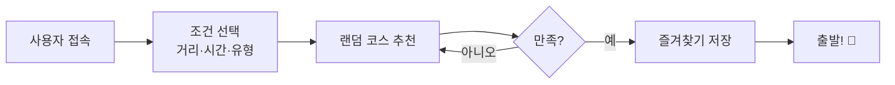

# RWR: Run Walk Random

> 동네 산책/러닝 코스를 랜덤으로 추천해주는 반응형 웹 서비스  
> 작성일: 2026.05.28 | 작성 도구: GitHub Copilot (Claude Sonnet 4.6)

---

## 한 줄 소개

거리·소요 시간·운동 유형을 선택하면 동네 산책/러닝 코스를 **랜덤으로 추천**해주는 반응형 웹 서비스입니다.  
앱 설치 없이 모바일 브라우저에서 30초 안에 오늘의 운동 코스를 정할 수 있습니다.

---

## UI 미리보기

<table>
  <tr>
    <th align="center">S01. 메인 화면</th>
    <th align="center">S02. 추천 결과</th>
    <th align="center">S03. 코스 상세</th>
  </tr>
  <tr>
    <td align="center"></td>
    <td align="center"></td>
    <td align="center"></td>
  </tr>
</table>

> 전체 와이어프레임 → [docs/05-ui-wireframe.md](docs/05-ui-wireframe.md)

---

## 문서 구성 (docs/)

기획 문서는 분야별로 분리하여 `docs/` 폴더에 정리되어 있습니다.

| #   | 문서                                                  | 내용                                                 |
| --- | ----------------------------------------------------- | ---------------------------------------------------- |
| 01  | [프로젝트 개요 & 기획 배경](docs/01-overview.md)      | 프로젝트 목적, 기획 배경, 문제 정의, 서비스 목표     |
| 02  | [목표 사용자 & 가치 제안](docs/02-users-and-value.md) | 페르소나 정의, 핵심 가치 제안, 포지셔닝              |
| 03  | [요구사항 정의서](docs/03-requirements.md)            | MVP 범위, 기능 목록, 기능/비기능 요구사항            |
| 04  | [사용자 시나리오 & 플로우](docs/04-user-scenarios.md) | 4개 사용자 시나리오, 사용자 플로우 다이어그램        |
| 05  | [UI 설계 & 와이어프레임](docs/05-ui-wireframe.md)     | 화면 구성, 텍스트 와이어프레임, 이미지 생성 프롬프트 |
| 06  | [데이터 명세](docs/06-data-spec.md)                   | 데이터 구조, 샘플 데이터, 필터링 로직                |
| 07  | [기술 스택 & 아키텍처](docs/07-tech-stack.md)         | 스택 비교, 최종 선정, 컴포넌트 구조                  |
| 08  | [개발 일정 & 리스크](docs/08-schedule.md)             | 금~일 3일 개발 일정, Gantt 차트, 리스크 관리         |
| 09  | [PRD](docs/09-prd.md)                                 | Product Requirements Document 전문                   |
| 10  | [로드맵 & 최종 요약](docs/10-roadmap.md)              | 향후 확장 로드맵, 카페 제출용 소개 문구              |

---

## 빠른 요약



---

## 기술 스택

| 분류          | 기술               |
| ------------- | ------------------ |
| UI 프레임워크 | React 18           |
| 언어          | JavaScript (ES6+)  |
| 스타일링      | CSS (Flexbox/Grid) |
| 빌드 도구     | Vite 5             |
| 데이터 저장   | localStorage       |
| 버전 관리     | Git + GitHub       |

---

## 목차 (단일 문서 전체 보기)

---

## 1. 프로젝트 개요

### 프로젝트명

**RWR: Run Walk Random**

### 한 줄 소개

거리·소요 시간·운동 유형을 선택하면 동네 산책/러닝 코스를 랜덤으로 추천해주는 반응형 웹 서비스

### 프로젝트 목적

| 구분                | 내용                                                                          |
| ------------------- | ----------------------------------------------------------------------------- |
| 학습용 미니프로젝트 | React, JavaScript, CSS 등 그동안 배운 기술을 실제 서비스 흐름에 적용          |
| 포트폴리오용 MVP    | 문제 정의 → 요구사항 → PRD까지 포함한 실무형 기획 문서 완성                   |
| 개인 사용 서비스    | 매일 반복되는 동네 코스의 지루함을 줄이고, 오늘의 운동 목적지를 간편하게 결정 |

### 핵심 사용자

- 매번 같은 코스로 걷거나 뛰는 것이 지겨운 사람
- 오늘 어디로 운동하러 갈지 정하기 귀찮은 사람
- 8,000보 걷기 등 가벼운 운동 목표가 있는 사람
- 모바일에서 빠르게 코스를 확인하고 싶은 사람

### 핵심 기능 요약

| #   | 기능           | 설명                                         |
| --- | -------------- | -------------------------------------------- |
| 1   | 조건 선택      | 거리, 소요 시간, 운동 유형 선택              |
| 2   | 랜덤 코스 추천 | 선택 조건에 맞는 코스를 랜덤으로 1개 추천    |
| 3   | 다시 추천      | 같은 조건으로 다른 코스 재추천               |
| 4   | 코스 상세 보기 | 코스 설명, 추천 이유, 주의사항, 준비 팁 확인 |
| 5   | 즐겨찾기       | 마음에 드는 코스 저장 (localStorage)         |
| 6   | 최근 추천 이력 | 최근 추천받은 코스 목록 확인                 |

---

## 2. 기획 배경

### 왜 이 서비스를 만들게 되었는가

러닝이나 산책을 꾸준히 하는 사람들 대부분은 자신에게 익숙한 코스 한두 개를 반복합니다. 처음에는 익숙함이 편안하게 느껴지지만, 반복이 쌓이면 운동 자체가 지루해지고 결국 운동을 미루게 되는 원인이 됩니다.

특히 "오늘 어디로 가지?"라는 질문에 매번 막히는 경험은, 운동을 시작하는 의지를 낮추는 작은 마찰 요소입니다.

이 서비스는 그 **작은 마찰**을 없애기 위해 기획되었습니다.

### 사용자가 겪는 문제

- 늘 같은 코스만 반복하다 보니 운동이 루틴처럼 느껴지고 지루해진다.
- 새로운 코스를 직접 찾으려면 지도 앱을 켜고, 경로를 짜고, 저장하는 과정이 번거롭다.
- "어디로 걸을까?" 고민하는 시간이 오히려 운동 시작을 방해한다.
- 목적지 없이 걷다 보면 목표 보수(8,000보 등)를 채우기 어렵다.

### 기존 걷기/러닝 앱과 다른 점

| 기존 앱 (Nike Run Club, 카카오맵 등) | RWR                               |
| ------------------------------------ | --------------------------------- |
| GPS 기반 실시간 경로 추적            | 추천 코스 선택에 집중, GPS 불필요 |
| 기록 측정 중심                       | 오늘의 코스 선택 경험 중심        |
| 코스 직접 설정                       | 조건 입력 → 랜덤 추천             |
| 앱 설치 필요                         | 설치 없이 반응형 웹으로 접근 가능 |
| 복잡한 UI                            | 모바일 최적화된 단순한 UI         |

---

## 3. 문제 정의

### 사용자 문제 정의 (Problem Statement)

> "운동하고 싶은 의지는 있지만, 오늘 어디로 가야 할지 정하는 것 자체가 귀찮다."

| #   | 사용자 문제                                          | 빈도 | 영향도 |
| --- | ---------------------------------------------------- | ---- | ------ |
| P1  | 매번 같은 코스로 걷거나 뛰어 지루함을 느낀다         | 높음 | 높음   |
| P2  | 새로운 코스를 찾는 과정이 귀찮고 시간이 걸린다       | 높음 | 중간   |
| P3  | 목적지가 없으면 8,000보 등 운동 목표를 채우기 어렵다 | 중간 | 높음   |
| P4  | 운동 시작 전 코스를 정하는 데 시간을 낭비한다        | 높음 | 중간   |
| P5  | 괜찮았던 코스를 나중에 다시 찾기 어렵다              | 낮음 | 중간   |

---

## 4. 서비스 목표

### 정량적 목표 (MVP 기준)

| 목표 항목                            | 목표 수치              |
| ------------------------------------ | ---------------------- |
| 조건 선택 → 추천 결과 표시 응답 시간 | 1초 이내               |
| 화면 전환 흐름 완성도 (6개 화면)     | 100%                   |
| 모바일 반응형 UI 지원                | 375px ~ 1280px         |
| 즐겨찾기 저장 유지 (새로고침 후)     | localStorage 기반 유지 |

### 정성적 목표

- 사용자가 앱을 열고 30초 이내에 코스를 추천받을 수 있다.
- 운동 코스를 고민하는 데 드는 시간과 에너지를 줄인다.
- 반복 운동에 소소한 새로움을 제공한다.
- 포트폴리오에 올려도 서비스 의도가 명확히 전달될 수 있다.

---

## 5. 목표 사용자

### 주 사용자 (Primary User)

**페르소나 A: 퇴근 후 가볍게 산책하는 직장인**

- 나이: 25~40세
- 운동 습관: 주 3~4회 30분~1시간 산책 또는 가벼운 조깅
- 불편함: 늘 같은 길만 걸어서 지루하고, 새 코스를 직접 찾기 귀찮음
- 기기: 주로 스마트폰 사용

**페르소나 B: 주말 러닝을 즐기는 일반인**

- 나이: 20~35세
- 운동 습관: 주 1~2회 5km 이상 러닝
- 불편함: 새로운 코스를 시도하고 싶지만 낯선 길은 막막함
- 기기: 스마트폰 + 가끔 PC

### 보조 사용자 (Secondary User)

**페르소나 C: 건강 관리 목적의 중장년층**

- 나이: 40~60세
- 운동 습관: 매일 아침 8,000~10,000보 걷기
- 불편함: 산책 목적지를 매일 정하기 귀찮고 변화가 없음
- 기기: 스마트폰 중심

---

## 6. 핵심 가치 제안

### Value Proposition

> **"오늘 어디로 달릴지 고민하지 마세요. RWR이 대신 골라드립니다."**

| 가치         | 설명                                                         |
| ------------ | ------------------------------------------------------------ |
| ⚡ 빠른 선택 | 조건 3가지 선택 → 즉시 코스 추천, 30초면 충분                |
| 🎲 새로움    | 매번 다른 코스를 추천받아 운동의 단조로움을 줄임             |
| 📱 접근성    | 앱 설치 없이 모바일 브라우저에서 바로 사용 가능              |
| 🔖 기록      | 마음에 드는 코스를 즐겨찾기로 저장, 언제든 재사용            |
| 🎯 맞춤 조건 | 거리, 시간, 운동 유형을 직접 선택해 내 상황에 맞는 코스 추천 |

---

## 7. MVP 범위

### 기능 분류표

| 기능                              | 분류         | 이유              |
| --------------------------------- | ------------ | ----------------- |
| 조건 선택 (거리·시간·유형)        | ✅ 필수 MVP  | 서비스 핵심 기능  |
| 랜덤 코스 추천 (샘플 데이터 기반) | ✅ 필수 MVP  | 서비스 핵심 기능  |
| 다시 추천 버튼                    | ✅ 필수 MVP  | UX 핵심 요소      |
| 코스 상세 화면                    | ✅ 필수 MVP  | 정보 제공 필요    |
| 즐겨찾기 (localStorage)           | ✅ 필수 MVP  | 재사용성          |
| 최근 추천 이력                    | ✅ 필수 MVP  | UX 편의 기능      |
| 반응형 UI (모바일 우선)           | ✅ 필수 MVP  | 핵심 접근 환경    |
| 지도 API 연동 (코스 위치 표시)    | 🟡 선택 도전 | 시간 여유 시 구현 |
| 실제 GPS 기반 경로 탐색           | ❌ 제외      | 구현 복잡도 과다  |
| AI 기반 개인화 추천               | ❌ 제외      | 향후 확장 기능    |
| 회원 가입 / 로그인                | ❌ 제외      | MVP 범위 초과     |
| 날씨 기반 추천                    | ❌ 제외      | 향후 확장 기능    |
| 사용자 코스 등록                  | ❌ 제외      | 향후 확장 기능    |
| 소셜 공유                         | ❌ 제외      | 향후 확장 기능    |

---

## 8. 주요 기능 목록

| 기능명             | 설명                                                        | 우선순위 | 구현 난이도 |
| ------------------ | ----------------------------------------------------------- | -------- | ----------- |
| 조건 선택 UI       | 거리(3종), 소요 시간(3종), 운동 유형(3종) 선택 칩           | P0       | 낮음        |
| 랜덤 코스 추천     | 선택 조건에 맞는 코스를 샘플 데이터에서 필터링 후 랜덤 반환 | P0       | 낮음        |
| 코스 결과 카드     | 코스명, 거리, 시간, 유형, 설명, 추천 이유 표시              | P0       | 낮음        |
| 다시 추천 버튼     | 동일 조건으로 다른 코스 재추천 (현재 결과 제외)             | P0       | 낮음        |
| 코스 상세 화면     | 요약, 추천 이유, 주의사항, 준비 팁 표시                     | P1       | 낮음        |
| 즐겨찾기 저장/해제 | localStorage에 코스 ID 저장·삭제, 아이콘으로 상태 표시      | P1       | 낮음        |
| 즐겨찾기 목록 화면 | 저장된 코스 목록 표시                                       | P1       | 낮음        |
| 최근 추천 이력     | 최근 추천받은 코스를 최대 5~10개 localStorage에 저장·표시   | P1       | 낮음        |
| 반응형 레이아웃    | 375px(모바일) ~ 1280px(PC) 화면 대응 CSS                    | P1       | 중간        |
| 조건 초기화        | 선택 조건을 초기 상태로 리셋                                | P2       | 낮음        |
| 지도 위치 표시     | 카카오맵/네이버/구글맵 API로 코스 위치 마커 표시            | P3       | 높음        |

> **P0**: 없으면 서비스 불가 | **P1**: 있어야 완성도 있음 | **P2**: 있으면 좋음 | **P3**: 도전 기능

---

## 9. 요구사항 정의서

### 9.1 기능 요구사항 (Functional Requirements)

| ID    | 요구사항                                                           | 우선순위 | 검증 방법                                   |
| ----- | ------------------------------------------------------------------ | -------- | ------------------------------------------- |
| FR-01 | 사용자는 거리 조건(1km / 3km / 5km)을 선택할 수 있다               | 필수     | 각 버튼 클릭 시 선택 상태 변경 확인         |
| FR-02 | 사용자는 소요 시간(15분 / 30분 / 60분)을 선택할 수 있다            | 필수     | 각 버튼 클릭 시 선택 상태 변경 확인         |
| FR-03 | 사용자는 운동 유형(걷기 / 조깅 / 러닝)을 선택할 수 있다            | 필수     | 각 버튼 클릭 시 선택 상태 변경 확인         |
| FR-04 | 조건 미선택 시 추천 버튼 클릭하면 안내 메시지가 표시된다           | 필수     | 조건 미선택 후 추천 버튼 클릭 테스트        |
| FR-05 | 추천 버튼 클릭 시 조건에 맞는 코스가 1개 랜덤으로 표시된다         | 필수     | 동일 조건 반복 클릭 시 결과 다양성 확인     |
| FR-06 | 다시 추천 버튼 클릭 시 동일 조건으로 다른 코스가 표시된다          | 필수     | 직전 추천 코스와 다른 결과 출력 확인        |
| FR-07 | 코스 카드에는 코스명, 거리, 시간, 유형, 설명, 추천 이유가 표시된다 | 필수     | 카드 UI 렌더링 확인                         |
| FR-08 | 사용자는 코스 상세 화면에서 주의사항과 준비 팁을 확인할 수 있다    | 필수     | 상세 화면 이동 및 데이터 표시 확인          |
| FR-09 | 사용자는 코스를 즐겨찾기에 저장할 수 있다                          | 필수     | 저장 버튼 클릭 → localStorage 저장 확인     |
| FR-10 | 즐겨찾기는 새로고침 후에도 유지된다                                | 필수     | 저장 후 새로고침 → 목록 유지 확인           |
| FR-11 | 즐겨찾기 화면에서 저장된 코스 목록을 확인할 수 있다                | 필수     | 즐겨찾기 탭 이동 후 목록 렌더링 확인        |
| FR-12 | 즐겨찾기 해제 시 목록에서 즉시 제거된다                            | 필수     | 해제 버튼 클릭 → localStorage 업데이트 확인 |
| FR-13 | 최근 추천 이력이 최대 10개까지 저장되고 확인할 수 있다             | 필수     | 10회 이상 추천 후 최근 10개만 표시 확인     |
| FR-14 | 사용자는 선택 조건을 초기화할 수 있다                              | 선택     | 초기화 버튼 클릭 → 전체 조건 해제 확인      |

### 9.2 비기능 요구사항 (Non-Functional Requirements)

| ID     | 요구사항                                                              | 기준                                 |
| ------ | --------------------------------------------------------------------- | ------------------------------------ |
| NFR-01 | 추천 결과는 1초 이내 화면에 표시되어야 한다                           | 외부 API 없는 클라이언트 필터링 기준 |
| NFR-02 | 모바일(375px)부터 PC(1280px)까지 레이아웃이 정상 동작해야 한다        | CSS 반응형 구현                      |
| NFR-03 | 모든 주요 기능이 JavaScript 비활성화 없이 브라우저에서 동작해야 한다  | Chrome 최신 버전 기준                |
| NFR-04 | 즐겨찾기 데이터는 localStorage를 통해 브라우저에 영구 저장되어야 한다 | 세션 종료 후에도 유지                |
| NFR-05 | UI는 운동 관련 비전공자도 직관적으로 사용할 수 있어야 한다            | 3회 클릭 이내 추천 완료 목표         |
| NFR-06 | 전체 소스 코드는 GitHub에 공개 저장소로 관리되어야 한다               | 포트폴리오 제출 기준                 |
| NFR-07 | 빌드 오류 없이 `npm run build`가 완료되어야 한다                      | CI/CD 없이 로컬 빌드 기준            |

---

## 10. 사용자 시나리오

### 시나리오 1: 퇴근 후 30분 산책 코스를 추천받는 사용자

| 항목            | 내용                                                                                                                                                                                                                          |
| --------------- | ----------------------------------------------------------------------------------------------------------------------------------------------------------------------------------------------------------------------------- |
| **사용자 상황** | 퇴근 후 스마트폰을 꺼내 가볍게 30분 산책을 하려는 직장인                                                                                                                                                                      |
| **사용자 목표** | 지금 당장 어디로 걸어갈지 빠르게 결정하고 싶다                                                                                                                                                                                |
| **사용 흐름**   | 1. 스마트폰 브라우저에서 RWR 접속 → 2. 거리 [3km] 선택 → 3. 소요 시간 [30분] 선택 → 4. 운동 유형 [걷기] 선택 → 5. [랜덤 코스 추천받기] 버튼 클릭 → 6. "동네 공원 한 바퀴 코스" 결과 확인 → 7. 상세 내용 확인 후 즐겨찾기 저장 |
| **기대 결과**   | 30초 이내 오늘의 산책 목적지가 정해지고, 코스 설명을 확인한 뒤 바로 출발할 수 있다                                                                                                                                            |

---

### 시나리오 2: 주말 아침 5km 러닝 코스를 추천받는 사용자

| 항목            | 내용                                                                                                                                                                                             |
| --------------- | ------------------------------------------------------------------------------------------------------------------------------------------------------------------------------------------------ |
| **사용자 상황** | 주말 아침 5km 러닝을 하려는 사람. 항상 같은 한강 코스만 달려서 지루함을 느낌                                                                                                                     |
| **사용자 목표** | 오늘은 다른 코스를 달려보고 싶다                                                                                                                                                                 |
| **사용 흐름**   | 1. RWR 접속 → 2. 거리 [5km] 선택 → 3. 소요 시간 [30분] 선택 → 4. 운동 유형 [러닝] 선택 → 5. 추천 결과 확인 → 6. 마음에 들지 않아 [다시 추천] 클릭 → 7. 새 코스 확인 후 마음에 들어 즐겨찾기 저장 |
| **기대 결과**   | 기존과 다른 새로운 러닝 코스를 발견하고, 마음에 드는 코스를 저장해 재사용할 수 있다                                                                                                              |

---

### 시나리오 3: 8,000보 걷기를 위해 오늘의 목적지를 정하는 사용자

| 항목            | 내용                                                                                                                                                                                                      |
| --------------- | --------------------------------------------------------------------------------------------------------------------------------------------------------------------------------------------------------- |
| **사용자 상황** | 매일 8,000보 걷기 목표를 갖고 있지만 목적지 없이 나가면 동기부여가 약해지는 40대 직장인                                                                                                                   |
| **사용자 목표** | 오늘 걸을 목적지를 미리 정해두고 의지를 다지고 싶다                                                                                                                                                       |
| **사용 흐름**   | 1. RWR 접속 → 2. 거리 [5km] 선택 (8,000보 ≈ 5km) → 3. 소요 시간 [60분] 선택 → 4. 운동 유형 [걷기] 선택 → 5. 추천 코스 확인 → 6. 코스 상세 화면에서 주의사항 확인 → 7. 최근 추천 이력에서 지난 코스와 비교 |
| **기대 결과**   | 오늘의 걷기 목적지가 결정되고, 이전에 걸었던 코스와 비교해 다양성을 유지할 수 있다                                                                                                                        |

---

### 시나리오 4: 즐겨찾기에서 자주 가는 코스를 다시 확인하는 사용자

| 항목            | 내용                                                                                                                              |
| --------------- | --------------------------------------------------------------------------------------------------------------------------------- |
| **사용자 상황** | 지난 주에 마음에 들었던 코스를 다시 가고 싶은 사용자                                                                              |
| **사용자 목표** | 이전에 저장한 즐겨찾기 코스를 빠르게 찾아 상세 내용을 확인하고 싶다                                                               |
| **사용 흐름**   | 1. RWR 접속 → 2. 하단 메뉴에서 [즐겨찾기] 이동 → 3. 저장된 코스 목록 확인 → 4. 원하는 코스 탭 → 5. 상세 화면에서 코스 정보 재확인 |
| **기대 결과**   | 저장해둔 코스를 빠르게 찾아 다시 출발할 수 있다                                                                                   |

---

## 11. 사용자 플로우

```
[서비스 접속]
      │
      ▼
[메인 화면]
 - 거리 선택 (1km / 3km / 5km)
 - 소요 시간 선택 (15분 / 30분 / 60분)
 - 운동 유형 선택 (걷기 / 조깅 / 러닝)
      │
      ├── 조건 미선택 → [안내 메시지] → 조건 선택으로 돌아감
      │
      ▼
[랜덤 코스 추천받기] 버튼 클릭
      │
      ▼
[추천 결과 화면]
 - 코스명, 거리, 시간, 유형, 설명, 추천 이유 표시
      │
      ├── [다시 추천] 클릭 → 동일 조건으로 다른 코스 재추천
      │
      ├── [상세 보기] 클릭
      │         └── [코스 상세 화면]
      │               - 코스 요약
      │               - 추천 이유
      │               - 주의사항
      │               - 준비 팁
      │               - [즐겨찾기 저장] 버튼
      │
      └── [즐겨찾기 저장] 클릭 → localStorage 저장 → 아이콘 상태 변경

[하단 네비게이션]
      │
      ├── [홈] → 메인(조건 선택) 화면
      ├── [즐겨찾기] → 저장된 코스 목록
      └── [최근 추천] → 최근 추천받은 코스 목록 (최대 10개)
```

---

## 12. 화면 구성

### 화면 1: 메인 화면 (조건 선택 화면)

| 항목             | 내용                                                                |
| ---------------- | ------------------------------------------------------------------- |
| **화면 목적**    | 사용자가 운동 조건을 선택하고 추천을 요청하는 핵심 진입 화면        |
| **주요 UI 요소** | 앱 타이틀, 조건 선택 칩(거리/시간/유형), 추천 버튼, 하단 네비게이션 |
| **사용자 행동**  | 각 조건별 칩 선택 → 추천 버튼 클릭                                  |
| **표시 데이터**  | 조건 선택 상태(선택됨/미선택), 조건 미선택 시 안내 메시지           |

---

### 화면 2: 추천 결과 화면

| 항목             | 내용                                                                          |
| ---------------- | ----------------------------------------------------------------------------- |
| **화면 목적**    | 랜덤 추천된 코스 정보를 카드 형태로 보여주는 화면                             |
| **주요 UI 요소** | 코스 결과 카드, 즐겨찾기 버튼, 다시 추천 버튼, 상세 보기 버튼, 조건 요약 배지 |
| **사용자 행동**  | 결과 확인 → 상세 보기, 즐겨찾기 저장, 또는 다시 추천                          |
| **표시 데이터**  | 코스명, 예상 거리, 예상 소요 시간, 운동 유형, 코스 설명, 추천 이유            |

---

### 화면 3: 코스 상세 화면

| 항목             | 내용                                                                                       |
| ---------------- | ------------------------------------------------------------------------------------------ |
| **화면 목적**    | 코스에 대한 상세 정보 제공                                                                 |
| **주요 UI 요소** | 뒤로 가기 버튼, 코스 요약 섹션, 추천 이유 섹션, 주의사항 섹션, 준비 팁 섹션, 즐겨찾기 버튼 |
| **사용자 행동**  | 정보 읽기, 즐겨찾기 저장, 뒤로 가기                                                        |
| **표시 데이터**  | 코스명, 조건 배지(거리/시간/유형), 코스 설명, 추천 이유, 주의사항, 준비 팁                 |

---

### 화면 4: 즐겨찾기 화면

| 항목             | 내용                                                                                   |
| ---------------- | -------------------------------------------------------------------------------------- |
| **화면 목적**    | 사용자가 저장한 즐겨찾기 코스 목록 관리                                                |
| **주요 UI 요소** | 즐겨찾기 목록 카드, 즐겨찾기 해제 버튼, 빈 상태(empty state) 안내                      |
| **사용자 행동**  | 코스 목록 확인, 상세 보기 이동, 즐겨찾기 해제                                          |
| **표시 데이터**  | 저장된 코스 카드(코스명, 거리, 시간, 유형), 저장 없을 때 "저장된 코스가 없습니다" 안내 |

---

### 화면 5: 최근 추천 코스 화면

| 항목             | 내용                                                              |
| ---------------- | ----------------------------------------------------------------- |
| **화면 목적**    | 최근 추천받은 코스 이력 확인                                      |
| **주요 UI 요소** | 최근 추천 목록 카드(최대 10개), 추천 날짜/시간 표시, 빈 상태 안내 |
| **사용자 행동**  | 이전 추천 코스 확인, 상세 보기 이동                               |
| **표시 데이터**  | 코스명, 추천 시각, 조건(거리/시간/유형), 이력 없을 때 안내        |

---

## 13. 와이어프레임

### 화면 1: 메인 화면 (조건 선택)

```
┌─────────────────────────────┐
│  RWR: Run Walk Random       │
│  오늘은 어디로 걸어볼까요?   │
├─────────────────────────────┤
│                             │
│  📍 거리 선택               │
│  [ 1km ] [ 3km ] [ 5km ]   │
│                             │
│  🏃 운동 유형               │
│  [ 걷기 ] [ 조깅 ] [ 러닝 ] │
│                             │
│  ⏱ 소요 시간               │
│  [ 15분 ] [ 30분 ] [ 60분 ] │
│                             │
│  ─────────────────────────  │
│                             │
│  [ 🎲 랜덤 코스 추천받기 ]   │
│  [ 조건 초기화 ]            │
│                             │
├─────────────────────────────┤
│  [홈]   [즐겨찾기]  [최근]  │
└─────────────────────────────┘
```

---

### 화면 2: 추천 결과 화면

```
┌─────────────────────────────┐
│  🎉 오늘의 추천 코스        │
│  조건: 3km · 30분 · 걷기   │
├─────────────────────────────┤
│                             │
│  ┌───────────────────────┐  │
│  │  🌿 동네 공원 한 바퀴  │  │
│  │  📏 3km  ⏱ 30분      │  │
│  │  🚶 걷기               │  │
│  │                       │  │
│  │  가볍게 산책하기 좋은  │  │
│  │  공원 중심 코스입니다  │  │
│  │                       │  │
│  │  ✨ 추천 이유          │  │
│  │  초보자도 부담 없이    │  │
│  │  걸을 수 있는 코스    │  │
│  └───────────────────────┘  │
│                             │
│  [ ♡ 즐겨찾기 ]             │
│  [ 상세 보기 ]              │
│  [ 🔄 다시 추천 ]           │
│                             │
├─────────────────────────────┤
│  [홈]   [즐겨찾기]  [최근]  │
└─────────────────────────────┘
```

---

### 화면 3: 코스 상세 화면

```
┌─────────────────────────────┐
│  ← 뒤로                     │
│  코스 상세                  │
├─────────────────────────────┤
│                             │
│  🌿 동네 공원 한 바퀴 코스  │
│  [3km] [30분] [걷기]        │
│                             │
│  📋 코스 요약               │
│  가볍게 산책하기 좋은       │
│  공원 중심 코스입니다.      │
│                             │
│  ✨ 추천 이유               │
│  초보자도 부담 없이 걸을    │
│  수 있고 30분 운동에 적합   │
│                             │
│  ⚠️ 주의사항               │
│  저녁 시간에는 조명이       │
│  어두운 구간을 주의하세요.  │
│                             │
│  🎒 준비 팁                 │
│  편한 신발, 물 한 병,       │
│  이어폰 챙기기              │
│                             │
│  [ ♡ 즐겨찾기 저장 ]        │
│                             │
├─────────────────────────────┤
│  [홈]   [즐겨찾기]  [최근]  │
└─────────────────────────────┘
```

---

### 화면 4: 즐겨찾기 화면

```
┌─────────────────────────────┐
│  ♡ 즐겨찾기                 │
├─────────────────────────────┤
│                             │
│  ┌───────────────────────┐  │
│  │ 🌿 동네 공원 한 바퀴  │  │
│  │ 3km · 30분 · 걷기    │  │
│  │              [✕해제]  │  │
│  └───────────────────────┘  │
│                             │
│  ┌───────────────────────┐  │
│  │ 🏙 하천변 조깅 코스   │  │
│  │ 5km · 30분 · 조깅    │  │
│  │              [✕해제]  │  │
│  └───────────────────────┘  │
│                             │
│  (저장된 코스가 없을 때)    │
│  아직 저장된 코스가 없어요  │
│  마음에 드는 코스를         │
│  즐겨찾기에 추가해보세요 🎲 │
│                             │
├─────────────────────────────┤
│  [홈]   [즐겨찾기]  [최근]  │
└─────────────────────────────┘
```

---

### 화면 5: 최근 추천 코스 화면

```
┌─────────────────────────────┐
│  🕐 최근 추천 코스          │
├─────────────────────────────┤
│                             │
│  ┌───────────────────────┐  │
│  │ 🌿 동네 공원 한 바퀴  │  │
│  │ 3km · 30분 · 걷기    │  │
│  │ 05/28 오후 7:30      │  │
│  └───────────────────────┘  │
│                             │
│  ┌───────────────────────┐  │
│  │ 🏙 하천변 조깅 코스   │  │
│  │ 5km · 30분 · 조깅    │  │
│  │ 05/27 오전 7:10      │  │
│  └───────────────────────┘  │
│                             │
│  (이력 없을 때)              │
│  아직 추천받은 코스가 없어요│
│  지금 바로 코스를 추천받아  │
│  보세요! 🎲                 │
│                             │
├─────────────────────────────┤
│  [홈]   [즐겨찾기]  [최근]  │
└─────────────────────────────┘
```

---

## 14. 이미지 와이어프레임 생성 프롬프트

### 한국어 프롬프트

```
흑백 모바일 앱 와이어프레임 이미지를 만들어줘.
서비스명은 'RWR: Run Walk Random'이며, 러닝/걷기 코스 추천 반응형 웹 서비스야.

다음 화면 요소들을 포함해줘:
- 상단에 앱 타이틀과 부제목
- 거리, 소요 시간, 운동 유형을 선택하는 칩(chip) 형태의 선택 버튼들
- "랜덤 코스 추천받기" 강조 버튼
- 추천 코스 결과 카드 (코스명, 거리, 시간, 운동 유형, 짧은 설명 포함)
- 즐겨찾기 아이콘 버튼, 다시 추천 버튼
- 하단 탭 바 (홈 / 즐겨찾기 / 최근 추천)

스타일 조건:
- 흑백 또는 저채도 회색조
- 깔끔한 카드 UI, 둥근 모서리
- 모바일 375px 기준 화면 비율 (세로형)
- 실제 개발 화면이 아닌 UX 기획서용 와이어프레임 느낌
- 텍스트는 최소화하고 레이아웃 구조 중심
- 러닝/걷기 느낌의 아이콘 또는 일러스트 최소 포함
```

### 영어 프롬프트

```
Create a grayscale mobile wireframe image for a responsive web app called "RWR: Run Walk Random" — a walking and running route recommendation service.

Include the following UI elements:
- App title and subtitle at the top
- Chip-style selection buttons for distance, duration, and exercise type
- A prominent "Get Random Route" CTA button
- A recommendation result card with: route name, distance, time, type, and short description
- Favorite icon button and "Try Again" button
- Bottom tab navigation bar (Home / Favorites / Recent)

Style requirements:
- Black and white or low-saturation grayscale
- Clean card UI with rounded corners
- Mobile 375px portrait layout
- UX planning wireframe style, not a finished product screenshot
- Minimal placeholder text, focus on layout structure
- Subtle running or walking icon/illustration elements
- Suitable for a product planning document or portfolio
```

---

## 15. 데이터 구조 예시

```javascript
// routeData.js — 샘플 코스 데이터

const routeList = [
  {
    id: 1,
    title: "동네 공원 한 바퀴 코스",
    distance: 3, // km
    time: 30, // 분
    type: "걷기", // "걷기" | "조깅" | "러닝"
    mood: "공원", // 코스 분위기 태그 (향후 확장용)
    description: "가볍게 산책하기 좋은 공원 중심 코스입니다.",
    reason: "초보자도 부담 없이 걸을 수 있고, 30분 운동에 적합합니다.",
    caution: "저녁 시간에는 조명이 어두운 구간을 주의하세요.",
    tip: "편한 신발과 물 한 병을 챙겨가세요.",
    favorite: false, // localStorage 연동 시 동적으로 관리
  },
  {
    id: 2,
    title: "하천변 조깅 코스",
    distance: 5,
    time: 30,
    type: "조깅",
    mood: "하천",
    description: "탁 트인 하천변을 따라 달리는 상쾌한 코스입니다.",
    reason:
      "평탄한 지형으로 페이스 조절이 쉽고, 경관이 좋아 기분 전환에 최적입니다.",
    caution: "주말 오전에는 자전거 이용자가 많으니 우측 통행을 지켜주세요.",
    tip: "이어폰과 스포츠 음료를 준비하면 좋습니다.",
    favorite: false,
  },
  {
    id: 3,
    title: "골목 탐험 산책 코스",
    distance: 1,
    time: 15,
    type: "걷기",
    mood: "골목",
    description: "가까운 동네 골목길을 느긋하게 걷는 짧은 코스입니다.",
    reason:
      "시간이 부족할 때 가볍게 나서기 좋고, 새로운 골목을 발견하는 재미가 있습니다.",
    caution: "좁은 골목에서는 차량을 주의하세요.",
    tip: "음악이나 팟캐스트를 들으며 걸으면 더 즐거워요.",
    favorite: false,
  },
  {
    id: 4,
    title: "언덕 극복 러닝 코스",
    distance: 3,
    time: 30,
    type: "러닝",
    mood: "언덕",
    description: "완만한 언덕이 포함된 코스로 다리 근력 강화에 효과적입니다.",
    reason: "평지 러닝에 익숙해졌다면 이 코스로 변화를 줘보세요.",
    caution: "언덕 구간에서 무릎에 부담이 오면 속도를 줄이세요.",
    tip: "언덕 구간 전 스트레칭을 충분히 해주세요.",
    favorite: false,
  },
  {
    id: 5,
    title: "공원 둘레길 조깅 코스",
    distance: 3,
    time: 30,
    type: "조깅",
    mood: "공원",
    description: "넓은 공원 외곽 둘레길을 한 바퀴 도는 조깅 코스입니다.",
    reason: "나무 그늘이 많아 여름에도 쾌적하게 달릴 수 있습니다.",
    caution: "반려동물 동반 산책객이 많으니 주의해서 달리세요.",
    tip: "선크림을 바르고 모자를 챙기면 더 쾌적합니다.",
    favorite: false,
  },
  {
    id: 6,
    title: "도심 5km 장거리 러닝",
    distance: 5,
    time: 60,
    type: "러닝",
    mood: "도심",
    description: "도심 블록을 따라 이어지는 5km 장거리 러닝 코스입니다.",
    reason:
      "도심 풍경을 보며 달리면 지루하지 않게 장거리를 완주할 수 있습니다.",
    caution: "횡단보도 신호를 꼭 지켜 안전하게 달리세요.",
    tip: "GPS 앱으로 경로를 미리 확인해두면 편합니다.",
    favorite: false,
  },
  {
    id: 7,
    title: "아침 1km 가벼운 걷기",
    distance: 1,
    time: 15,
    type: "걷기",
    mood: "주택가",
    description: "아침 일찍 주택가 골목을 가볍게 걷는 짧은 웜업 코스입니다.",
    reason: "운동 습관을 막 시작하는 분들에게 부담 없이 시작하기 좋습니다.",
    caution: "이른 아침에는 시야가 좁을 수 있으니 밝은 옷을 입으세요.",
    tip: "스트레칭으로 시작하면 몸이 빨리 깨어납니다.",
    favorite: false,
  },
  {
    id: 8,
    title: "저녁 하천변 산책 코스",
    distance: 3,
    time: 60,
    type: "걷기",
    mood: "하천",
    description: "노을 지는 하천변을 따라 여유롭게 걷는 저녁 산책 코스입니다.",
    reason: "하루를 마무리하며 머리를 비우고 싶을 때 최적의 코스입니다.",
    caution: "해가 지면 어두워지므로 밝은 색 옷이나 반사 소재를 착용하세요.",
    tip: "좋아하는 음악 플레이리스트를 미리 준비해보세요.",
    favorite: false,
  },
];

export default routeList;
```

### 필터링 로직 예시

```javascript
// 조건에 맞는 코스를 필터링 후 랜덤으로 1개 반환
function getRandomRoute(distance, time, type, excludeId = null) {
  const filtered = routeList.filter(
    (route) =>
      route.distance === distance &&
      route.time === time &&
      route.type === type &&
      route.id !== excludeId, // 다시 추천 시 직전 코스 제외
  );

  if (filtered.length === 0) return null;

  const randomIndex = Math.floor(Math.random() * filtered.length);
  return filtered[randomIndex];
}
```

---

## 16. 기술 스택 및 선정 이유

### 기술 스택 비교

| 항목                | 추천안 A (안정적인 MVP)  | 추천안 B (확장형 MVP)    |
| ------------------- | ------------------------ | ------------------------ |
| **프론트엔드**      | React + JavaScript + CSS | React + JavaScript + CSS |
| **백엔드**          | ❌ 없음                  | Node.js + Express        |
| **데이터 저장**     | 샘플 JSON 데이터 (정적)  | JSON 파일 또는 메모리    |
| **상태 저장**       | localStorage             | localStorage             |
| **빌드 도구**       | Vite (React)             | Vite + Node 서버 분리    |
| **지도 API**        | 미포함                   | 도전 기능으로 포함 가능  |
| **예상 구현 시간**  | 12~14시간                | 14~18시간 (초과 위험)    |
| **완성도 위험**     | 낮음                     | 중간~높음                |
| **포트폴리오 가치** | 프론트엔드 집중          | 풀스택 경험 가능         |

### ✅ 최종 추천: 추천안 A (안정적인 MVP)

**선정 이유:**

1. **개발 기간 활용**: 금요일~일요일 3일 (실작업 약 30시간) 동안 백엔드 없이 React + 정적 JSON 데이터로 모든 핵심 기능을 충분히 구현할 수 있습니다.
2. **집중도 향상**: 프론트엔드 UI/UX 품질에 집중할 수 있어 완성도 높은 결과물이 나옵니다.
3. **포트폴리오 적합**: React, 상태 관리, localStorage, 반응형 CSS를 모두 보여줄 수 있습니다.
4. **확장 가능성 유지**: 추후 Node.js/Express 백엔드나 지도 API를 추가하기 쉬운 구조로 설계할 수 있습니다.

> 백엔드(Node.js/Express)는 향후 지도 API 연동이나 데이터베이스 연결이 필요할 때 추가하면 됩니다.

### 최종 기술 스택

| 분류          | 기술                    | 버전 |
| ------------- | ----------------------- | ---- |
| UI 프레임워크 | React                   | 18.x |
| 언어          | JavaScript (ES6+)       | -    |
| 스타일링      | CSS (Flexbox/Grid)      | -    |
| 빌드 도구     | Vite                    | 5.x  |
| 데이터        | 정적 JSON / JS 배열     | -    |
| 저장소        | localStorage (브라우저) | -    |
| 버전 관리     | Git + GitHub            | -    |

---

## 17. 개발 일정 (2026.05.29 금 ~ 05.31 일)

| 날짜              | 시간   | 주요 작업                                                | 산출물             |
| ----------------- | ------ | -------------------------------------------------------- | ------------------ |
| 금 05.29 14~23시  | 9시간  | 환경 세팅, 메인UI, 코스 추천 로직, 결과 화면             | 핵심 P0 기능 완성  |
| 토 05.30 09~23시  | 14시간 | 즐겨찾기, 이력네비, 반응형CSS, 카카오맵 API, 데이터 20개 | P1 확장 + 카카오맵 |
| 일 05.31 10~23:59 | 14시간 | GPS 필터, 코스 공유, UI 완성도, 통합테스트, 최종 제출    | 도전 P2 + 제출     |

### 타임라인 다이어그램

```
금 05.29 |███ 환경세팅 | ████ 메인UI | ███ 데이터+로직 | ██ 결과화면 |
토 05.30 |██ 즐겨찾기 | ██ 이력네비 | ███ 반응형CSS | ████ 카카오맵 | ██ 데이터확장|
일 05.31 |███ GPS필터 | ██ 코스공유 | ███ UI완성도 | ████ 통합테스트+제출 |
```

> 상세 일정은 [08. 개발 일정 & 리스크](docs/08-schedule.md) 참조

### ⚠️ 리스크 관리

| 리스크                          | 대응 방안                                       |
| ------------------------------- | ----------------------------------------------- |
| 반응형 CSS에 예상보다 시간 소요 | 토요일 13~16시 블록 보호; PC 1024px 단순화 가능 |
| 카카오맵 API 키 발급 오류       | 사전 발급 후 시작; 실패 시 정적 이미지 대체     |
| GPS 권한 거부로 기능 무력화     | fallback으로 랜덤 추천 유지                     |
| 도전 기능 시간 초과             | GPS·공유는 일요일 배치; 시간 부족 시 스킵       |

---

## 18. PRD (Product Requirements Document)

---

### 제품명

**RWR: Run Walk Random**

---

### 배경

매일 걷거나 뛰는 사람들은 자신에게 익숙한 코스 한두 개를 반복하는 경향이 있습니다. 이로 인해 운동의 단조로움이 쌓이고, 새로운 코스를 직접 찾기 귀찮다는 이유로 운동 동기가 낮아질 수 있습니다. RWR은 사용자가 조건만 선택하면 랜덤으로 코스를 추천받아 이 마찰을 즉시 해소해주는 웹 서비스입니다.

---

### 문제 정의

| 문제                                   | 빈도 | 영향 |
| -------------------------------------- | ---- | ---- |
| 매번 같은 코스 반복 → 운동 지루함 증가 | 높음 | 높음 |
| 새 코스 탐색 과정이 번거로움           | 높음 | 중간 |
| 목적지 없는 운동의 낮은 동기부여       | 중간 | 높음 |
| 코스 결정에 시간이 걸려 운동 시작 지연 | 높음 | 중간 |

---

### 목표

1. 사용자가 서비스 접속 후 30초 이내 코스 추천을 완료할 수 있도록 한다.
2. 같은 조건에서도 여러 코스를 랜덤으로 추천해 다양성을 제공한다.
3. 즐겨찾기와 최근 이력 기능으로 코스 재활용 경험을 제공한다.
4. 모바일 브라우저에서 설치 없이 즉시 사용 가능한 반응형 웹으로 제공한다.

---

### 타겟 사용자

**주 사용자**: 25~40세, 주 2~5회 산책 또는 러닝을 즐기지만 코스 결정을 어려워하는 일반인  
**보조 사용자**: 건강 목적으로 매일 보행 목표(8,000보)를 달성하려는 40~60세 성인

---

### 핵심 기능

| 기능           | 설명                                                  | 버전 |
| -------------- | ----------------------------------------------------- | ---- |
| 조건 선택      | 거리(1/3/5km), 시간(15/30/60분), 유형(걷기/조깅/러닝) | v1.0 |
| 랜덤 코스 추천 | 조건 필터링 + 랜덤 반환                               | v1.0 |
| 다시 추천      | 동일 조건 재추천 (직전 코스 제외)                     | v1.0 |
| 코스 상세      | 설명·추천이유·주의사항·준비팁 표시                    | v1.0 |
| 즐겨찾기       | localStorage 기반 저장·해제                           | v1.0 |
| 최근 추천 이력 | 최대 10건 localStorage 저장                           | v1.0 |
| 반응형 UI      | 모바일(375px) ~ PC(1280px)                            | v1.0 |

---

### 사용자 플로우 요약

```
접속 → 조건 선택(거리·시간·유형) → 랜덤 추천 → 결과 확인
→ [만족] 즐겨찾기 저장 또는 출발
→ [불만족] 다시 추천 클릭
→ 과거 코스 확인: 즐겨찾기 탭 / 최근 추천 탭
```

---

### 성공 기준 (Success Metrics)

| 지표                               | 목표                                |
| ---------------------------------- | ----------------------------------- |
| 추천 결과 응답 시간                | 1초 이내 (클라이언트 사이드 필터링) |
| 모든 핵심 기능 (6종) 정상 동작     | 100%                                |
| 반응형 지원 범위                   | 375px ~ 1280px                      |
| 즐겨찾기 영속성 (새로고침 후 유지) | localStorage 기반 100% 유지         |
| GitHub 코드 공개                   | Public Repository 게시              |

---

### 제외 범위 (Out of Scope)

| 항목                  | 제외 이유                          |
| --------------------- | ---------------------------------- |
| 회원 가입 / 로그인    | MVP 범위 초과, 인증 구현 시간 부족 |
| 실제 GPS 경로 탐색    | 지도 API 연동 복잡도 과다          |
| AI 기반 개인화 추천   | 향후 확장 기능, MVP에서 불필요     |
| 날씨 API 연동         | 외부 API 의존성 추가 리스크        |
| 사용자 코스 직접 등록 | DB 필요, 범위 초과                 |

---

### 리스크

| 리스크                                | 가능성 | 영향도 | 대응 방안                                  |
| ------------------------------------- | ------ | ------ | ------------------------------------------ |
| 샘플 데이터 부족으로 추천 결과 반복   | 중간   | 중간   | 최소 10개 이상 코스 데이터 사전 준비       |
| 반응형 CSS 구현에 예상 초과 시간 소요 | 높음   | 중간   | CSS 단순화, Flexbox/Grid 표준 패턴 활용    |
| 지도 API 욕심으로 핵심 기능 미완성    | 낮음   | 높음   | MVP에서 지도 API 완전 배제 규칙 유지       |
| localStorage 브라우저 간 비호환       | 낮음   | 낮음   | 최신 Chrome 기준으로만 보장, README에 명시 |

---

### 향후 확장 방향

- v1.1: 카카오맵 API 연동으로 코스 위치 표시
- v1.2: 현재 위치(GPS) 기반 주변 코스 필터링
- v2.0: AI 기반 개인화 코스 추천 (날씨, 시간대, 사용자 기록 반영)
- v2.1: Firebase 연동으로 계정 기반 즐겨찾기 동기화
- v3.0: 사용자 코스 등록 및 커뮤니티 공유 기능

---

## 19. 향후 확장 기능

### 로드맵

| 단계 | 기능                                                               | 기술 필요 사항                            |
| ---- | ------------------------------------------------------------------ | ----------------------------------------- |
| v1.1 | **지도 API 연동** — 카카오맵/네이버/구글맵으로 코스 위치 마커 표시 | Kakao Maps / Naver Maps / Google Maps API |
| v1.2 | **GPS 기반 현재 위치 반영** — 사용자 위치 주변 코스 우선 추천      | Geolocation API                           |
| v2.0 | **날씨 기반 코스 추천** — 맑음·비·더위 등 날씨 조건 반영           | OpenWeather API 또는 기상청 API           |
| v2.1 | **운동 기록 저장** — 코스 완료 후 기록(날짜, 거리, 시간) 저장      | 로컬 DB 또는 Firebase Firestore           |
| v2.2 | **AI 기반 개인화 추천** — 사용자 기록 분석 및 맞춤 코스 추천       | OpenAI API 또는 자체 ML 모델              |
| v2.3 | **Firebase 연동** — 계정 기반 데이터 동기화                        | Firebase Auth + Firestore                 |
| v3.0 | **사용자 코스 등록** — 직접 코스를 만들어 서비스에 추가            | 백엔드 API + DB                           |
| v3.1 | **소셜 공유 기능** — 오늘의 코스를 SNS에 공유                      | Web Share API / OG 태그                   |

---

## 20. 최종 요약

### 카페 제출용 소개 문구

---

**[주말 미니프로젝트] RWR: Run Walk Random — 오늘 어디로 달릴지, AI가 아닌 랜덤이 골라드립니다 🎲**

매번 같은 코스만 걷거나 뛰다 지루해진 경험, 다들 있으시죠?
RWR은 거리·소요 시간·운동 유형 3가지 조건만 선택하면, 동네 산책/러닝 코스를 랜덤으로 추천해주는 반응형 웹 서비스입니다.

React + Vite로 구현한 프론트엔드 중심 프로젝트로, 즐겨찾기(localStorage)와 최근 추천 이력 기능도 포함되어 있습니다.
기획부터 요구사항 정의서, 사용자 시나리오, PRD까지 실무형 문서도 함께 작성했습니다.
3일(약 30시간) 안에 완성을 목표로 한 MVP 프로젝트입니다. 코드는 GitHub에 공개 예정입니다.

피드백과 응원 환영합니다! 🙌

---

> 본 문서는 GitHub Copilot (Claude Sonnet 4.6)을 활용해 작성되었습니다.
