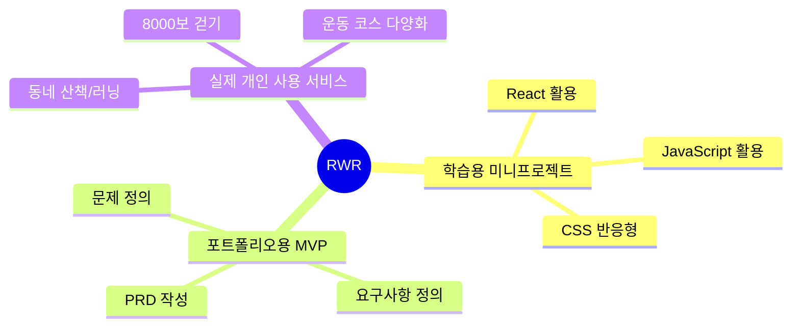
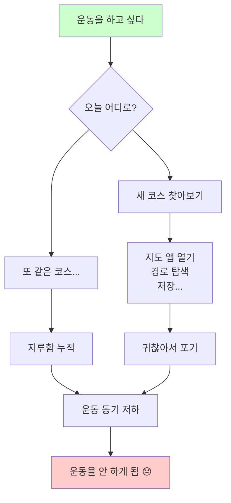
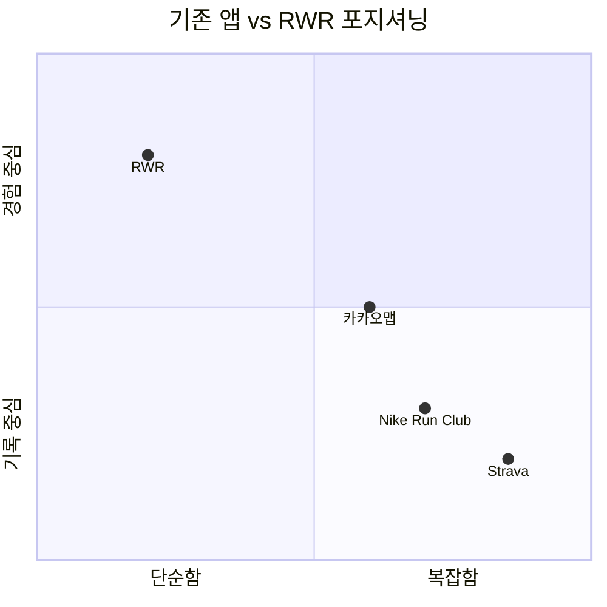
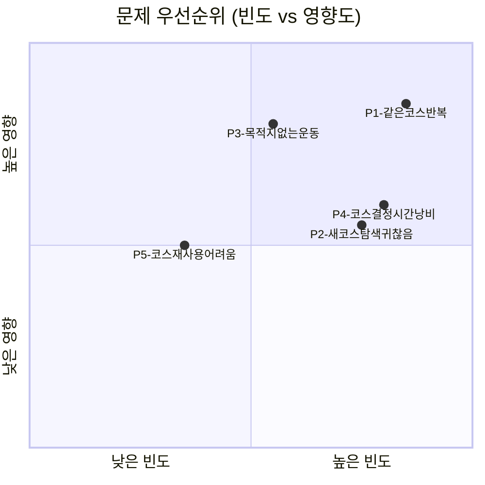
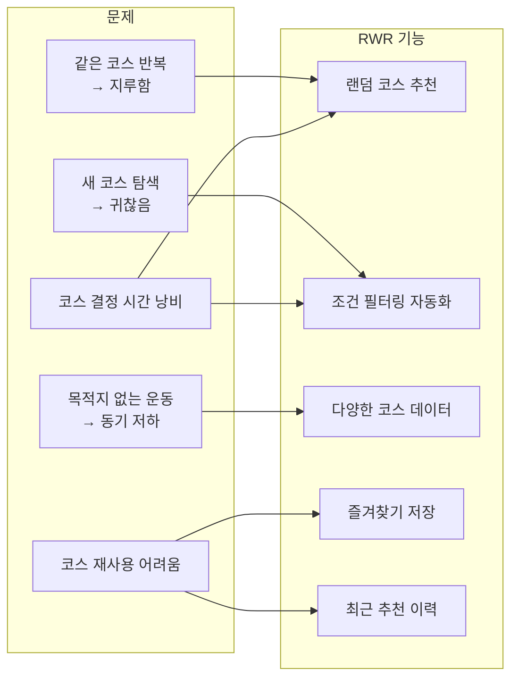
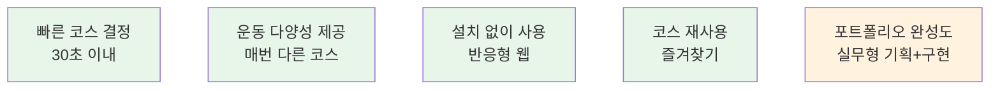

# 01. 프로젝트 개요 & 기획 배경

> **문서 유형**: 기획서  
> **작성일**: 2026.05.28  
> **관련 문서**: [목표 사용자](./02-users-and-value.md) | [요구사항 정의서](./03-requirements.md) | [PRD](./09-prd.md)

---

## 목차

1. [프로젝트 개요](#1-프로젝트-개요)
2. [기획 배경](#2-기획-배경)
3. [문제 정의](#3-문제-정의)
4. [서비스 목표](#4-서비스-목표)

---

## 1. 프로젝트 개요

### 프로젝트명

**RWR: Run Walk Random**

> Run(달리다) + Walk(걷다) + Random(랜덤) — 오늘의 코스를 고민 없이 랜덤으로 정한다는 의미

### 한 줄 소개

거리·소요 시간·운동 유형을 선택하면 동네 산책/러닝 코스를 **랜덤으로 추천**해주는 반응형 웹 서비스

### 프로젝트 성격

### 프로젝트 목적

| 구분          | 목적                                             | 기대 결과                                 |
| ------------- | ------------------------------------------------ | ----------------------------------------- |
| 🎓 학습       | React, JavaScript, CSS 실제 서비스 흐름에 적용   | 배운 기술로 완성된 서비스 구현 경험       |
| 💼 포트폴리오 | 문제 정의 → 요구사항 → PRD 실무형 기획 문서 완성 | 기획력과 개발 역량을 동시에 보여주는 자료 |
| 🏃 개인 사용  | 매일 반복되는 동네 코스의 지루함 해소            | 30초 안에 오늘의 운동 목적지 결정         |

### 핵심 기능 요약

| #   | 기능           | 설명                                                  | MVP 포함 |
| --- | -------------- | ----------------------------------------------------- | -------- |
| 1   | 조건 선택      | 거리(1/3/5km), 시간(15/30/60분), 유형(걷기/조깅/러닝) | ✅       |
| 2   | 랜덤 코스 추천 | 조건에 맞는 코스를 랜덤으로 1개 추천                  | ✅       |
| 3   | 다시 추천      | 같은 조건으로 다른 코스 재추천                        | ✅       |
| 4   | 코스 상세 보기 | 설명, 추천 이유, 주의사항, 준비 팁                    | ✅       |
| 5   | 즐겨찾기       | localStorage 기반 코스 저장/해제                      | ✅       |
| 6   | 최근 추천 이력 | 최근 추천 코스 목록 (최대 10개)                       | ✅       |
| 7   | 지도 API 연동  | 카카오맵 코스 시작점 마커 표시                        | ✅ MVP   |
| 8   | GPS 현재 위치  | 내 위치 기반 랜덤 운동 코스 자동 추천 기반            | 🟡 도전  |
| 9   | 코스 공유      | Web Share API (네이티브 공유 / 클립보드 fallback)     | 🟡 도전  |
| 10  | AI 개인화 추천 | 사용자 기록 기반 맞춤 추천                            | ❌ 향후  |

---

### 2026.05.31 GPS 기능 방향 보정 기록

초기 MVP 문서에서는 GPS 기능을 "가까운 코스 우선 정렬"로 설명했다. 이는 PostgreSQL에 저장된 고정 코스를 빠르게 활용하기 위한 MVP 중심 표현이었다.

Step 18에서 최종 목표를 재검토한 결과, RWR의 장기 방향은 사용자의 현재 위치, 목표 거리, 소요 시간, 운동 유형을 바탕으로 매일 다른 랜덤 운동 코스를 자동 추천하는 것으로 정리했다. 따라서 가까운 기존 코스 정렬은 메인 기능이 아니라 위치 권한 거부, 외부 라우팅 실패, MVP 데모 안정성을 위한 fallback 또는 보조 기능으로 다룬다.

### 2026.06.01 주소 입력 중심 기능 보정 기록

Step 21에서 추천 진입 흐름을 다시 정리했다. GPS 권한 요청을 메인 인터랙션으로 두면 사용자가 서비스를 열자마자 브라우저 권한 팝업을 마주하게 되고, 현재 위치가 아닌 다른 출발지를 기준으로 코스를 만들기도 어렵다.

따라서 RWR의 메인 입력은 사용자가 직접 적는 주소로 변경한다. 서버는 카카오 Local REST API로 주소를 좌표로 변환하고, 변환 좌표를 기준으로 ORS Round Trip 경로를 생성한다. GPS는 `현재 위치 사용` 보조 버튼으로 남겨 주소 입력을 돕는 역할을 한다.

기존 `랜덤 코스` / `GPS 자동 추천` 추천 방식 선택 버튼은 제거하고, 사용자는 주소와 조건을 입력한 뒤 `코스 생성` 버튼 하나로 추천을 시작한다. 경로 생성 실패 시에는 입력 위치와 가까운 저장 코스를 찾아 fallback 추천한다.

### 2026.06.01 주소 검색 결과 선택 UI 보정 기록

Step 22에서는 자유 텍스트 주소 입력을 바로 코스 생성에 사용하는 흐름을 보완했다. 한국 주소는 도로명, 지번, 건물명, 상세 주소 표기 방식이 다양하기 때문에 사용자가 입력한 문자열만으로는 의도한 좌표를 안정적으로 찾기 어렵다.

홈 화면의 출발 주소 영역은 `주소 검색어 입력칸 + 검색 버튼`과 `선택된 주소 표시 영역`으로 분리한다. 사용자는 카카오 Local API 검색 결과 후보 중 하나를 선택하고, 선택된 주소와 좌표가 `routeLocation`에 저장된 뒤에만 코스를 생성할 수 있다. GPS는 계속 `현재 위치 사용` 보조 버튼으로 유지한다.

### 2026.06.01 우편번호 서비스 기반 주소 선택 보정 기록

Step 23에서는 Step 22의 카카오 Local API 검색 결과 목록 UI를 Kakao 우편번호 서비스 기반 주소 선택 UI로 대체한다. 카카오 Local 주소 검색 API는 주소를 좌표로 변환하는 데 적합하지만, 도로명 일부 입력만으로 하위 건물번호 후보를 충분히 보여주는 주소 입력 UX에는 한계가 있었다.

사용자는 홈 화면의 `주소 찾기` 버튼으로 페이지 내 우편번호 검색 레이어를 열고, 도로명/지번/건물명 검색 결과에서 정확한 주소를 선택한다. 선택된 주소는 기존 서버 `POST /api/locations/geocode`로 좌표 변환하고, 좌표 변환에 성공한 경우에만 코스 생성 기준 위치로 확정한다.

## 2. 기획 배경

### 왜 이 서비스를 만들게 되었는가

> 이 서비스는 **B → C/D → 결국 안 하게 되는** 흐름의 마찰을 없애기 위해 기획되었습니다.

### 사용자가 겪는 문제

| 상황           | 사용자의 경험                                      |
| -------------- | -------------------------------------------------- |
| 퇴근 후 산책   | "또 그 길인가..." 식상함을 느끼며 나가기 싫어진다  |
| 주말 아침 러닝 | 새 코스를 가보고 싶지만, 낯선 길이 막막해 포기한다 |
| 매일 8,000보   | 목적지 없이 나가면 금방 집으로 돌아오게 된다       |
| 운동 시작 전   | "어디로 갈까" 고민하다 운동 시작이 늦어진다        |

### 기존 걷기/러닝 앱과 다른 점

| 비교 항목 | 기존 앱 (Nike Run Club 등) | **RWR**                  |
| --------- | -------------------------- | ------------------------ |
| 주요 목적 | GPS 기반 운동 기록·측정    | 오늘의 코스 랜덤 추천    |
| 코스 설정 | 사용자가 직접 경로 설정    | 조건 선택 → 자동 추천    |
| 앱 설치   | 필요                       | ❌ 불필요 (반응형 웹)    |
| UI 복잡도 | 다양한 기능으로 복잡       | 조건 선택만 있는 단순 UI |
| GPS 활용  | 핵심 기능                  | MVP에서 불필요           |
| 주요 가치 | 기록 관리, 커뮤니티        | **코스 선택 고민 해소**  |

---

## 3. 문제 정의

### Problem Statement

> _"운동하고 싶은 의지는 있지만, 오늘 어디로 가야 할지 정하는 것 자체가 귀찮다."_

### 사용자 문제 우선순위 매트릭스

| ID  | 사용자 문제                                          | 빈도    | 영향도  | 우선순위   |
| --- | ---------------------------------------------------- | ------- | ------- | ---------- |
| P1  | 매번 같은 코스로 걷거나 뛰어 지루함을 느낀다         | 🔴 높음 | 🔴 높음 | **최우선** |
| P2  | 새로운 코스를 찾는 과정이 귀찮고 시간이 걸린다       | 🔴 높음 | 🟡 중간 | 높음       |
| P3  | 목적지가 없으면 8,000보 등 운동 목표를 채우기 어렵다 | 🟡 중간 | 🔴 높음 | 높음       |
| P4  | 운동 시작 전 코스를 정하는 데 시간을 낭비한다        | 🔴 높음 | 🟡 중간 | 높음       |
| P5  | 괜찮았던 코스를 나중에 다시 찾기 어렵다              | 🟢 낮음 | 🟡 중간 | 보통       |

### 문제 → 해결책 매핑

---

## 4. 서비스 목표

### 핵심 목표 (North Star)

> **"사용자가 앱을 열고 30초 이내에 오늘의 운동 코스를 결정할 수 있도록 한다."**

### 정량적 목표 (MVP 기준)

| 목표 항목           | 목표 수치                   | 측정 방법                       |
| ------------------- | --------------------------- | ------------------------------- |
| 추천 결과 응답 시간 | **1초 이내**                | 조건 선택 → 결과 표시까지       |
| 전체 화면 완성도    | **6개 화면 100%**           | 화면별 기능 동작 확인           |
| 반응형 지원 범위    | **375px ~ 1280px**          | Chrome DevTools 기기 에뮬레이션 |
| 즐겨찾기 영속성     | **새로고침 후 100% 유지**   | localStorage 저장 확인          |
| 빌드 성공           | **npm run build 오류 없음** | 로컬 빌드 테스트                |

### 정성적 목표

| 목표              | 설명                                                       |
| ----------------- | ---------------------------------------------------------- |
| ⚡ 빠른 코스 결정 | 오늘의 운동 코스를 30초 안에 정할 수 있다                  |
| 🎲 운동 다양성    | 같은 조건이라도 매번 다른 코스를 추천받아 지루함을 줄인다  |
| 📱 접근성         | 앱 설치 없이 모바일 브라우저에서 즉시 사용 가능하다        |
| 🔖 코스 재사용    | 마음에 드는 코스를 즐겨찾기로 저장해 언제든 꺼내볼 수 있다 |
| 💼 포트폴리오     | 기획부터 구현까지 실무 수준의 산출물을 제출할 수 있다      |

---

_다음 문서: [02. 목표 사용자 & 가치 제안](./02-users-and-value.md)_
