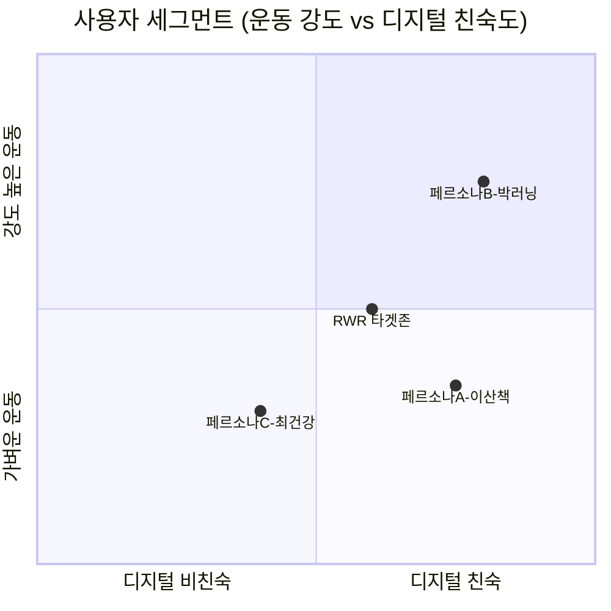
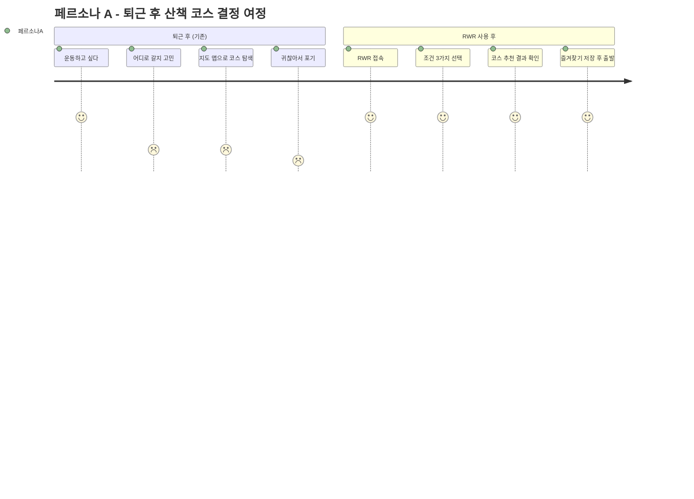
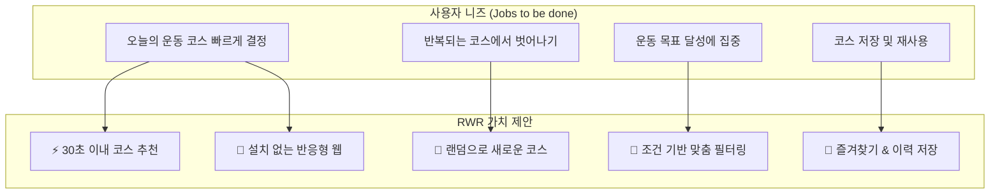
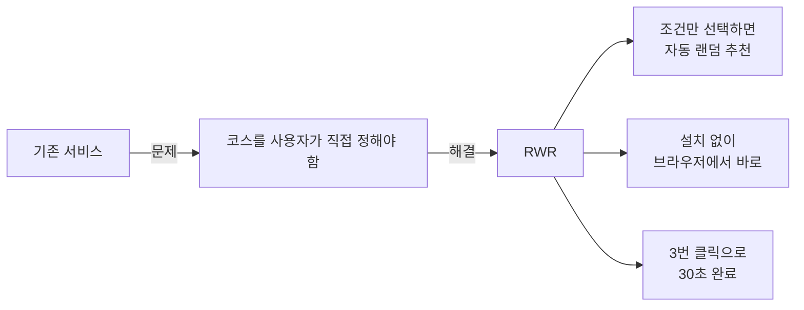

# 02. 목표 사용자 & 핵심 가치 제안

> **문서 유형**: 사용자 리서치 / UX 기획  
> **작성일**: 2026.05.28  
> **관련 문서**: [프로젝트 개요](./01-overview.md) | [사용자 시나리오](./04-user-scenarios.md)

---

## 목차

1. [목표 사용자 (Persona)](#1-목표-사용자-persona)
2. [사용자 세그먼트 분류](#2-사용자-세그먼트-분류)
3. [핵심 가치 제안](#3-핵심-가치-제안)
4. [서비스 포지셔닝](#4-서비스-포지셔닝)

---

## 1. 목표 사용자 (Persona)

### 페르소나 A — 퇴근 후 가볍게 산책하는 직장인

```
┌─────────────────────────────────────────────────────────┐
│  👤 페르소나 A: 이산책 (29세, 직장인)                   │
├─────────────────────────────────────────────────────────┤
│  직업: IT 회사 재직 중                                  │
│  운동 빈도: 주 3~4회 퇴근 후 30분~1시간                 │
│  주요 기기: 스마트폰 (아이폰)                           │
├─────────────────────────────────────────────────────────┤
│  🎯 목표                                                │
│  • 하루 스트레스를 풀며 30분~1시간 걷기                 │
│  • 8,000보 채우기                                       │
│                                                         │
│  😤 불편함 (Pain Points)                               │
│  • 늘 회사 주변 같은 길만 걷는다                        │
│  • "오늘은 어디로 가지?" 고민하다 집으로 간다           │
│  • 지도 앱으로 새 코스 찾는 게 귀찮다                   │
│                                                         │
│  💬 하는 말                                             │
│  "또 그 길이야... 다른 데 가고 싶은데 귀찮아"           │
└─────────────────────────────────────────────────────────┘
```

---

### 페르소나 B — 주말 러닝을 즐기는 일반인

```
┌─────────────────────────────────────────────────────────┐
│  👤 페르소나 B: 박러닝 (32세, 자영업)                   │
├─────────────────────────────────────────────────────────┤
│  직업: 카페 운영                                        │
│  운동 빈도: 주 1~2회 주말 아침 5km 러닝                 │
│  주요 기기: 스마트폰 + 스마트워치                       │
├─────────────────────────────────────────────────────────┤
│  🎯 목표                                                │
│  • 주말 아침 기분 좋게 달리기                           │
│  • 새로운 동네 코스 발견                                │
│                                                         │
│  😤 불편함 (Pain Points)                               │
│  • 항상 같은 한강 코스만 달린다                         │
│  • 새 코스를 시도하고 싶은데 어디가 좋은지 모른다       │
│  • 러닝 앱은 기록 측정 중심이라 코스 탐색엔 별로        │
│                                                         │
│  💬 하는 말                                             │
│  "오늘은 좀 다른 데 달려볼까... 어디가 좋지?"           │
└─────────────────────────────────────────────────────────┘
```

---

### 페르소나 C — 건강 관리 목적의 중장년층

```
┌─────────────────────────────────────────────────────────┐
│  👤 페르소나 C: 최건강 (52세, 회사원)                   │
├─────────────────────────────────────────────────────────┤
│  직업: 중견기업 팀장                                    │
│  운동 빈도: 매일 아침 30~60분 걷기                      │
│  주요 기기: 안드로이드 스마트폰                         │
├─────────────────────────────────────────────────────────┤
│  🎯 목표                                                │
│  • 매일 8,000~10,000보 걷기                             │
│  • 건강 관리 + 기분 전환                                │
│                                                         │
│  😤 불편함 (Pain Points)                               │
│  • 아파트 단지 내 같은 코스를 매일 반복한다             │
│  • 산책 목적지가 없으면 쉽게 집으로 돌아온다            │
│  • 복잡한 앱보다 단순한 서비스를 선호한다               │
│                                                         │
│  💬 하는 말                                             │
│  "오늘 아침엔 어디로 걸어볼까, 루트 좀 바꿔봐야겠어"   │
└─────────────────────────────────────────────────────────┘
```

---

## 2. 사용자 세그먼트 분류

### 세그먼트 매트릭스



### 주 사용자 vs 보조 사용자

| 구분            | 페르소나            | 나이    | 운동 습관        | 주요 니즈              | 중요도 |
| --------------- | ------------------- | ------- | ---------------- | ---------------------- | ------ |
| **주 사용자**   | A - 산책하는 직장인 | 25~40세 | 주 3~4회 30~60분 | 코스 다양화, 빠른 결정 | ⭐⭐⭐ |
| **주 사용자**   | B - 주말 러너       | 20~35세 | 주 1~2회 5km+    | 새로운 코스 발견       | ⭐⭐⭐ |
| **보조 사용자** | C - 걷기 중장년     | 40~60세 | 매일 8,000보+    | 목적지 설정, 단순한 UI | ⭐⭐   |

### 사용자 여정 지도 (User Journey Map)



---

## 3. 핵심 가치 제안

### Value Proposition Canvas



### 가치 제안 상세

| 가치             | 사용자 언어로 설명                                | 구현 기능                 |
| ---------------- | ------------------------------------------------- | ------------------------- |
| ⚡ **빠른 선택** | "30초면 오늘 어디로 갈지 정할 수 있어요"          | 조건 선택 3개 → 즉시 추천 |
| 🎲 **새로움**    | "매번 다른 코스를 추천받으니 질리지 않아요"       | 랜덤 추천 + 다시 추천     |
| 📱 **접근성**    | "앱 설치 없이 바로 쓸 수 있어서 편해요"           | 반응형 웹 (PWA 가능)      |
| 🔖 **기록**      | "마음에 들었던 코스를 저장해서 다시 볼 수 있어요" | localStorage 즐겨찾기     |
| 🎯 **맞춤 조건** | "내 시간과 체력에 맞는 코스만 나와요"             | 거리·시간·유형 필터       |

### 가치 제안 한 문장

> **"매일 같은 코스가 지겨운 분들께, 조건 3가지만 고르면 오늘의 새로운 코스를 30초 안에 추천해드립니다."**

---

## 4. 서비스 포지셔닝

### 경쟁 서비스 비교

| 비교 항목      | Nike Run Club | 카카오맵 | Strava |   **RWR**    |
| -------------- | :-----------: | :------: | :----: | :----------: |
| 설치 필요      |      앱       |    앱    |   앱   |  ❌ 불필요   |
| 코스 자동 추천 |      ❌       |    ❌    |   ❌   |      ✅      |
| 랜덤 코스      |      ❌       |    ❌    |   ❌   |      ✅      |
| 기록 측정      |      ✅       |    ❌    |   ✅   |      ❌      |
| 사용 난이도    |     중간      |   높음   |  높음  | 🟢 매우 낮음 |
| 모바일 최적화  |      ✅       |    ✅    |   ✅   |      ✅      |
| 즐겨찾기 저장  |      ✅       |    ✅    |   ✅   |      ✅      |

### RWR의 차별화 포인트



> RWR은 **"코스 추천"** 이라는 한 가지 문제에만 집중합니다.  
> 기록, 커뮤니티, GPS 추적은 의도적으로 제외하여 사용 마찰을 최소화합니다.

---

_다음 문서: [03. 요구사항 정의서](./03-requirements.md)_
