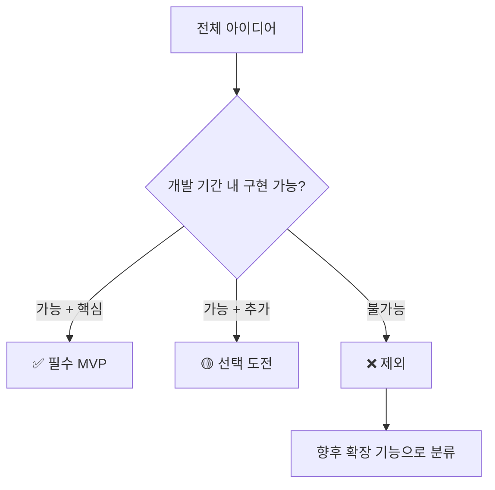
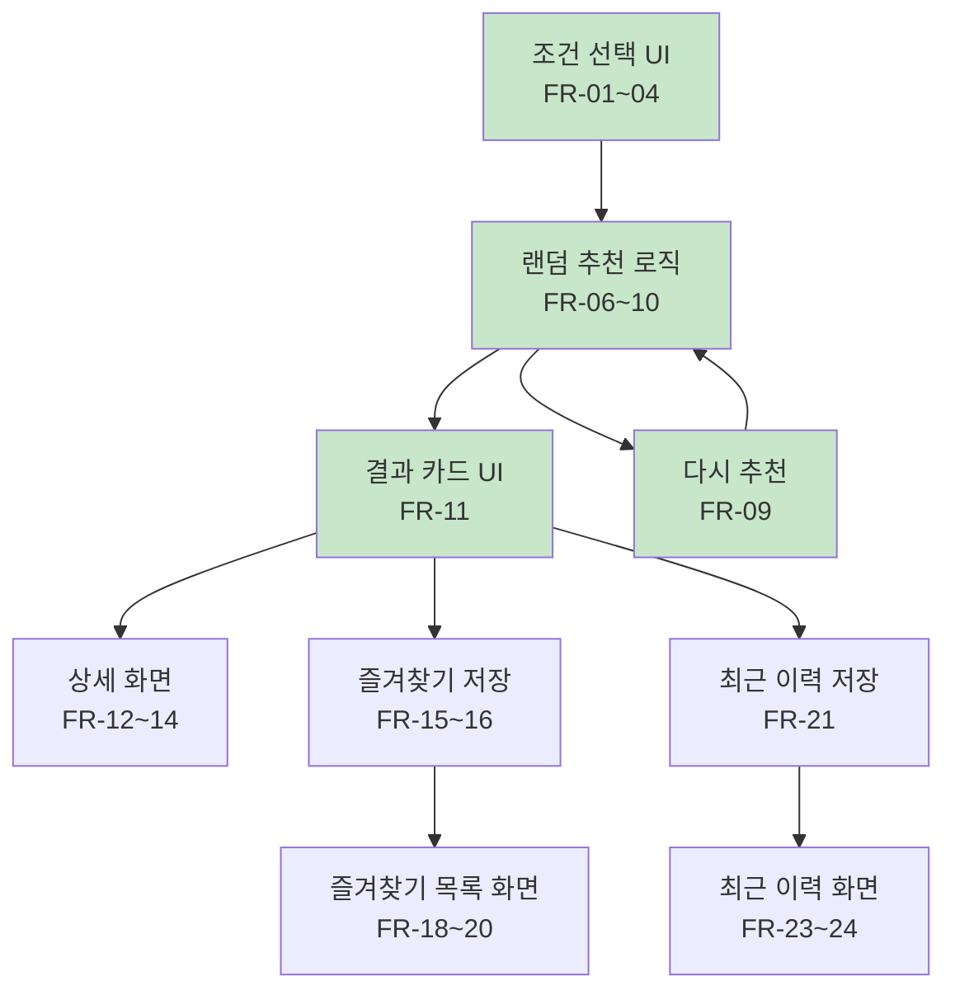

# 03. 요구사항 정의서

> **문서 유형**: 요구사항 정의서 (Requirements Specification)  
> **작성일**: 2026.05.28  
> **버전**: v1.0  
> **관련 문서**: [MVP 개요](./01-overview.md) | [사용자 시나리오](./04-user-scenarios.md) | [PRD](./09-prd.md)

---

## 목차

1. [MVP 범위 정의](#1-mvp-범위-정의)
2. [주요 기능 목록](#2-주요-기능-목록)
3. [기능 요구사항](#3-기능-요구사항)
4. [비기능 요구사항](#4-비기능-요구사항)
5. [기능 간 의존 관계](#5-기능-간-의존-관계)

---

## 1. MVP 범위 정의

### 기능 분류 기준



### MVP 기능 분류표

| 기능                              | 분류           | 제외/포함 이유                                 |
| --------------------------------- | -------------- | ---------------------------------------------- |
| 조건 선택 (거리·시간·유형)        | ✅ 필수 MVP    | 서비스의 핵심 인터랙션                         |
| 랜덤 코스 추천 (샘플 데이터)      | ✅ 필수 MVP    | 서비스의 핵심 가치                             |
| 다시 추천 버튼                    | ✅ 필수 MVP    | 랜덤 서비스의 필수 UX                          |
| 코스 상세 화면                    | ✅ 필수 MVP    | 코스 정보 제공                                 |
| 즐겨찾기 (PostgreSQL + 익명 UUID) | ✅ 필수 MVP    | 재방문 가치 창출                               |
| 최근 추천 이력                    | ✅ 필수 MVP    | 사용 기록 편의 기능                            |
| 반응형 UI (모바일 우선)           | ✅ 필수 MVP    | 핵심 접근 환경                                 |
| 조건 초기화                       | ✅ 필수 MVP    | 기본 UX 편의                                   |
| 지도 API 연동 (마커 표시)         | ✅ 필수 MVP    | 카카오맵 API 키 발급 후 구현                   |
| GPS 기반 자동 코스 추천           | 🟡 선택 도전   | Geolocation API, 경로 생성 확장, fallback 처리 |
| Web Share API 공유 (네이티브)     | 🟡 선택 도전   | navigator.share(), 클립보드 fallback           |
| AI 기반 개인화 추천               | ❌ 제외 → 향후 | 외부 API 의존, 비용 발생                       |
| 회원 가입 / 로그인                | ❌ 제외 → 향후 | 인증 구현 복잡도 초과                          |
| 날씨 기반 추천                    | ❌ 제외 → 향후 | 외부 API 연동 필요                             |
| 사용자 코스 등록                  | ❌ 제외 → 향후 | DB 필요                                        |

### 2026.05.31 GPS 요구사항 보정 기록

초기 MVP 요구사항은 GPS를 "현재 위치 탐색" 또는 "가까운 코스 우선 정렬" 수준으로 보았다. 이는 이미 저장된 PostgreSQL 코스를 활용해 빠르게 MVP를 완성하기 위한 범위였다.

Step 18에서 최종 목표를 재확인하면서 GPS 기능의 방향을 "현재 위치 기반 랜덤 운동 코스 자동 추천"으로 보정했다. 기존 DB 랜덤 추천은 계속 유지하지만, GPS 기반 추천이 실패하거나 아직 외부 라우팅 엔진이 연결되지 않은 단계에서 사용하는 fallback으로 역할을 명확히 한다.

### 2026.06.01 주소 입력 중심 요구사항 보정 기록

Step 21에서는 GPS를 메인 추천 방식에서 보조 입력 수단으로 낮추고, 주소 입력을 메인 흐름으로 변경했다.

사용자는 홈 화면에서 출발 주소, 거리, 소요 시간, 운동 유형을 입력한 뒤 `코스 생성` 버튼 하나로 랜덤 경로 생성을 요청한다. 서버는 카카오 Local REST API로 주소를 좌표로 변환하고, ORS Round Trip API로 실제 도로망 기반 순환 경로를 생성한다.

GPS는 `현재 위치 사용` 버튼으로 제공한다. 이 버튼은 브라우저 Geolocation API로 좌표를 얻고, 가능한 경우 카카오 좌표→주소 변환으로 주소 입력칸을 채운다. 좌표→주소 변환이 실패해도 좌표가 있으면 코스 생성 기준점으로 사용할 수 있다.

기존 FR-25~29의 `추천 방식 선택`, `GPS 기반 자동 추천 선택` 표현은 이후 구현 기준에서는 주소 중심 단일 흐름으로 해석한다. `랜덤 코스` / `GPS 자동 추천` 선택 버튼은 제거되며, 랜덤성은 경로 생성 seed와 fallback 후보 선택 로직에서 유지한다.

### 2026.06.01 주소 검색 결과 선택 요구사항 보정 기록

Step 22에서는 주소 입력을 자유 입력 확정 방식에서 검색 결과 선택 방식으로 개선했다.

사용자는 홈 화면에서 주소 검색어를 입력하고 `검색` 버튼 또는 Enter 키로 카카오 Local API 검색 후보를 조회한다. 검색 결과가 있으면 후보 목록에서 출발 주소를 선택해야 하며, 선택된 주소와 좌표가 있을 때만 `코스 생성` 버튼이 활성화된다. 검색어만 입력한 상태는 추천 기준점이 확정되지 않은 상태로 보며 코스 생성을 허용하지 않는다.

GPS `현재 위치 사용` 버튼은 주소 입력 보조 기능으로 유지한다. 좌표→주소 변환에 성공하면 선택 주소 영역에 변환 주소를 표시하고, 실패하더라도 좌표가 있으면 `현재 위치 기준`으로 코스 생성 기준점에 사용할 수 있다.

### 2026.06.01 우편번호 서비스 기반 주소 선택 요구사항 보정 기록

Step 23에서는 홈 화면 주소 선택 UX를 Kakao 우편번호 서비스 기반으로 변경한다.

사용자는 자유 입력 검색 결과 목록이 아니라 우편번호 서비스 레이어에서 주소를 선택한다. 주소 선택 직후 클라이언트는 서버 `POST /api/locations/geocode`로 좌표 변환을 요청하고, 좌표 변환에 성공한 주소만 `routeLocation`에 저장한다. 좌표 변환에 실패한 주소는 추천 기준점으로 확정하지 않으며, `코스 생성` 버튼도 비활성 상태를 유지한다.

GPS `현재 위치 사용` 버튼은 계속 보조 기능으로 제공한다.

### 화면 목록

| #   | 화면명                | 역할                     | 우선순위 |
| --- | --------------------- | ------------------------ | -------- |
| S01 | 메인 화면 (조건 선택) | 서비스 진입점, 조건 선택 | P0       |
| S02 | 추천 결과 화면        | 랜덤 코스 결과 표시      | P0       |
| S03 | 코스 상세 화면        | 상세 정보 표시           | P1       |
| S04 | 즐겨찾기 화면         | 저장된 코스 목록         | P1       |
| S05 | 최근 추천 이력 화면   | 최근 추천 코스 목록      | P1       |

---

## 2. 주요 기능 목록

| 기능명              | 설명                                                               | 우선순위 | 구현 난이도 | 예상 소요 시간 |
| ------------------- | ------------------------------------------------------------------ | :------: | :---------: | :------------: |
| 조건 선택 UI        | 거리(3종), 소요 시간(3종), 운동 유형(3종) 선택 칩                  |  **P0**  |   🟢 낮음   |      1~2h      |
| 조건 유효성 검사    | 전체 미선택 시 추천 버튼 비활성 또는 안내 메시지                   |  **P0**  |   🟢 낮음   |      0.5h      |
| 랜덤 코스 추천 로직 | 조건 필터링 + 랜덤 반환 함수                                       |  **P0**  |   🟢 낮음   |       1h       |
| 코스 결과 카드 UI   | 코스명, 거리, 시간, 유형, 설명, 추천 이유 카드                     |  **P0**  |   🟢 낮음   |     1~1.5h     |
| 다시 추천 버튼      | 동일 조건 + 이전 코스 제외 재추천                                  |  **P0**  |   🟢 낮음   |      0.5h      |
| 코스 상세 화면      | 코스 요약, 추천 이유, 주의사항, 준비 팁 표시                       |  **P1**  |   🟢 낮음   |     1~1.5h     |
| 즐겨찾기 저장/해제  | POST/DELETE /api/favorites API 호출 (PostgreSQL), 아이콘 상태 반영 |  **P1**  |   🟢 낮음   |       1h       |
| 즐겨찾기 목록 화면  | 저장된 코스 목록 + 빈 상태 UI                                      |  **P1**  |   🟢 낮음   |       1h       |
| 최근 추천 이력 저장 | POST /api/history API 저장 (PostgreSQL, 표시 limit=10)             |  **P1**  |   🟢 낮음   |       1h       |
| 최근 추천 이력 화면 | 이력 목록 + 시각 표시 + 빈 상태 UI                                 |  **P1**  |   🟢 낮음   |      0.5h      |
| 하단 탭 네비게이션  | 홈·즐겨찾기·최근 3탭 전환                                          |  **P1**  |   🟢 낮음   |     0.5~1h     |
| 반응형 레이아웃     | 375px ~ 1280px CSS 미디어 쿼리                                     |  **P1**  |   🟡 중간   |      2~3h      |
| 조건 초기화 버튼    | 선택 조건 전체 리셋                                                |  **P2**  |   🟢 낮음   |      0.5h      |
| 샘플 코스 데이터    | 20개 코스 JSON 데이터 (lat/lng 포함)                               |  **P0**  |   🟢 낮음   |      1~2h      |
| 카카오맵 마커       | MapView.jsx, 코스 시작점 마커 표시                                 |  **P1**  |   🟡 중간   |     1.5~2h     |
| GPS 기반 추천 옵션  | Geolocation API, 추천 방식 분리, 기존 랜덤 추천 fallback           |  **P2**  |   🟡 중간   |     1~1.5h     |
| 코스 공유 기능      | Web Share API + 클립보드 fallback                                  |  **P2**  |   🟢 낮음   |     0.5~1h     |

> **P0**: 없으면 서비스 불가 | **P1**: 완성도에 필수 | **P2**: 있으면 좋음

---

## 3. 기능 요구사항

### 요구사항 작성 규칙

> `[ID]` `[화면]` `[주체]` + 행동 + 결과 형식으로 작성

### 3.1 조건 선택

| ID    | 요구사항                                                | 우선순위 | 검증 방법                                      |
| ----- | ------------------------------------------------------- | :------: | ---------------------------------------------- |
| FR-01 | 사용자는 거리 조건(1km / 3km / 5km)을 선택할 수 있다    |    P0    | 각 칩 클릭 → 선택 상태(활성 스타일) 변경 확인  |
| FR-02 | 사용자는 소요 시간(15분 / 30분 / 60분)을 선택할 수 있다 |    P0    | 각 칩 클릭 → 선택 상태 변경 확인               |
| FR-03 | 사용자는 운동 유형(걷기 / 조깅 / 러닝)을 선택할 수 있다 |    P0    | 각 칩 클릭 → 선택 상태 변경 확인               |
| FR-04 | 각 조건 그룹에서 한 번에 하나만 선택된다 (단일 선택)    |    P0    | 같은 그룹의 다른 칩 클릭 → 이전 선택 해제 확인 |
| FR-05 | 조건 초기화 버튼 클릭 시 모든 선택이 해제된다           |    P2    | 초기화 버튼 클릭 → 전체 칩 비활성화 확인       |

### 3.2 코스 추천

| ID    | 요구사항                                                       | 우선순위 | 검증 방법                                  |
| ----- | -------------------------------------------------------------- | :------: | ------------------------------------------ |
| FR-06 | 3가지 조건이 모두 선택된 경우에만 추천 버튼이 활성화된다       |    P0    | 조건 1~2개 선택 시 버튼 비활성 확인        |
| FR-07 | 추천 버튼 클릭 시 조건에 맞는 코스 1개가 랜덤으로 표시된다     |    P0    | 동일 조건 반복 클릭 → 결과 다양성 확인     |
| FR-08 | 조건에 맞는 코스가 없을 경우 안내 메시지가 표시된다            |    P0    | 매핑되지 않는 조건 조합 테스트             |
| FR-09 | 다시 추천 버튼 클릭 시 직전 추천 코스와 다른 코스가 표시된다   |    P0    | 동일 코스가 연속 출력되지 않는지 확인      |
| FR-10 | 코스가 1개뿐인 경우 다시 추천 시 동일 코스가 표시되며 안내된다 |    P1    | 해당 조건 조합에 코스 1개만 있을 때 테스트 |

### 3.3 코스 정보 표시

| ID    | 요구사항                                                                | 우선순위 | 검증 방법                                 |
| ----- | ----------------------------------------------------------------------- | :------: | ----------------------------------------- |
| FR-11 | 추천 결과 카드에는 코스명, 거리, 시간, 유형, 설명, 추천 이유가 표시된다 |    P0    | 결과 카드 렌더링 후 필드 존재 확인        |
| FR-12 | 사용자는 코스 카드에서 상세 보기로 이동할 수 있다                       |    P1    | 상세 보기 버튼 클릭 → 상세 화면 이동 확인 |
| FR-13 | 상세 화면에서 코스 설명, 추천 이유, 주의사항, 준비 팁을 확인할 수 있다  |    P1    | 상세 화면 렌더링 후 4개 섹션 표시 확인    |
| FR-14 | 상세 화면에서 뒤로 가기 버튼으로 이전 화면으로 돌아갈 수 있다           |    P1    | 뒤로 가기 버튼 클릭 → 결과 화면 복귀 확인 |

### 3.4 즐겨찾기

| ID    | 요구사항                                                  | 우선순위 | 검증 방법                                           |
| ----- | --------------------------------------------------------- | :------: | --------------------------------------------------- |
| FR-15 | 사용자는 코스를 즐겨찾기에 저장할 수 있다                 |    P1    | 저장 버튼 클릭 → POST /api/favorites 응답 확인      |
| FR-16 | 즐겨찾기 아이콘이 저장 상태에 따라 시각적으로 구분된다    |    P1    | 저장/미저장 상태 아이콘 색상·모양 확인              |
| FR-17 | 즐겨찾기는 새로고침 후에도 유지된다                       |    P1    | 저장 후 새로고침 → GET /api/favorites API 응답 확인 |
| FR-18 | 즐겨찾기 화면에서 저장된 코스 목록을 확인할 수 있다       |    P1    | 즐겨찾기 탭 이동 → 목록 렌더링 확인                 |
| FR-19 | 즐겨찾기 해제 시 목록에서 즉시 제거된다                   |    P1    | 해제 버튼 클릭 → 목록 즉시 업데이트 확인            |
| FR-20 | 즐겨찾기가 없을 때 빈 상태(empty state) 메시지가 표시된다 |    P1    | 신규 userId로 즐겨찾기 탭 접근 → 빈 상태 UI 확인    |

### 3.5 최근 추천 이력

| ID    | 요구사항                                                               | 우선순위 | 검증 방법                                           |
| ----- | ---------------------------------------------------------------------- | :------: | --------------------------------------------------- |
| FR-21 | 코스 추천 시 해당 코스가 최근 이력에 자동 저장된다                     |    P1    | 추천 후 GET /api/history 응답에 해당 코스 포함 확인 |
| FR-22 | 최근 이력은 최대 10개까지 저장되며 초과 시 가장 오래된 항목이 삭제된다 |    P1    | 11번 추천 후 이력 10개인지 확인                     |
| FR-23 | 최근 추천 이력 화면에서 추천 날짜·시간을 확인할 수 있다                |    P1    | 이력 탭 이동 → 타임스탬프 표시 확인                 |
| FR-24 | 이력이 없을 때 빈 상태 메시지가 표시된다                               |    P1    | 신규 userId로 이력 탭 접근 → 빈 상태 UI 확인        |

### 3.6 GPS 기반 추천 옵션

| ID    | 요구사항                                                                   | 우선순위 | 검증 방법                                    |
| ----- | -------------------------------------------------------------------------- | :------: | -------------------------------------------- |
| FR-25 | 사용자는 추천 방식을 기존 랜덤 코스와 GPS 기반 자동 추천 중 선택할 수 있다 |    P2    | 추천 방식 버튼 클릭 → 선택 상태 변경 확인    |
| FR-26 | GPS 기반 자동 추천 선택 후 추천 시 브라우저 위치 권한 요청이 발생한다      |    P2    | 추천 버튼 클릭 → 위치 권한 요청 표시 확인    |
| FR-27 | 위치 권한 거부 또는 위치 취득 실패 시 기존 랜덤 추천으로 fallback한다      |    P2    | 권한 거부 → 기존 코스 추천 및 안내 문구 확인 |
| FR-28 | Step 18에서는 위치 좌표를 서버로 전송하지 않는다                           |    P2    | Network 요청 query/body에 좌표 없음 확인     |
| FR-29 | 실제 도로망 기반 경로 생성은 Step 19 이후 ORS 연동으로 확장한다            |    P2    | 문서와 UI 안내에서 fallback 이유 확인        |

---

## 4. 비기능 요구사항

### 4.1 성능

| ID     | 요구사항                                    | 기준값    | 측정 방법                   |
| ------ | ------------------------------------------- | --------- | --------------------------- |
| NFR-01 | 추천 결과는 1초 이내 화면에 표시되어야 한다 | < 1,000ms | Chrome DevTools Network 탭  |
| NFR-02 | 페이지 초기 로딩은 3초 이내여야 한다        | < 3,000ms | Lighthouse Performance 점수 |
| NFR-03 | 화면 전환 애니메이션은 300ms 이내여야 한다  | < 300ms   | CSS transition 설정값       |

### 4.2 호환성

| ID     | 요구사항                                                     | 기준                            |
| ------ | ------------------------------------------------------------ | ------------------------------- |
| NFR-04 | 모바일 375px부터 PC 1280px까지 레이아웃이 정상 동작해야 한다 | Chrome DevTools 기기 에뮬레이션 |
| NFR-05 | Chrome 최신 버전 기준으로 모든 기능이 정상 동작해야 한다     | Chrome 120+                     |
| NFR-06 | Safari iOS (최신 버전) 에서 주요 기능이 동작해야 한다        | iPhone 기준                     |

### 4.3 데이터

| ID     | 요구사항                                                                          | 기준                                              |
| ------ | --------------------------------------------------------------------------------- | ------------------------------------------------- |
| NFR-07 | 즐겨찾기 데이터는 PostgreSQL에 저장되어 브라우저 세션 종료 후에도 유지되어야 한다 | PostgreSQL + 익명 UUID 기반 서버 저장             |
| NFR-08 | 최근 추천 이력은 PostgreSQL에 저장되어야 한다                                     | GET /api/history API 응답 확인                    |
| NFR-09 | API 요청 실패 시 서비스가 중단되지 않아야 한다 (graceful degradation)             | 네트워크 오류 시 에러 UI 표시 후 재시도 가능 확인 |

### 4.4 사용성

| ID     | 요구사항                                                    | 기준                    |
| ------ | ----------------------------------------------------------- | ----------------------- |
| NFR-10 | UI는 비전공자도 설명 없이 직관적으로 사용할 수 있어야 한다  | 3클릭 이내 추천 완료    |
| NFR-11 | 터치 타겟(버튼 등) 크기는 최소 44px × 44px 이상이어야 한다  | iOS HIG 기준            |
| NFR-12 | 빈 상태(empty state)에는 항상 안내 메시지가 표시되어야 한다 | 각 화면 빈 상태 UI 확인 |

### 4.5 개발/배포

| ID     | 요구사항                                                | 기준             |
| ------ | ------------------------------------------------------- | ---------------- |
| NFR-13 | `npm run build` 실행 시 빌드 오류가 없어야 한다         | 로컬 빌드 성공   |
| NFR-14 | 전체 소스 코드는 GitHub Public 저장소에 관리되어야 한다 | GitHub 커밋 확인 |
| NFR-15 | README에 프로젝트 소개, 실행 방법이 포함되어야 한다     | 문서 완성도      |

---

## 5. 기능 간 의존 관계



### 구현 순서 권장

```
1단계 (P0 핵심): FR-01~11 (조건 선택 + 추천 + 결과 카드)
2단계 (P1 완성): FR-12~14 (상세 화면)
3단계 (P1 저장): FR-15~24 (즐겨찾기 + 이력)
4단계 (P2 편의): FR-05 (조건 초기화)
```

---

_다음 문서: [04. 사용자 시나리오 & 플로우](./04-user-scenarios.md)_
