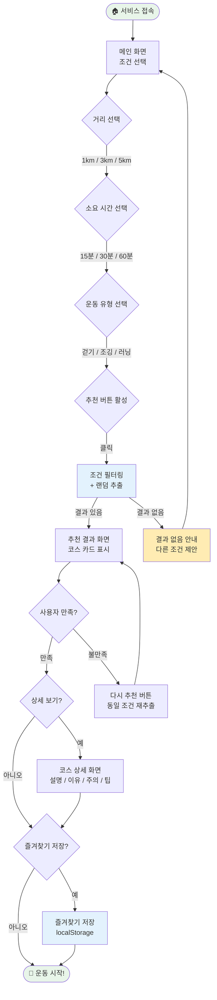
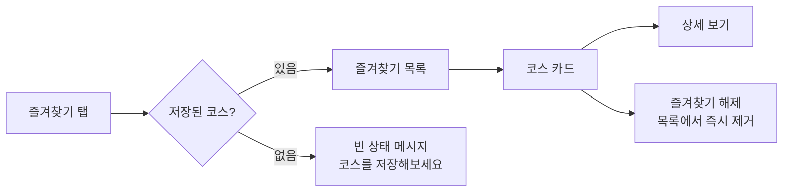
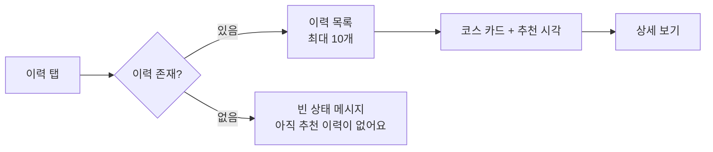
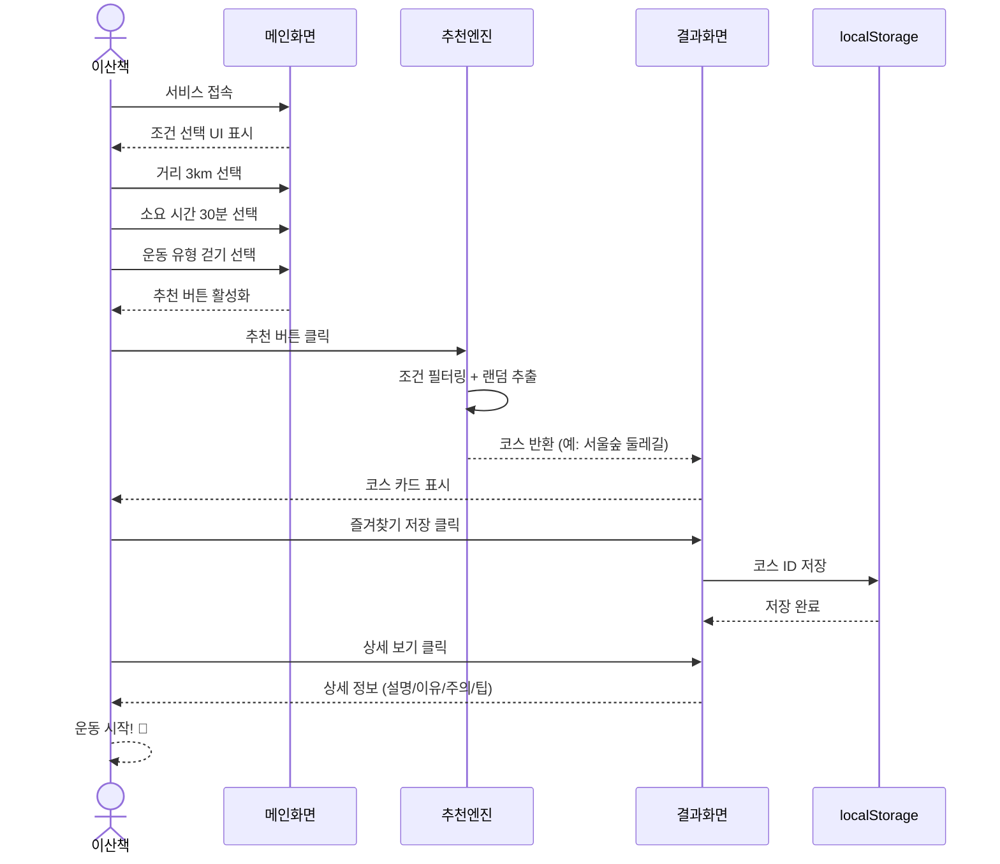
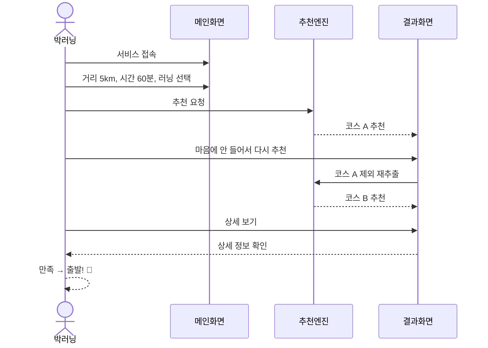
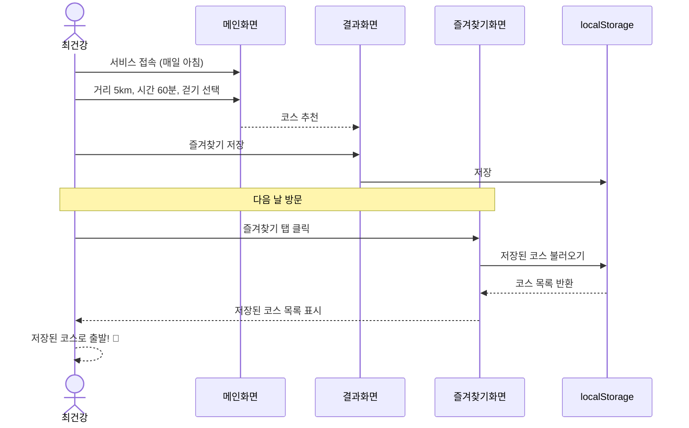
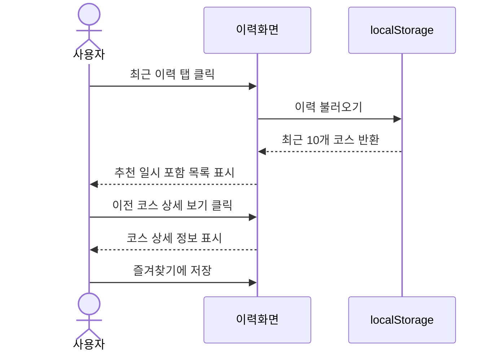
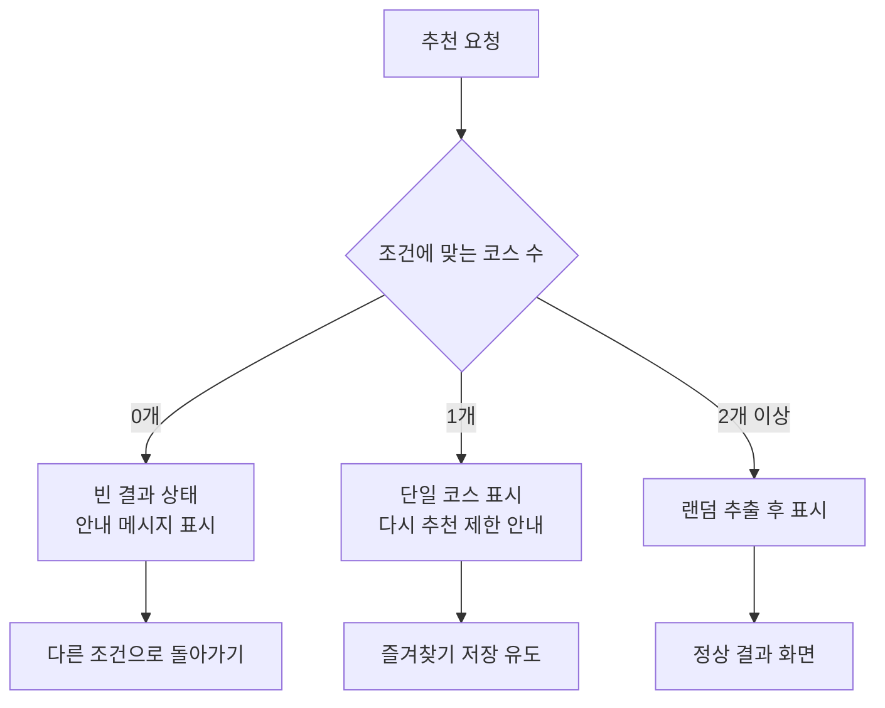
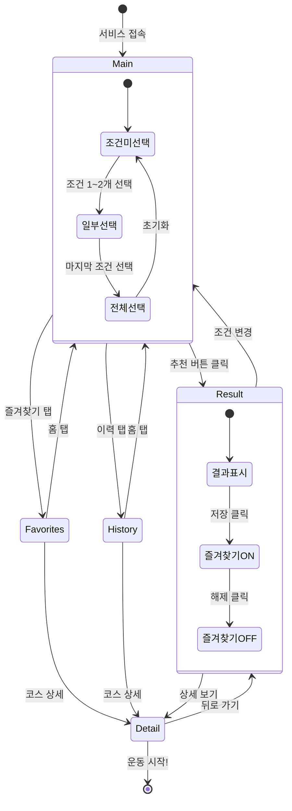
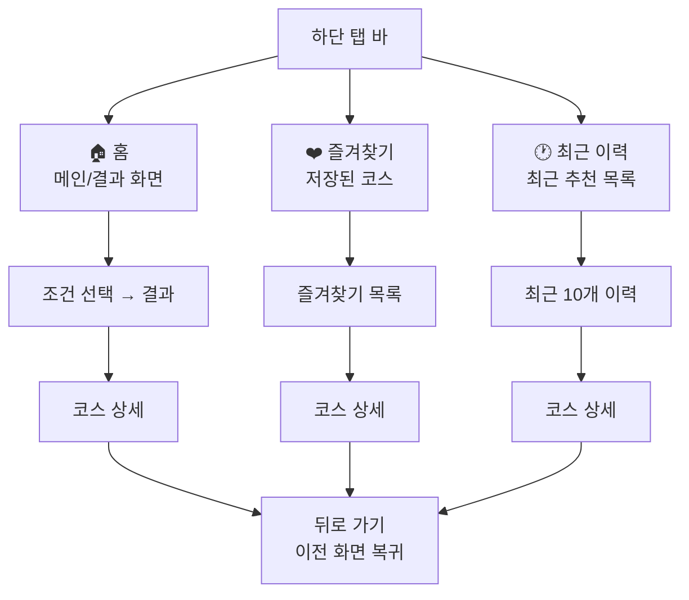

# 04. 사용자 시나리오 & 플로우

> **문서 유형**: UX 설계 / 사용자 플로우  
> **작성일**: 2026.05.28  
> **관련 문서**: [목표 사용자](./02-users-and-value.md) | [요구사항 정의서](./03-requirements.md) | [UI 설계](./05-ui-wireframe.md)

---

## 목차

1. [전체 사용자 플로우](#1-전체-사용자-플로우)
2. [사용자 시나리오](#2-사용자-시나리오)
3. [예외 플로우](#3-예외-플로우)
4. [화면 전환 다이어그램](#4-화면-전환-다이어그램)

---

## 1. 전체 사용자 플로우

### 메인 플로우 다이어그램

### 서브 플로우: 즐겨찾기 관리

### 서브 플로우: 최근 이력

---

## 2. 사용자 시나리오

### 시나리오 1 — 퇴근 후 가볍게 산책 (페르소나 A)

> 직장인 이산책 씨가 퇴근 후 30분 산책을 위해 RWR을 처음 사용하는 상황

**주요 포인트**

- 첫 사용에서 3번 클릭 + 버튼 1번으로 추천 완료
- 즐겨찾기 저장과 상세 보기를 동시에 활용
- 총 소요 시간: 30초 이내

---

### 시나리오 2 — 주말 러닝 코스 탐색 (페르소나 B)

> 박러닝 씨가 주말 아침 새로운 5km 러닝 코스를 찾는 상황

**주요 포인트**

- "다시 추천" 기능으로 처음 결과가 마음에 들지 않아도 자연스럽게 재탐색
- 상세 화면에서 코스 정보를 충분히 파악 후 결정

---

### 시나리오 3 — 매일 8,000보 걷기 목표 (페르소나 C)

> 최건강 씨가 매일 아침 1시간 걷기 목적지를 정하는 상황

**주요 포인트**

- 즐겨찾기 기능으로 매번 조건 선택 없이 바로 재사용 가능
- localStorage 영속성으로 새로고침·재방문 후에도 목록 유지

---

### 시나리오 4 — 이전에 갔던 코스 다시 보기

> 지난주 추천받은 코스가 좋았는데 어떤 코스였는지 확인하는 상황

---

## 3. 예외 플로우

### 예외 케이스 정의

| #   | 상황                    | 처리 방법                                                                 | 사용자 경험                       |
| --- | ----------------------- | ------------------------------------------------------------------------- | --------------------------------- |
| E1  | 조건에 맞는 코스가 없음 | "조건에 맞는 코스가 없어요. 조건을 조금 바꿔보세요." 안내                 | 안내 메시지 + 조건 변경 유도      |
| E2  | 해당 조건 코스가 1개뿐  | 다시 추천 클릭 시 "현재 조건에 코스가 1개뿐이에요." 안내                  | 동일 코스 유지 + 안내 메시지      |
| E3  | localStorage 저장 실패  | try-catch 처리 + 조용한 실패 (서비스 중단 없음)                           | 기능 사용에 이상 없음             |
| E4  | 즐겨찾기가 비어 있음    | 빈 상태 UI: "아직 저장된 코스가 없어요. 마음에 드는 코스를 저장해보세요!" | 빈 상태 일러스트 + 메인 이동 링크 |
| E5  | 이력이 없음             | 빈 상태 UI: "아직 추천 이력이 없어요. 지금 바로 첫 코스를 찾아보세요!"    | 빈 상태 + 메인 이동 링크          |

### 예외 처리 플로우

---

## 4. 화면 전환 다이어그램

### 화면 상태 전환 (State Diagram)

### 내비게이션 구조

---

_다음 문서: [05. UI 설계 & 와이어프레임](./05-ui-wireframe.md)_
