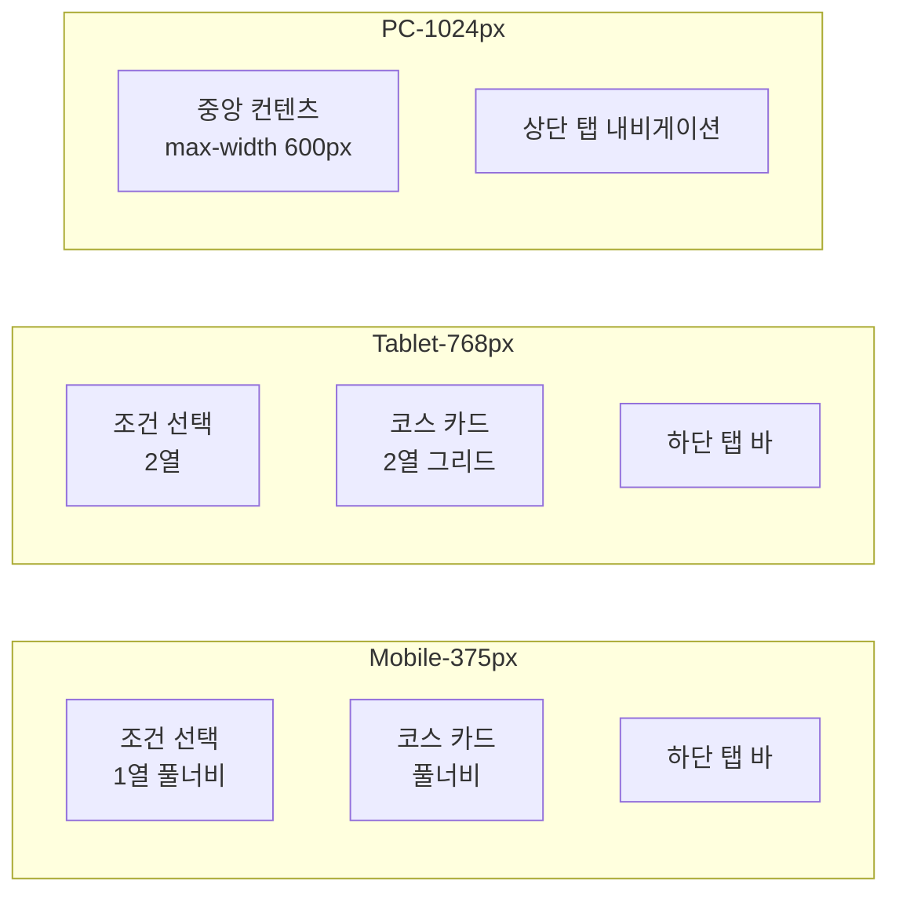
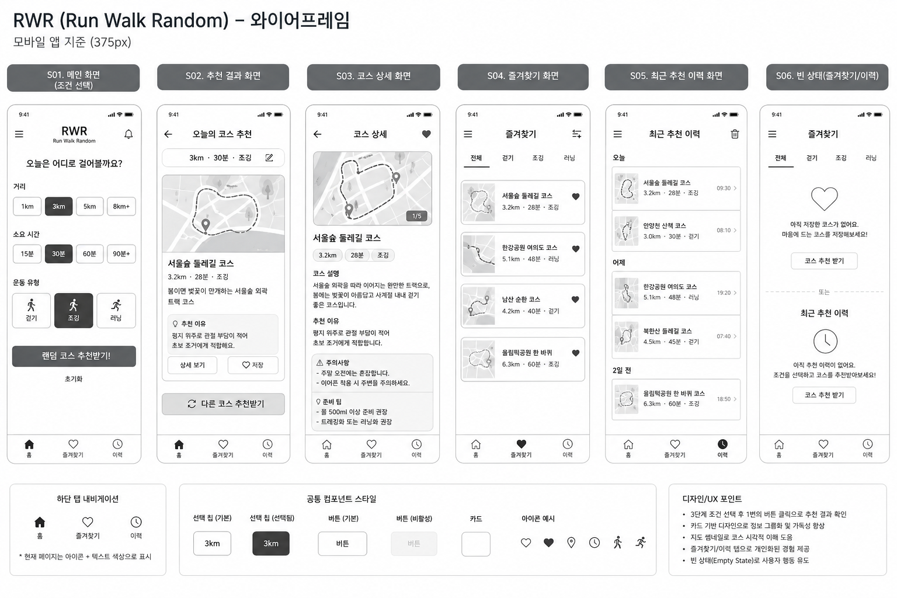
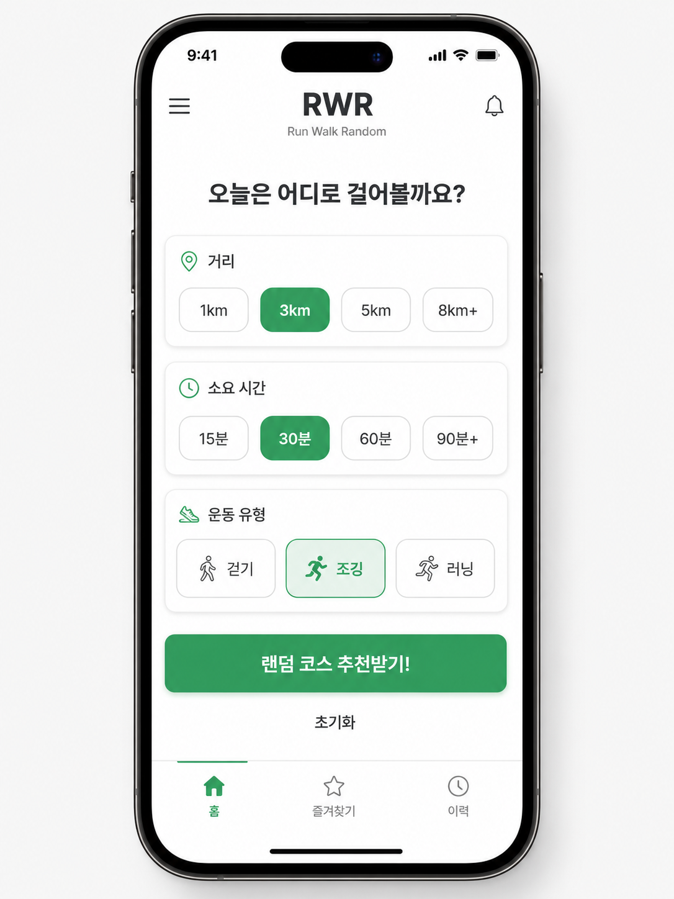
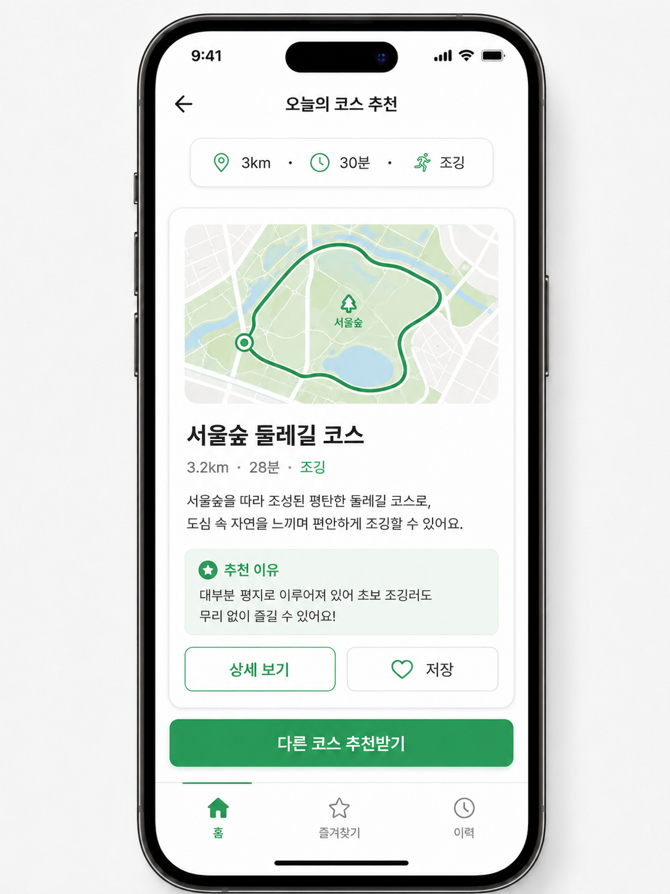
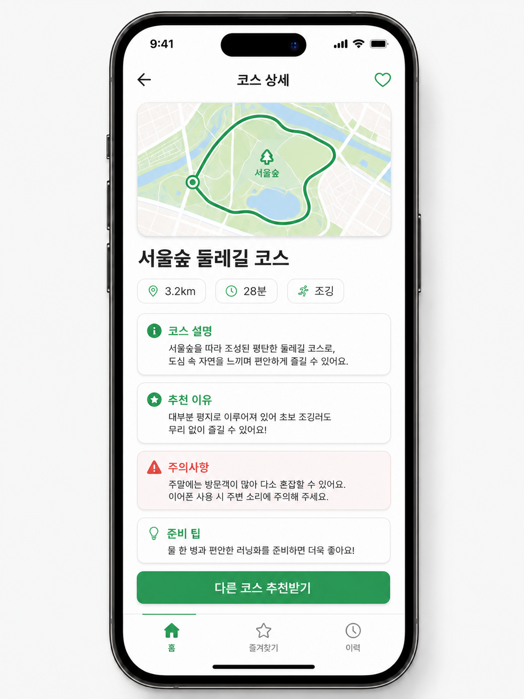
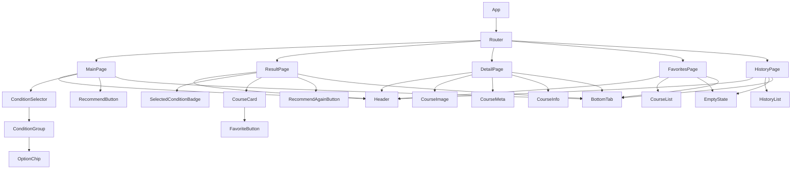

# 05. UI 설계 & 와이어프레임

> **문서 유형**: UI/UX 설계서  
> **작성일**: 2026.05.28  
> **관련 문서**: [사용자 시나리오](./04-user-scenarios.md) | [요구사항 정의서](./03-requirements.md)

---

## 목차

1. [디자인 원칙](#1-디자인-원칙)
2. [레이아웃 시스템](#2-레이아웃-시스템)
3. [화면별 와이어프레임](#3-화면별-와이어프레임)
4. [컴포넌트 정의](#4-컴포넌트-정의)
5. [이미지 생성 프롬프트](#5-이미지-생성-프롬프트)

---

## 1. 디자인 원칙

| 원칙              | 설명                             | 적용 방식                           |
| ----------------- | -------------------------------- | ----------------------------------- |
| **단순함**        | 3클릭으로 추천 완료              | 불필요한 입력 제거, 조건 선택 칩 UI |
| **모바일 우선**   | 375px 기준 설계 후 확장          | CSS mobile-first 미디어 쿼리        |
| **명확한 피드백** | 선택 상태, 저장 상태 시각적 구분 | 색상·아이콘 상태 변화               |
| **접근성**        | 터치 타겟 최소 44px              | 버튼·칩 크기 기준 준수              |
| **빈 상태 UX**    | 비어있는 화면에도 방향 제시      | Empty state 안내 메시지             |

### 컬러 시스템

| 역할            | 색상             | 예시                    |
| --------------- | ---------------- | ----------------------- |
| Primary         | `#4CAF50` (초록) | 추천 버튼, 선택 상태 칩 |
| Primary Dark    | `#388E3C`        | 버튼 hover, 강조 텍스트 |
| Background      | `#F5F5F5`        | 전체 배경               |
| Card            | `#FFFFFF`        | 카드 배경               |
| Text Main       | `#212121`        | 제목, 본문              |
| Text Sub        | `#757575`        | 보조 텍스트, 아이콘     |
| Danger/Caution  | `#FF5252`        | 주의사항 강조           |
| Favorite Active | `#F44336`        | 즐겨찾기 활성 아이콘    |

### 타이포그래피

| 역할          | 크기    | 굵기           |
| ------------- | ------- | -------------- |
| 헤더 (H1)     | 24px    | Bold (700)     |
| 서브헤더 (H2) | 18px    | SemiBold (600) |
| 본문          | 14~16px | Regular (400)  |
| 캡션          | 12px    | Regular (400)  |

---

## 2. 레이아웃 시스템

### 반응형 브레이크포인트

```
Mobile   : 375px ~  767px → 1열 레이아웃, 하단 탭 바
Tablet   : 768px ~ 1023px → 조건 2열, 카드 2열
PC       : 1024px ~ 1280px → 최대 너비 600px 중앙 고정
```



### 전체 레이아웃 구조

```
┌──────────────────────────────┐
│         Header               │  ← 앱 타이틀, 뒤로 가기 버튼
├──────────────────────────────┤
│                              │
│         Main Content         │  ← 화면별 콘텐츠 영역
│                              │
│                              │
├──────────────────────────────┤
│      Bottom Tab Bar          │  ← 홈 / 즐겨찾기 / 이력 탭
└──────────────────────────────┘
```

---

## 3. 화면별 와이어프레임

> 전체 화면 구성 한눈에 보기



---

### S01 — 메인 화면 (조건 선택)

```
┌──────────────────────────────────┐
│  🏃 RWR  Run Walk Random         │  ← 헤더
│  오늘의 코스를 추천해드릴게요!    │
├──────────────────────────────────┤
│                                  │
│  거리                            │  ← 섹션 레이블
│  ┌──────┐ ┌──────┐ ┌──────┐     │
│  │  1km │ │■3km■ │ │  5km │     │  ← 선택 칩 (선택됨: 초록 배경)
│  └──────┘ └──────┘ └──────┘     │
│                                  │
│  소요 시간                        │
│  ┌──────┐ ┌──────┐ ┌──────┐     │
│  │ 15분 │ │ 30분 │ │ 60분 │     │
│  └──────┘ └──────┘ └──────┘     │
│                                  │
│  운동 유형                        │
│  ┌──────┐ ┌──────┐ ┌──────┐     │
│  │ 걷기 │ │■조깅■│ │러닝  │     │
│  └──────┘ └──────┘ └──────┘     │
│                                  │
│  ┌──────────────────────────┐   │
│  │    🎲 코스 추천받기!     │   │  ← CTA 버튼 (조건 3개 선택시 활성)
│  └──────────────────────────┘   │
│                                  │
│  [초기화]                         │  ← 텍스트 버튼
├──────────────────────────────────┤
│   🏠홈    ❤️즐겨찾기   🕐이력   │  ← 하단 탭 바
└──────────────────────────────────┘
```

**UX 포인트**

- 선택된 칩: `background: #4CAF50`, 텍스트 흰색
- 추천 버튼: 3개 미선택 시 `opacity: 0.4` + `cursor: not-allowed`
- 초기화: 하단 텍스트 링크 스타일

**디자인 시안**



---

### S02 — 추천 결과 화면

```
┌──────────────────────────────────┐
│  ← 뒤로    오늘의 코스 추천      │  ← 헤더
├──────────────────────────────────┤
│                                  │
│  ✅ 조건: 3km · 30분 · 조깅      │  ← 선택 조건 요약 칩
│                                  │
│  ┌──────────────────────────┐   │
│  │  🗺️ 코스 이미지           │   │  ← 코스 썸네일 (이미지 or 색상)
│  │                          │   │
│  │  서울숲 둘레길            │   │  ← 코스명
│  │  3km · 30분 · 조깅       │   │  ← 메타 정보
│  │                          │   │
│  │  봄이면 벚꽃이 만개하는   │   │  ← 짧은 설명
│  │  서울숲 외곽 트랙 코스    │   │
│  │                          │   │
│  │  💡 추천 이유: 평지 위주  │   │  ← 추천 이유 (강조)
│  │  관절 부담 적은 조깅용    │   │
│  │                          │   │
│  │  [상세 보기]    [❤️ 저장] │   │  ← 액션 버튼
│  └──────────────────────────┘   │
│                                  │
│  ┌──────────────────────────┐   │
│  │  🔄 다른 코스 추천받기   │   │  ← 다시 추천 버튼
│  └──────────────────────────┘   │
│                                  │
├──────────────────────────────────┤
│   🏠홈    ❤️즐겨찾기   🕐이력   │
└──────────────────────────────────┘
```

**디자인 시안**



---

### S03 — 코스 상세 화면

```
┌──────────────────────────────────┐
│  ← 결과로    서울숲 둘레길  ❤️   │  ← 헤더 + 즐겨찾기 토글
├──────────────────────────────────┤
│                                  │
│  ┌──────────────────────────┐   │
│  │       코스 이미지         │   │
│  └──────────────────────────┘   │
│                                  │
│  🏷️  3km  ·  30분  ·  조깅       │  ← 핵심 메타 태그
│                                  │
│  📝 코스 설명                    │
│  서울숲 외곽을 따라 이어지는      │
│  완만한 트랙으로, 봄에는 벚꽃이  │
│  만개해 경관이 아름답습니다.      │
│                                  │
│  💡 추천 이유                    │
│  평지 위주로 관절 부담이 적어     │
│  초보 조거에게 적합합니다.        │
│                                  │
│  ⚠️ 주의사항                    │  ← 경고 색상 강조
│  주말 오전에는 혼잡합니다.        │
│  이어폰 착용 시 주변을 주의하세요.│
│                                  │
│  🎒 준비 팁                      │
│  물 500ml 이상 준비 권장          │
│  트레킹화 또는 러닝화 권장        │
│                                  │
│  ┌──────────────────────────┐   │
│  │  🎲 다른 코스 추천받기   │   │
│  └──────────────────────────┘   │
│                                  │
├──────────────────────────────────┤
│   🏠홈    ❤️즐겨찾기   🕐이력   │
└──────────────────────────────────┘
```

**디자인 시안**



---

### S04 — 즐겨찾기 화면

```
┌──────────────────────────────────┐
│  내 즐겨찾기                      │
├──────────────────────────────────┤
│                                  │
│  ┌──────────────────────────┐   │
│  │ ❤️ 서울숲 둘레길          │   │
│  │ 3km · 30분 · 조깅        │   │
│  │ 봄이면 벚꽃이 만개하는...  │   │
│  │            [상세보기] [삭제]│   │
│  └──────────────────────────┘   │
│                                  │
│  ┌──────────────────────────┐   │
│  │ ❤️ 남산 순환 산책로       │   │
│  │ 5km · 60분 · 걷기        │   │
│  │ 서울 도심을 내려다보며... │   │
│  │            [상세보기] [삭제]│   │
│  └──────────────────────────┘   │
│                                  │
│           (빈 상태)               │
│  ┌──────────────────────────┐   │
│  │  😢  저장된 코스가 없어요 │   │
│  │  코스를 추천받고          │   │
│  │  ❤️를 눌러 저장해보세요! │   │
│  │                          │   │
│  │     [코스 추천 받으러 가기]│   │
│  └──────────────────────────┘   │
│                                  │
├──────────────────────────────────┤
│   🏠홈    ❤️즐겨찾기   🕐이력   │
└──────────────────────────────────┘
```

---

### S05 — 최근 추천 이력 화면

```
┌──────────────────────────────────┐
│  최근 추천 이력   (최대 10개)     │
├──────────────────────────────────┤
│                                  │
│  ┌──────────────────────────┐   │
│  │ 🕐 2026.05.28  08:32      │   │  ← 추천 시각
│  │ 서울숲 둘레길             │   │
│  │ 3km · 30분 · 조깅        │   │
│  │             [상세보기] ❤️ │   │
│  └──────────────────────────┘   │
│                                  │
│  ┌──────────────────────────┐   │
│  │ 🕐 2026.05.27  19:15      │   │
│  │ 한강 반포 구간            │   │
│  │ 5km · 60분 · 러닝        │   │
│  │             [상세보기] ❤️ │   │
│  └──────────────────────────┘   │
│                                  │
│           (빈 상태)               │
│  ┌──────────────────────────┐   │
│  │  🔍  아직 추천 이력이     │   │
│  │      없어요               │   │
│  │  지금 바로 첫 코스를      │   │
│  │  추천받아 보세요!         │   │
│  │  [코스 추천 받으러 가기]  │   │
│  └──────────────────────────┘   │
│                                  │
├──────────────────────────────────┤
│   🏠홈    ❤️즐겨찾기   🕐이력   │
└──────────────────────────────────┘
```

---

## 4. 컴포넌트 정의

### 컴포넌트 계층 구조



### 주요 컴포넌트 명세

| 컴포넌트         | Props                                      | 역할                           |
| ---------------- | ------------------------------------------ | ------------------------------ |
| `OptionChip`     | `label`, `selected`, `onClick`             | 조건 선택 칩                   |
| `ConditionGroup` | `title`, `options`, `selected`, `onSelect` | 조건 그룹 (거리/시간/유형)     |
| `CourseCard`     | `course`, `isFavorite`, `onFavoriteToggle` | 코스 카드 (결과·즐겨찾기·이력) |
| `FavoriteButton` | `active`, `onClick`                        | 즐겨찾기 토글 버튼             |
| `EmptyState`     | `message`, `linkLabel`, `onLink`           | 빈 상태 UI                     |
| `BottomTab`      | `activeTab`, `onChange`                    | 하단 탭 바                     |
| `CourseInfo`     | `course`                                   | 코스 설명/이유/주의/팁 섹션    |

---

## 5. 이미지 생성 프롬프트

> DALL·E / Midjourney 등을 활용해 실제 목업 이미지 제작 시 사용 가능한 프롬프트입니다.

### 메인 화면 목업

```
(영문)
Mobile app UI design, white background, minimal and clean style.
Screen title: "RWR Run Walk Random".
Three condition selection sections: Distance (1km/3km/5km chips),
Duration (15min/30min/60min chips), Activity Type (Walk/Jog/Run chips).
One chip per section highlighted in green (#4CAF50).
Large green CTA button at bottom: "Get Course Recommendation".
Bottom navigation bar with three tabs: Home, Favorites, History.
Korean UI text, mobile 375px width, soft shadows, rounded corners.

(한글 설명)
모바일 앱 UI, 흰 배경, 미니멀 디자인.
타이틀: "RWR Run Walk Random".
거리/소요시간/운동유형 3개 조건 선택 섹션,
각 섹션에 선택 칩 3개, 하나는 초록색으로 선택된 상태.
하단 "코스 추천받기" 초록 버튼, 하단 탭 바(홈/즐겨찾기/이력).
```

### 추천 결과 화면 목업

```
(영문)
Mobile app recommendation result screen.
Header with back button and title "Today's Course Recommendation".
Selected condition summary chips (3km · 30min · Jog) at the top.
Large white card with course image placeholder, course name in bold,
short description, reason for recommendation, action buttons (Detail / Favorite heart icon).
Green button at bottom: "Recommend Another Course".
Bottom navigation bar. Korean UI text. Clean and minimal style.
```

### 코스 상세 화면 목업

```
(영문)
Mobile app course detail screen.
Header: back arrow on left, course name in center, heart icon on right.
Top image banner (scenery of a park or river path).
Tag badges: distance, duration, activity type.
Four info sections with icons: Course Description, Recommendation Reason,
Caution (red text), Preparation Tips.
Bottom green button: "Recommend Another Course".
Korean UI text, clean white card design, soft drop shadow.
```

---

_다음 문서: [06. 데이터 명세](./06-data-spec.md)_
