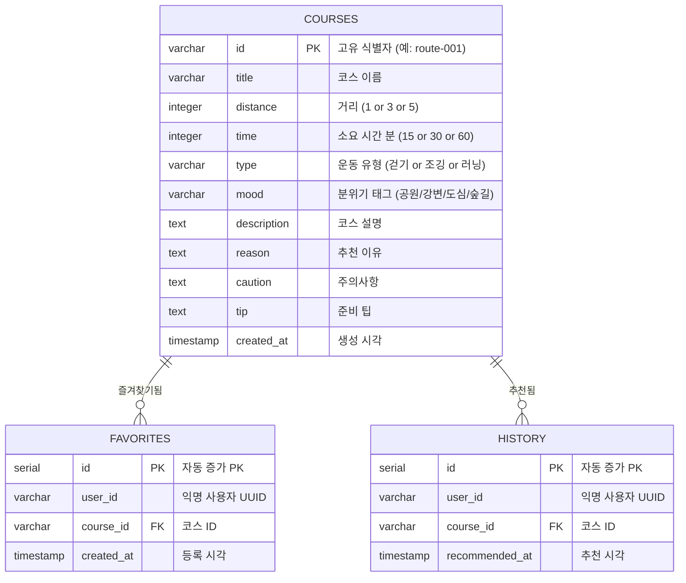

# 06. 데이터 명세

> **문서 유형**: 데이터 설계 / 기술 명세  
> **작성일**: 2026.05.28  
> **최종 수정일**: 2026.05.29 (PostgreSQL DB + REST API 구조로 전환)  
> **관련 문서**: [요구사항 정의서](./03-requirements.md) | [기술 스택](./07-tech-stack.md)

---

## 목차

1. [코스 데이터 모델](#1-코스-데이터-모델)
2. [PostgreSQL DB 스키마](#2-postgresql-db-스키마)
3. [샘플 코스 시드 데이터](#3-샘플-코스-시드-데이터)
4. [REST API 명세](#4-rest-api-명세)
5. [사용자 식별 구조 (익명 UUID)](#5-사용자-식별-구조-익명-uuid)
6. [데이터 흐름 다이어그램](#6-데이터-흐름-다이어그램)

---

## 1. 코스 데이터 모델

### DB 테이블 관계 (ERD)



### courses 테이블 필드 상세

| 컬럼명        | DB 타입        | 허용 값                                | 예시                  |
| ------------- | -------------- | -------------------------------------- | --------------------- |
| `id`          | `VARCHAR(20)`  | 형식: `route-NNN`                      | `'route-001'`         |
| `title`       | `VARCHAR(100)` | 한국어 코스명                          | `'서울숲 둘레길'`     |
| `distance`    | `INTEGER`      | `1`, `3`, `5` (km)                     | `3`                   |
| `time`        | `INTEGER`      | `15`, `30`, `60` (분)                  | `30`                  |
| `type`        | `VARCHAR(20)`  | `'걷기'`, `'조깅'`, `'러닝'`           | `'조깅'`              |
| `mood`        | `VARCHAR(20)`  | `'공원'`, `'강변'`, `'도심'`, `'숲길'` | `'공원'`              |
| `description` | `TEXT`         | 1~2문장 자유 텍스트                    | `'봄이면 벚꽃이...'`  |
| `reason`      | `TEXT`         | 1문장 추천 이유                        | `'평지 위주로...'`    |
| `caution`     | `TEXT`         | 1~2문장 주의사항                       | `'주말 오전 혼잡...'` |
| `tip`         | `TEXT`         | 1~2문장 준비 팁                        | `'물 500ml 이상...'`  |
| `created_at`  | `TIMESTAMP`    | DEFAULT NOW()                          | -                     |

### favorites / history 테이블 필드 상세

| 컬럼명           | 테이블    | DB 타입       | 설명                                 |
| ---------------- | --------- | ------------- | ------------------------------------ |
| `id`             | 공통      | `SERIAL PK`   | 자동 증가                            |
| `user_id`        | 공통      | `VARCHAR(36)` | 익명 UUID (브라우저 첫 방문 시 생성) |
| `course_id`      | 공통      | `VARCHAR(20)` | courses.id 참조 (FK)                 |
| `created_at`     | favorites | `TIMESTAMP`   | 즐겨찾기 등록 시각                   |
| `recommended_at` | history   | `TIMESTAMP`   | 추천 발생 시각                       |

> **UNIQUE 제약**: `favorites(user_id, course_id)` 조합은 중복 불가

---

## 2. PostgreSQL DB 스키마

### schema.sql

```sql
-- server/src/db/schema.sql

-- 코스 테이블
CREATE TABLE IF NOT EXISTS courses (
  id           VARCHAR(20)  PRIMARY KEY,
  title        VARCHAR(100) NOT NULL,
  distance     INTEGER      NOT NULL CHECK (distance IN (1, 3, 5)),
  time         INTEGER      NOT NULL CHECK (time IN (15, 30, 60)),
  type         VARCHAR(20)  NOT NULL CHECK (type IN ('걷기', '조깅', '러닝')),
  mood         VARCHAR(20)  NOT NULL CHECK (mood IN ('공원', '강변', '도심', '숲길')),
  description  TEXT         NOT NULL,
  reason       TEXT         NOT NULL,
  caution      TEXT         NOT NULL,
  tip          TEXT         NOT NULL,
  created_at   TIMESTAMP    NOT NULL DEFAULT NOW()
);

-- 즐겨찾기 테이블
CREATE TABLE IF NOT EXISTS favorites (
  id         SERIAL       PRIMARY KEY,
  user_id    VARCHAR(36)  NOT NULL,
  course_id  VARCHAR(20)  NOT NULL REFERENCES courses(id) ON DELETE CASCADE,
  created_at TIMESTAMP    NOT NULL DEFAULT NOW(),
  UNIQUE (user_id, course_id)
);

-- 추천 이력 테이블
CREATE TABLE IF NOT EXISTS history (
  id               SERIAL      PRIMARY KEY,
  user_id          VARCHAR(36) NOT NULL,
  course_id        VARCHAR(20) NOT NULL REFERENCES courses(id) ON DELETE CASCADE,
  recommended_at   TIMESTAMP   NOT NULL DEFAULT NOW()
);

-- 조회 성능을 위한 인덱스
CREATE INDEX IF NOT EXISTS idx_courses_filter    ON courses(distance, time, type);
CREATE INDEX IF NOT EXISTS idx_favorites_user    ON favorites(user_id);
CREATE INDEX IF NOT EXISTS idx_history_user_time ON history(user_id, recommended_at DESC);
```

---

## 3. 샘플 코스 시드 데이터

> 기존 `routeData.js` 정적 배열 데이터를 `seed.sql` INSERT 문으로 변환합니다.

### seed.sql 전체

````sql
-- server/src/db/seed.sql

INSERT INTO courses (id, title, distance, time, type, mood, description, reason, caution, tip) VALUES

```sql
('route-001', '서울숲 둘레길', 3, 30, '조깅', '공원',
  '봄이면 벚꽃이 만개하는 서울숲 외곽 트랙 코스입니다. 평탄한 지형으로 꾸준한 페이스를 유지하기 좋습니다.',
  '평지 위주로 관절 부담이 적어 초보 조거에게 적합합니다.',
  '주말 오전에는 이용객이 많아 혼잡합니다. 이어폰 착용 시 주변을 주의하세요.',
  '물 500ml 이상 준비를 권장합니다. 트레킹화 또는 러닝화를 착용하세요.'),

('route-002', '한강 반포 구간', 5, 60, '러닝', '강변',
  '한강 반포지구에서 잠원지구까지 이어지는 강변 러닝 코스입니다. 탁 트인 강 뷰가 인상적입니다.',
  '강변의 시원한 바람 속에서 장거리 러닝 훈련에 최적인 코스입니다.',
  '강풍이 강할 수 있으니 가벼운 바람막이를 준비하세요.',
  '일출·일몰 시간대에 달리면 경치가 특히 아름답습니다.'),
('route-003', '북악산 자락길', 5, 60, '걷기', '숲길',
  '북악산 중턱을 따라 이어지는 흙길 산책로입니다. 도심 속에서 숲의 공기를 느낄 수 있습니다.',
  '경사가 완만하고 나무 그늘이 많아 여름철 무더위에도 쾌적합니다.',
  '일부 구간이 가파르니 등산화 착용을 권장합니다.',
  '선크림과 모기 기피제를 챙기세요. 화장실은 입구에만 있습니다.'),
('route-004', '여의도 한강공원 순환', 3, 30, '러닝', '강변',
  '여의도 한강공원을 한 바퀴 돌아오는 평탄한 러닝 코스입니다. 야경이 아름다워 저녁 러닝에 특히 인기입니다.',
  '조명이 잘 되어 있어 야간 러닝도 안전하게 즐길 수 있습니다.',
  '벚꽃 시즌에는 인파가 매우 많으니 주의하세요.',
  '주차 공간이 부족하니 대중교통 이용을 권장합니다.'),
('route-005', '월드컵공원 노을길', 3, 30, '걷기', '공원',
  '노을공원과 하늘공원을 잇는 완만한 산책로입니다. 석양 무렵 노을이 아름답기로 유명합니다.',
  '평탄한 포장길로 유모차나 노약자도 편하게 이용 가능합니다.',
  '해 질 녘 이후에는 조명이 부족한 구간이 있으니 손전등을 챙기세요.',
  '노을 시간대(오후 5~7시)에 방문하면 경치가 가장 좋습니다.'),
('route-006', '남산 순환 산책로', 5, 60, '걷기', '숲길',
  '남산을 한 바퀴 도는 전통적인 서울 산책 코스입니다. N서울타워를 바라보며 걷는 경험이 색다릅니다.',
  '도심 한복판에서 숲길 트레킹을 즐길 수 있는 서울 대표 코스입니다.',
  '경사 구간이 있으니 편한 신발을 착용하세요.',
  'N서울타워에서 서울 전경을 감상하는 것도 추천합니다.'),

('route-007', '청계천 산책길', 1, 15, '걷기', '도심',
  '광화문에서 청계천을 따라 걷는 도심 속 힐링 코스입니다. 물소리와 도심의 정취를 동시에 느낄 수 있습니다.',
  '짧고 간단하게 기분 전환이 필요할 때 딱 맞는 도심 산책 코스입니다.',
  '계단이 많으니 무릎이 좋지 않다면 평지 구간만 이용하세요.',
  '저녁 조명이 켜지는 시간대(7~9시)에 분위기가 가장 좋습니다.'),
('route-008', '올림픽공원 들길', 1, 15, '조깅', '공원',
  '올림픽공원 내 넓은 잔디밭과 들길을 따라 가볍게 조깅하는 코스입니다. 도심 속 힐링 공간으로 사랑받습니다.',
  '트랙이 아닌 잔디길 위 조깅으로 무릎 충격을 줄이면서 운동할 수 있습니다.',
  '잔디 구간은 비 온 후 미끄러울 수 있으니 날씨를 확인하세요.',
  '9호선 올림픽공원역과 5호선 올림픽공원역 모두 근접합니다.'),
('route-009', '뚝섬 한강공원 코스', 3, 30, '걷기', '강변',
  '뚝섬 한강공원을 따라 걷는 가족 친화적 산책 코스입니다. 분수대와 어린이 놀이 공간이 있어 활기차고 즐거운 분위기입니다.',
  '평탄하고 넓은 인도로 안전하며, 각종 편의시설이 잘 갖춰져 있습니다.',
  '자전거 전용 도로와 보행 구간을 혼동하지 않도록 주의하세요.',
  '편의점과 카페가 공원 내에 있어 간식을 챙기기 편합니다.'),

  {
    id: "route-010",
    title: "수락산 입구 둘레길",
    distance: 5,
('route-010', '수락산 입구 둘레길', 5, 60, '조깅', '숲길',
  '수락산 입구를 따라 이어지는 완만한 산 아래 둘레길입니다. 도시에서 벗어나 자연 속에서 조깅을 즐길 수 있습니다.',
  '경사가 낮은 편이라 산을 좋아하지만 격한 운동은 피하고 싶은 분에게 추천합니다.',
  '산길이므로 날이 어두워진 뒤에는 입산을 자제하세요.',
  '등산용 스틱이 있으면 하산 시 무릎 보호에 도움이 됩니다.')
ON CONFLICT (id) DO NOTHING;
````

````

### 코스 데이터 요약표

| ID        | 코스명               | 거리 | 시간 | 유형 | 분위기 |
| --------- | -------------------- | :--: | :--: | :--: | :----: |
| route-001 | 서울숲 둘레길        | 3km  | 30분 | 조깅 |  공원  |
| route-002 | 한강 반포 구간       | 5km  | 60분 | 러닝 |  강변  |
| route-003 | 북악산 자락길        | 5km  | 60분 | 걷기 |  숲길  |
| route-004 | 여의도 한강공원 순환 | 3km  | 30분 | 러닝 |  강변  |
| route-005 | 월드컵공원 노을길    | 3km  | 30분 | 걷기 |  공원  |
| route-006 | 남산 순환 산책로     | 5km  | 60분 | 걷기 |  숲길  |
| route-007 | 청계천 산책길        | 1km  | 15분 | 걷기 |  도심  |
| route-008 | 올림픽공원 들길      | 1km  | 15분 | 조깅 |  공원  |
| route-009 | 뚝섬 한강공원 코스   | 3km  | 30분 | 걷기 |  강변  |
| route-010 | 수락산 입구 둘레길   | 5km  | 60분 | 조깅 |  숲길  |

---

## 4. REST API 명세

> Base URL: `http://localhost:3000/api`

### 응답 형식 공통 규칙

```json
// 성공
{ "success": true, "data": { ... } }

// 실패
{ "success": false, "message": "에러 설명" }
````

---

### 코스 API

#### `GET /courses` — 코스 목록 조회 (필터 지원)

| 파라미터   | 타입      | 필수 | 허용값                 | 설명          |
| ---------- | --------- | ---- | ---------------------- | ------------- |
| `distance` | `integer` | 선택 | `1`, `3`, `5`          | 거리(km) 필터 |
| `time`     | `integer` | 선택 | `15`, `30`, `60`       | 시간(분) 필터 |
| `type`     | `string`  | 선택 | `걷기`, `조깅`, `러닝` | 유형 필터     |

```
GET /api/courses?distance=3&time=30&type=조깅
```

#### `GET /courses/random` — 랜덤 코스 추천

| 파라미터   | 타입      | 필수 | 설명                       |
| ---------- | --------- | ---- | -------------------------- |
| `distance` | `integer` | 필수 | 거리 조건                  |
| `time`     | `integer` | 필수 | 시간 조건                  |
| `type`     | `string`  | 필수 | 유형 조건                  |
| `exclude`  | `string`  | 선택 | 제외할 코스 ID (다시 추천) |

```
GET /api/courses/random?distance=3&time=30&type=조깅&exclude=route-001
```

#### `GET /courses/:id` — 코스 상세 조회

```
GET /api/courses/route-001
```

---

### 즐겨찾기 API

#### `GET /favorites` — 즐겨찾기 목록 조회

| 파라미터 | 타입     | 필수 | 설명             |
| -------- | -------- | ---- | ---------------- |
| `userId` | `string` | 필수 | 익명 사용자 UUID |

```
GET /api/favorites?userId=550e8400-e29b-41d4-a716-446655440000
```

#### `POST /favorites` — 즐겨찾기 추가

```json
// Request Body
{ "userId": "550e8400-e29b-41d4-a716-446655440000", "courseId": "route-001" }
```

#### `DELETE /favorites/:courseId` — 즐겨찾기 해제

| 파라미터   | 위치        | 설명             |
| ---------- | ----------- | ---------------- |
| `courseId` | path param  | 코스 ID          |
| `userId`   | query param | 익명 사용자 UUID |

```
DELETE /api/favorites/route-001?userId=550e8400-e29b-41d4-a716-446655440000
```

---

### 이력 API

#### `GET /history` — 추천 이력 조회

| 파라미터 | 타입      | 필수 | 기본값 | 설명             |
| -------- | --------- | ---- | ------ | ---------------- |
| `userId` | `string`  | 필수 | -      | 익명 사용자 UUID |
| `limit`  | `integer` | 선택 | `10`   | 최대 반환 건수   |

```
GET /api/history?userId=550e8400-e29b-41d4-a716-446655440000&limit=10
```

#### `POST /history` — 추천 이력 저장

```json
// Request Body
{ "userId": "550e8400-e29b-41d4-a716-446655440000", "courseId": "route-001" }
```

---

### 조건 조합 커버리지 (시드 데이터 기준)

|    거리    | 시간 | 유형 |     해당 코스 수     |
| :--------: | :--: | :--: | :------------------: |
|    1km     | 15분 | 걷기 |   1개 (route-007)    |
|    1km     | 15분 | 조깅 |   1개 (route-008)    |
|    3km     | 30분 | 걷기 | 2개 (route-005, 009) |
|    3km     | 30분 | 조깅 |   1개 (route-001)    |
|    3km     | 30분 | 러닝 |   1개 (route-004)    |
|    5km     | 60분 | 걷기 | 2개 (route-003, 006) |
|    5km     | 60분 | 조깅 |   1개 (route-010)    |
|    5km     | 60분 | 러닝 |   1개 (route-002)    |
| 그 외 조합 |  -   |  -   |  0개 (빈 결과 안내)  |

> ℹ️ **설계 주의**: 1km + 15분 + 걷기 조합은 현재 데이터 없음 → 빈 결과 안내 화면으로 처리

---

## 5. 사용자 식별 구조 (익명 UUID)

### 왜 익명 UUID가 필요한가

이 프로젝트는 회원 가입/로그인 없이도 즐겨찾기와 이력을 사용자별로 저장해야 합니다.  
브라우저 첫 방문 시 UUID를 생성해 localStorage에 저장하고, 모든 API 요청의 `userId`로 사용합니다.

### localStorage 키 설계

| localStorage 키 | 값 타입  | 설명                                          |
| --------------- | -------- | --------------------------------------------- |
| `rwr_user_id`   | `string` | 익명 UUID (첫 방문 시 생성, 이후 계속 재사용) |

### userIdentity.js 명세

```js
// client/src/utils/userIdentity.js

const USER_ID_KEY = "rwr_user_id";

/**
 * 익명 사용자 ID를 반환합니다.
 * localStorage에 없으면 UUID를 새로 생성해 저장합니다.
 * @returns {string} UUID
 */
export function getUserId() {
  let userId = localStorage.getItem(USER_ID_KEY);
  if (!userId) {
    userId = crypto.randomUUID(); // 브라우저 내장 API (ES2022)
    localStorage.setItem(USER_ID_KEY, userId);
  }
  return userId;
}
```

### 보안 주의사항

- 이 UUID는 인증 수단이 아닙니다. 다른 기기에서는 다른 UUID가 생성됩니다.
- localStorage 초기화 시 즐겨찾기/이력이 새 UUID로 분리됩니다.
- MVP 범위에서는 이 수준의 식별로 충분합니다. 실제 인증이 필요하면 별도 로그인 기능 추가가 필요합니다.
- `userId`는 서버에서 UUID 형식 검증(`/^[0-9a-f-]{36}$/`)을 수행합니다.

---

## 6. 데이터 흐름 다이어그램

```mermaid
flowchart TD
    subgraph 클라이언트
        LS[localStorage\nrwr_user_id]
        UI[조건 선택 UI]
        UUID[getUserId()]
    end

    subgraph Express API
        RC[GET /courses/random]
        FC[POST/DELETE /favorites]
        HC[POST /history]
        FG[GET /favorites]
        HG[GET /history]
    end

    subgraph PostgreSQL
        CT[(courses)]
        FT[(favorites)]
        HT[(history)]
    end

    subgraph 화면
        Result[추천 결과 화면]
        Detail[상세 화면]
        FavPage[즐겨찾기 화면]
        HistPage[이력 화면]
    end

    LS --> UUID
    UUID -- userId 포함 --> RC
    UI --> RC
    RC --> CT
    CT --> Result
    Result --> HC
    HC --> HT
    Result --> FC
    FC --> FT
    FG -- userId --> FT
    FT --> FavPage
    HG -- userId --> HT
    HT --> HistPage
    Result --> Detail
    FavPage --> Detail
    HistPage --> Detail
```

---

_다음 문서: [07. 기술 스택 & 아키텍처](./07-tech-stack.md)_
