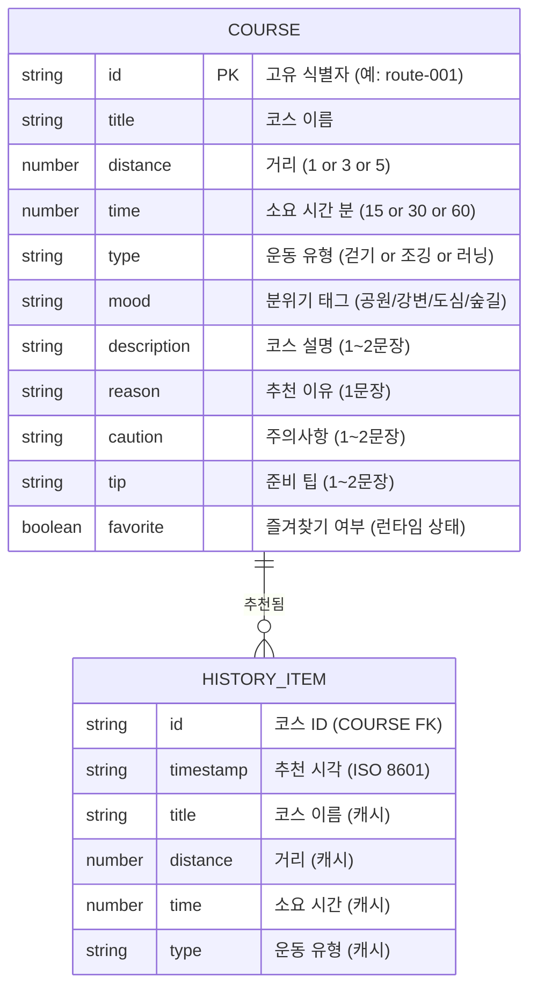
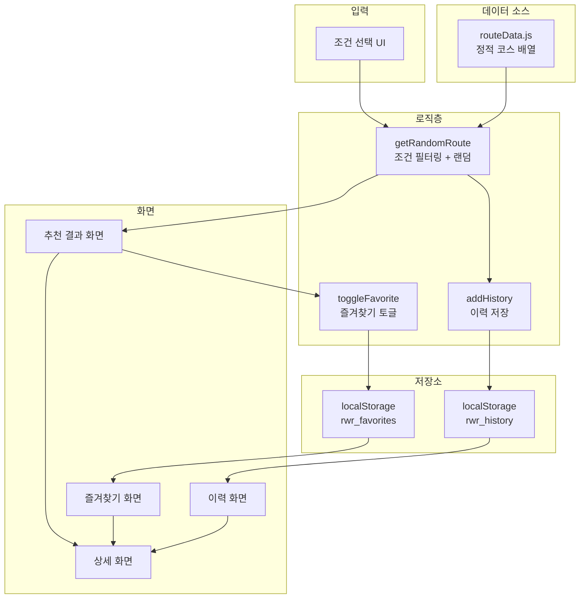

# 06. 데이터 명세

> **문서 유형**: 데이터 설계 / 기술 명세  
> **작성일**: 2026.05.28  
> **관련 문서**: [요구사항 정의서](./03-requirements.md) | [기술 스택](./07-tech-stack.md)

---

## 목차

1. [코스 데이터 모델](#1-코스-데이터-모델)
2. [샘플 코스 데이터](#2-샘플-코스-데이터)
3. [추천 로직 명세](#3-추천-로직-명세)
4. [localStorage 데이터 구조](#4-localstorage-데이터-구조)
5. [데이터 흐름 다이어그램](#5-데이터-흐름-다이어그램)

---

## 1. 코스 데이터 모델

### 코스 객체 필드 명세



### 필드 타입 상세

| 필드명        | 타입     | 허용 값                                | 예시                  |
| ------------- | -------- | -------------------------------------- | --------------------- |
| `id`          | `string` | 형식: `route-NNN`                      | `"route-001"`         |
| `title`       | `string` | 한국어 코스명                          | `"서울숲 둘레길"`     |
| `distance`    | `number` | `1`, `3`, `5` (km)                     | `3`                   |
| `time`        | `number` | `15`, `30`, `60` (분)                  | `30`                  |
| `type`        | `string` | `"걷기"`, `"조깅"`, `"러닝"`           | `"조깅"`              |
| `mood`        | `string` | `"공원"`, `"강변"`, `"도심"`, `"숲길"` | `"공원"`              |
| `description` | `string` | 1~2문장 자유 텍스트                    | `"봄이면 벚꽃이..."`  |
| `reason`      | `string` | 1문장 추천 이유                        | `"평지 위주로..."`    |
| `caution`     | `string` | 1~2문장 주의사항                       | `"주말 오전 혼잡..."` |
| `tip`         | `string` | 1~2문장 준비 팁                        | `"물 500ml 이상..."`  |

---

## 2. 샘플 코스 데이터

### routeData.js 전체

```js
// src/data/routeData.js

export const routeList = [
  {
    id: "route-001",
    title: "서울숲 둘레길",
    distance: 3,
    time: 30,
    type: "조깅",
    mood: "공원",
    description:
      "봄이면 벚꽃이 만개하는 서울숲 외곽 트랙 코스입니다. 평탄한 지형으로 꾸준한 페이스를 유지하기 좋습니다.",
    reason: "평지 위주로 관절 부담이 적어 초보 조거에게 적합합니다.",
    caution:
      "주말 오전에는 이용객이 많아 혼잡합니다. 이어폰 착용 시 주변을 주의하세요.",
    tip: "물 500ml 이상 준비를 권장합니다. 트레킹화 또는 러닝화를 착용하세요.",
  },
  {
    id: "route-002",
    title: "한강 반포 구간",
    distance: 5,
    time: 60,
    type: "러닝",
    mood: "강변",
    description:
      "한강 반포지구에서 잠원지구까지 이어지는 강변 러닝 코스입니다. 탁 트인 강 뷰가 인상적입니다.",
    reason: "강변의 시원한 바람 속에서 장거리 러닝 훈련에 최적인 코스입니다.",
    caution: "강풍이 강할 수 있으니 가벼운 바람막이를 준비하세요.",
    tip: "일출·일몰 시간대에 달리면 경치가 특히 아름답습니다.",
  },
  {
    id: "route-003",
    title: "북악산 자락길",
    distance: 5,
    time: 60,
    type: "걷기",
    mood: "숲길",
    description:
      "북악산 중턱을 따라 이어지는 흙길 산책로입니다. 도심 속에서 숲의 공기를 느낄 수 있습니다.",
    reason: "경사가 완만하고 나무 그늘이 많아 여름철 무더위에도 쾌적합니다.",
    caution: "일부 구간이 가파르니 등산화 착용을 권장합니다.",
    tip: "선크림과 모기 기피제를 챙기세요. 화장실은 입구에만 있습니다.",
  },
  {
    id: "route-004",
    title: "여의도 한강공원 순환",
    distance: 3,
    time: 30,
    type: "러닝",
    mood: "강변",
    description:
      "여의도 한강공원을 한 바퀴 돌아오는 평탄한 러닝 코스입니다. 야경이 아름다워 저녁 러닝에 특히 인기입니다.",
    reason: "조명이 잘 되어 있어 야간 러닝도 안전하게 즐길 수 있습니다.",
    caution: "벚꽃 시즌에는 인파가 매우 많으니 주의하세요.",
    tip: "주차 공간이 부족하니 대중교통 이용을 권장합니다.",
  },
  {
    id: "route-005",
    title: "월드컵공원 노을길",
    distance: 3,
    time: 30,
    type: "걷기",
    mood: "공원",
    description:
      "노을공원과 하늘공원을 잇는 완만한 산책로입니다. 석양 무렵 노을이 아름답기로 유명합니다.",
    reason: "평탄한 포장길로 유모차나 노약자도 편하게 이용 가능합니다.",
    caution: "해 질 녘 이후에는 조명이 부족한 구간이 있으니 손전등을 챙기세요.",
    tip: "노을 시간대(오후 5~7시)에 방문하면 경치가 가장 좋습니다.",
  },
  {
    id: "route-006",
    title: "남산 순환 산책로",
    distance: 5,
    time: 60,
    type: "걷기",
    mood: "숲길",
    description:
      "남산을 한 바퀴 도는 전통적인 서울 산책 코스입니다. N서울타워를 바라보며 걷는 경험이 색다릅니다.",
    reason: "도심 한복판에서 숲길 트레킹을 즐길 수 있는 서울 대표 코스입니다.",
    caution: "경사 구간이 있으니 편한 신발을 착용하세요.",
    tip: "N서울타워에서 서울 전경을 감상하는 것도 추천합니다.",
  },
  {
    id: "route-007",
    title: "청계천 산책길",
    distance: 1,
    time: 15,
    type: "걷기",
    mood: "도심",
    description:
      "광화문에서 청계천을 따라 걷는 도심 속 힐링 코스입니다. 물소리와 도심의 정취를 동시에 느낄 수 있습니다.",
    reason: "짧고 간단하게 기분 전환이 필요할 때 딱 맞는 도심 산책 코스입니다.",
    caution: "계단이 많으니 무릎이 좋지 않다면 평지 구간만 이용하세요.",
    tip: "저녁 조명이 켜지는 시간대(7~9시)에 분위기가 가장 좋습니다.",
  },
  {
    id: "route-008",
    title: "올림픽공원 들길",
    distance: 1,
    time: 15,
    type: "조깅",
    mood: "공원",
    description:
      "올림픽공원 내 넓은 잔디밭과 들길을 따라 가볍게 조깅하는 코스입니다. 도심 속 힐링 공간으로 사랑받습니다.",
    reason:
      "트랙이 아닌 잔디길 위 조깅으로 무릎 충격을 줄이면서 운동할 수 있습니다.",
    caution: "잔디 구간은 비 온 후 미끄러울 수 있으니 날씨를 확인하세요.",
    tip: "9호선 올림픽공원역과 5호선 올림픽공원역 모두 근접합니다.",
  },
  {
    id: "route-009",
    title: "뚝섬 한강공원 코스",
    distance: 3,
    time: 30,
    type: "걷기",
    mood: "강변",
    description:
      "뚝섬 한강공원을 따라 걷는 가족 친화적 산책 코스입니다. 분수대와 어린이 놀이 공간이 있어 활기차고 즐거운 분위기입니다.",
    reason:
      "평탄하고 넓은 인도로 안전하며, 각종 편의시설이 잘 갖춰져 있습니다.",
    caution: "자전거 전용 도로와 보행 구간을 혼동하지 않도록 주의하세요.",
    tip: "편의점과 카페가 공원 내에 있어 간식을 챙기기 편합니다.",
  },
  {
    id: "route-010",
    title: "수락산 입구 둘레길",
    distance: 5,
    time: 60,
    type: "조깅",
    mood: "숲길",
    description:
      "수락산 입구를 따라 이어지는 완만한 산 아래 둘레길입니다. 도시에서 벗어나 자연 속에서 조깅을 즐길 수 있습니다.",
    reason:
      "경사가 낮은 편이라 산을 좋아하지만 격한 운동은 피하고 싶은 분에게 추천합니다.",
    caution: "산길이므로 날이 어두워진 뒤에는 입산을 자제하세요.",
    tip: "등산용 스틱이 있으면 하산 시 무릎 보호에 도움이 됩니다.",
  },
];
```

### 코스 데이터 요약표

| ID        | 코스명               | 거리 | 시간 | 유형 | 분위기 |
| --------- | -------------------- | :--: | :--: | :--: | :----: |
| route-001 | 서울숲 둘레길        | 3km  | 30분 | 조깅 |  공원  |
| route-002 | 한강 반포 구간       | 5km  | 60분 | 러닝 |  강변  |
| route-003 | 북악산 자락길        | 5km  | 60분 | 걷기 |  숲길  |
| route-004 | 여의도 한강공원 순환 | 3km  | 30분 | 러닝 |  강변  |
| route-005 | 월드컵공원 노을길    | 3km  | 30분 | 걷기 |  공원  |
| route-006 | 남산 순환 산책로     | 5km  | 60분 | 걷기 |  숲길  |
| route-007 | 청계천 산책길        | 1km  | 15분 | 걷기 |  도심  |
| route-008 | 올림픽공원 들길      | 1km  | 15분 | 조깅 |  공원  |
| route-009 | 뚝섬 한강공원 코스   | 3km  | 30분 | 걷기 |  강변  |
| route-010 | 수락산 입구 둘레길   | 5km  | 60분 | 조깅 |  숲길  |

---

## 3. 추천 로직 명세

### getRandomRoute 함수 명세

```js
// src/utils/routeUtils.js

/**
 * 조건에 맞는 코스를 랜덤으로 반환합니다.
 * @param {Object} conditions - 선택된 조건
 * @param {number} conditions.distance - 거리 (1 | 3 | 5)
 * @param {number} conditions.time    - 시간 (15 | 30 | 60)
 * @param {string} conditions.type    - 유형 ("걷기" | "조깅" | "러닝")
 * @param {string|null} excludeId     - 제외할 코스 ID (다시 추천 시)
 * @returns {Object|null} 코스 객체 또는 null (결과 없음)
 */
export function getRandomRoute(conditions, excludeId = null) {
  const { distance, time, type } = conditions;

  // 1단계: 조건 필터링
  let filtered = routeList.filter(
    (route) =>
      route.distance === distance && route.time === time && route.type === type,
  );

  // 2단계: 이전 코스 제외 (다시 추천)
  if (excludeId && filtered.length > 1) {
    filtered = filtered.filter((route) => route.id !== excludeId);
  }

  // 3단계: 결과 없음 처리
  if (filtered.length === 0) return null;

  // 4단계: 랜덤 반환
  const randomIndex = Math.floor(Math.random() * filtered.length);
  return filtered[randomIndex];
}
```

### 필터링 로직 흐름

```mermaid
flowchart TD
    A[getRandomRoute 호출\n거리 + 시간 + 유형 + excludeId] --> B[routeList 전체에서\n3가지 조건 필터링]
    B --> C{filtered.length > 0?}
    C -- "아니오 (0개)" --> D[return null\n빈 결과 상태]
    C -- "예" --> E{excludeId 있음\nAND length > 1?}
    E -- "아니오" --> G[랜덤 인덱스 추출]
    E -- "예" --> F[excludeId 제외 재필터링]
    F --> G
    G --> H[filtered\[randomIndex\] 반환]
```

### 조건 조합 커버리지

|    거리    | 시간 | 유형 |     해당 코스 수     |
| :--------: | :--: | :--: | :------------------: |
|    1km     | 15분 | 걷기 |   1개 (route-007)    |
|    1km     | 15분 | 조깅 |   1개 (route-008)    |
|    3km     | 30분 | 걷기 | 2개 (route-005, 009) |
|    3km     | 30분 | 조깅 |   1개 (route-001)    |
|    3km     | 30분 | 러닝 |   1개 (route-004)    |
|    5km     | 60분 | 걷기 | 2개 (route-003, 006) |
|    5km     | 60분 | 조깅 |   1개 (route-010)    |
|    5km     | 60분 | 러닝 |   1개 (route-002)    |
| 그 외 조합 |  -   |  -   |  0개 (빈 결과 안내)  |

> ℹ️ **설계 주의**: 1km + 15분 + 걷기 조합은 현재 데이터 없음 → 빈 결과 안내 화면으로 처리

---

## 4. localStorage 데이터 구조

### 키 설계

| localStorage 키 | 값 타입              | 설명                       |
| --------------- | -------------------- | -------------------------- |
| `rwr_favorites` | `string` (JSON 배열) | 즐겨찾기 코스 ID 배열      |
| `rwr_history`   | `string` (JSON 배열) | 최근 추천 이력 (최대 10개) |

### rwr_favorites 구조

```json
// rwr_favorites
["route-001", "route-006", "route-009"]
```

> 코스 ID만 저장 → 실제 코스 상세는 routeList에서 ID로 조회

### rwr_history 구조

```json
// rwr_history
[
  {
    "id": "route-001",
    "title": "서울숲 둘레길",
    "distance": 3,
    "time": 30,
    "type": "조깅",
    "timestamp": "2026-05-28T08:32:00.000Z"
  },
  {
    "id": "route-004",
    "title": "여의도 한강공원 순환",
    "distance": 3,
    "time": 30,
    "type": "러닝",
    "timestamp": "2026-05-27T19:15:00.000Z"
  }
]
```

> 최신 항목이 배열 앞에 위치 (index 0 = 가장 최근)

### localStorage 유틸리티 함수 명세

```js
// src/utils/storageUtils.js

const FAVORITES_KEY = "rwr_favorites";
const HISTORY_KEY = "rwr_history";
const MAX_HISTORY = 10;

/** 즐겨찾기 목록 반환 */
export function getFavorites() {
  try {
    return JSON.parse(localStorage.getItem(FAVORITES_KEY)) ?? [];
  } catch {
    return [];
  }
}

/** 즐겨찾기 토글 (없으면 추가, 있으면 제거) */
export function toggleFavorite(courseId) {
  const list = getFavorites();
  const idx = list.indexOf(courseId);
  const next =
    idx === -1 ? [...list, courseId] : list.filter((id) => id !== courseId);
  try {
    localStorage.setItem(FAVORITES_KEY, JSON.stringify(next));
  } catch {}
  return next;
}

/** 이력 목록 반환 */
export function getHistory() {
  try {
    return JSON.parse(localStorage.getItem(HISTORY_KEY)) ?? [];
  } catch {
    return [];
  }
}

/** 이력에 코스 추가 (최대 10개) */
export function addHistory(course) {
  const item = {
    id: course.id,
    title: course.title,
    distance: course.distance,
    time: course.time,
    type: course.type,
    timestamp: new Date().toISOString(),
  };
  const list = [item, ...getHistory()].slice(0, MAX_HISTORY);
  try {
    localStorage.setItem(HISTORY_KEY, JSON.stringify(list));
  } catch {}
  return list;
}
```

---

## 5. 데이터 흐름 다이어그램



---

_다음 문서: [07. 기술 스택 & 아키텍처](./07-tech-stack.md)_
