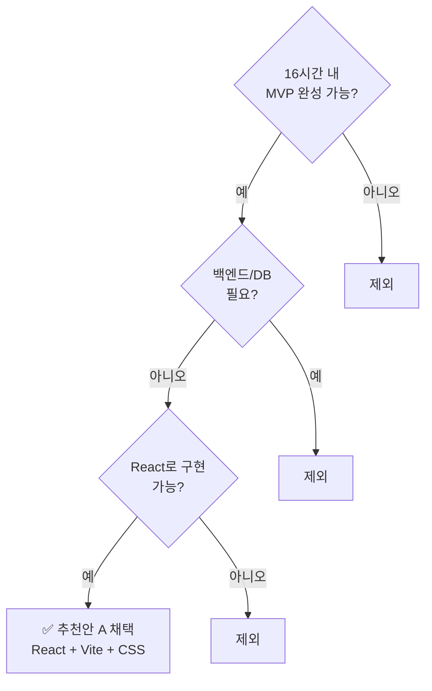
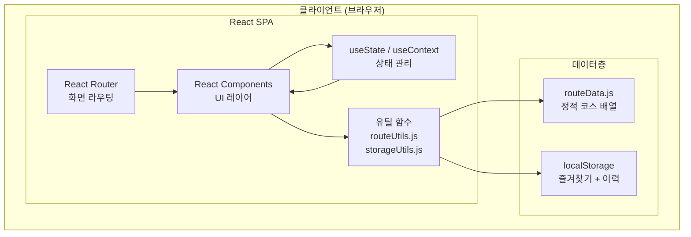
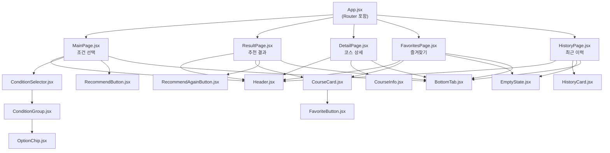
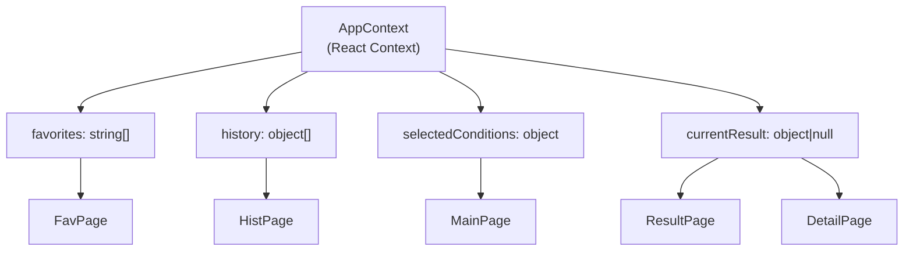

# 07. 기술 스택 & 아키텍처

> **문서 유형**: 기술 설계서  
> **작성일**: 2026.05.28  
> **관련 문서**: [데이터 명세](./06-data-spec.md) | [개발 일정](./08-schedule.md)

---

## 목차

1. [기술 스택 선정 배경](#1-기술-스택-선정-배경)
2. [최종 기술 스택](#2-최종-기술-스택)
3. [아키텍처 개요](#3-아키텍처-개요)
4. [컴포넌트 구조](#4-컴포넌트-구조)
5. [프로젝트 폴더 구조](#5-프로젝트-폴더-구조)

---

## 1. 기술 스택 선정 배경

### 추천안 비교 분석

| 항목                   | ✅ 추천안 A (채택)                   | 추천안 B                       |
| ---------------------- | ------------------------------------ | ------------------------------ |
| **구성**               | React + Vite + 순수 CSS              | Next.js + Tailwind CSS         |
| **특징**               | 프론트엔드만, 정적 데이터            | SSR 지원, 유틸리티 CSS         |
| **백엔드 필요**        | ❌ 불필요                            | ❌ 불필요                      |
| **DB 필요**            | ❌ 불필요 (localStorage)             | ❌ 불필요                      |
| **학습 난이도**        | 낮음                                 | 중간                           |
| **16시간 내 MVP 완성** | 🟢 높음                              | 🟡 중간                        |
| **빌드 복잡도**        | 낮음                                 | 중간                           |
| **배포 방법**          | GitHub Pages / Netlify               | Vercel 권장                    |
| **채택 이유**          | React 기초 학습 최적, Vite 빌드 빠름 | Tailwind 클래스 학습 부담 존재 |

> **결론**: 16시간 MVP 제약 내에서 완성도를 극대화하기 위해 **추천안 A**를 채택합니다.  
> 복잡한 SSR·TypeScript·CSS 프레임워크 없이 핵심 기능 구현에 집중합니다.

### 선정 기준



---

## 2. 최종 기술 스택

### 스택 전체 목록

| 분류              | 기술                        | 버전 | 역할                                          |
| ----------------- | --------------------------- | ---- | --------------------------------------------- |
| **UI 라이브러리** | React                       | 18.x | 컴포넌트 기반 UI 구성                         |
| **빌드 도구**     | Vite                        | 5.x  | 개발 서버 + 빠른 HMR, 프로덕션 빌드           |
| **라우팅**        | React Router DOM            | 6.x  | SPA 화면 전환 (HashRouter 또는 BrowserRouter) |
| **언어**          | JavaScript ES6+             | -    | 모든 로직 구현                                |
| **스타일링**      | 순수 CSS                    | -    | Flexbox/Grid 기반 반응형 레이아웃             |
| **상태 관리**     | React useState / useContext | -    | 전역 상태 (즐겨찾기, 조건 등)                 |
| **영속 저장**     | localStorage                | -    | 즐겨찾기, 최근 이력 저장                      |
| **데이터**        | 정적 JS 배열 (routeData.js) | -    | 샘플 코스 10개                                |
| **패키지 관리**   | npm                         | -    | 의존성 관리                                   |
| **버전 관리**     | Git + GitHub                | -    | 소스 코드 관리                                |
| **배포 (선택)**   | GitHub Pages / Netlify      | -    | 정적 파일 배포                                |

### 의존성 목록 (package.json 예시)

```json
{
  "dependencies": {
    "react": "^18.3.1",
    "react-dom": "^18.3.1",
    "react-router-dom": "^6.26.1"
  },
  "devDependencies": {
    "@vitejs/plugin-react": "^4.3.1",
    "vite": "^5.4.1"
  }
}
```

---

## 3. 아키텍처 개요

### 전체 시스템 아키텍처



### 데이터 흐름 요약

```
사용자 조건 선택
    ↓
ConditionSelector 컴포넌트 (useState로 조건 상태 관리)
    ↓
추천 버튼 클릭 → getRandomRoute(conditions) 호출
    ↓
routeData.js 정적 배열 필터링 + 랜덤 반환
    ↓
결과 → ResultPage 렌더링
    ↓
즐겨찾기 클릭 → toggleFavorite(id) → localStorage 저장
추천 시 자동 → addHistory(course) → localStorage 저장
```

---

## 4. 컴포넌트 구조

### 전체 컴포넌트 트리



### 컴포넌트별 역할 요약

| 컴포넌트            | 파일                               | 역할                                |
| ------------------- | ---------------------------------- | ----------------------------------- |
| `App`               | `App.jsx`                          | 라우터 설정, 전역 컨텍스트 제공     |
| `MainPage`          | `pages/MainPage.jsx`               | 조건 선택 화면                      |
| `ResultPage`        | `pages/ResultPage.jsx`             | 추천 결과 표시                      |
| `DetailPage`        | `pages/DetailPage.jsx`             | 코스 상세 정보                      |
| `FavoritesPage`     | `pages/FavoritesPage.jsx`          | 즐겨찾기 목록                       |
| `HistoryPage`       | `pages/HistoryPage.jsx`            | 최근 추천 이력                      |
| `Header`            | `components/Header.jsx`            | 상단 타이틀 + 뒤로 가기             |
| `ConditionSelector` | `components/ConditionSelector.jsx` | 3개 조건 선택 묶음                  |
| `ConditionGroup`    | `components/ConditionGroup.jsx`    | 거리/시간/유형 단위 그룹            |
| `OptionChip`        | `components/OptionChip.jsx`        | 선택 가능한 칩 단일 아이템          |
| `CourseCard`        | `components/CourseCard.jsx`        | 코스 카드 (결과·즐겨찾기·이력 공용) |
| `FavoriteButton`    | `components/FavoriteButton.jsx`    | 즐겨찾기 토글 버튼                  |
| `EmptyState`        | `components/EmptyState.jsx`        | 빈 상태 UI                          |
| `BottomTab`         | `components/BottomTab.jsx`         | 하단 탭 바                          |
| `CourseInfo`        | `components/CourseInfo.jsx`        | 상세 섹션 (설명/이유/주의/팁)       |

### 전역 상태 설계 (Context)



---

## 5. 프로젝트 폴더 구조

```
RWR-mini-project/
├── public/
│   └── favicon.ico
├── src/
│   ├── components/           # 재사용 가능한 UI 컴포넌트
│   │   ├── BottomTab.jsx
│   │   ├── BottomTab.css
│   │   ├── ConditionGroup.jsx
│   │   ├── ConditionGroup.css
│   │   ├── ConditionSelector.jsx
│   │   ├── CourseCard.jsx
│   │   ├── CourseCard.css
│   │   ├── CourseInfo.jsx
│   │   ├── CourseInfo.css
│   │   ├── EmptyState.jsx
│   │   ├── EmptyState.css
│   │   ├── FavoriteButton.jsx
│   │   ├── Header.jsx
│   │   ├── Header.css
│   │   └── OptionChip.jsx
│   ├── context/
│   │   └── AppContext.jsx     # 전역 상태 컨텍스트
│   ├── data/
│   │   └── routeData.js       # 샘플 코스 정적 데이터
│   ├── pages/                 # 화면 단위 컴포넌트
│   │   ├── MainPage.jsx
│   │   ├── MainPage.css
│   │   ├── ResultPage.jsx
│   │   ├── ResultPage.css
│   │   ├── DetailPage.jsx
│   │   ├── DetailPage.css
│   │   ├── FavoritesPage.jsx
│   │   ├── FavoritesPage.css
│   │   ├── HistoryPage.jsx
│   │   └── HistoryPage.css
│   ├── utils/
│   │   ├── routeUtils.js      # 필터링 + 랜덤 추천 로직
│   │   └── storageUtils.js    # localStorage 유틸 함수
│   ├── App.jsx                # 루트 컴포넌트 + 라우팅
│   ├── App.css
│   ├── index.css              # 전역 스타일 (CSS 변수, reset)
│   └── main.jsx               # React 진입점
├── docs/                      # 프로젝트 문서
├── index.html
├── vite.config.js
├── package.json
└── README.md
```

---

_다음 문서: [08. 개발 일정 & 리스크](./08-schedule.md)_
