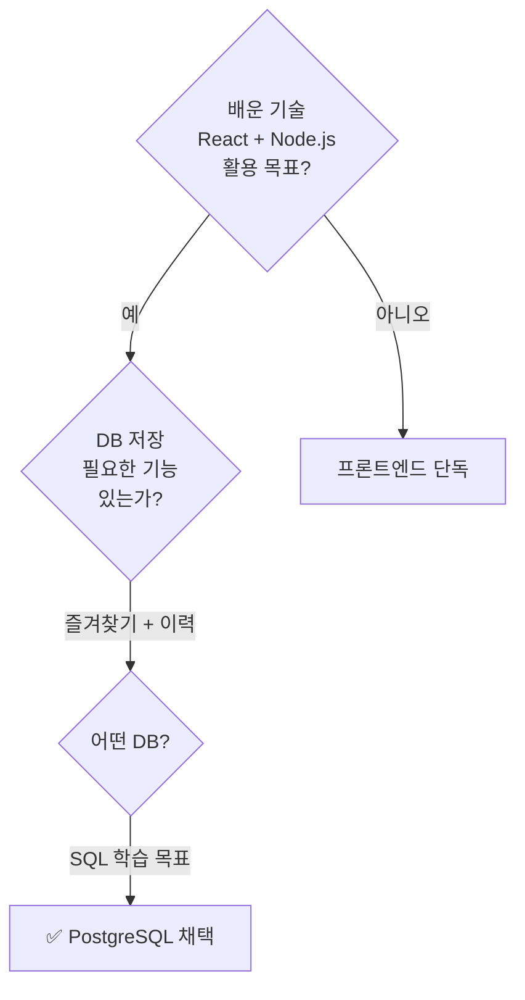
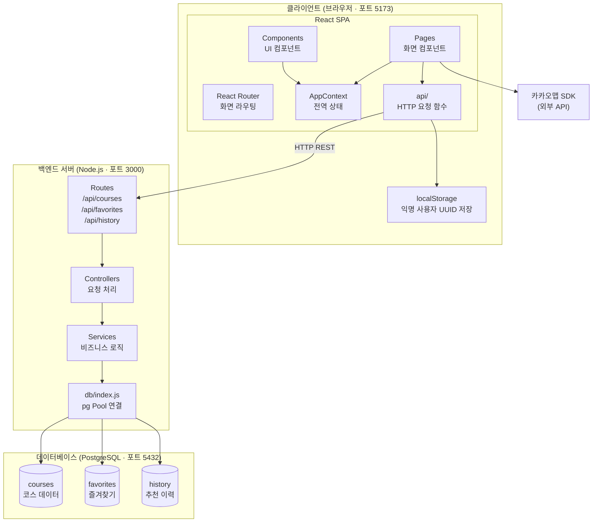
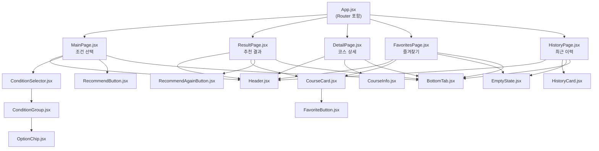
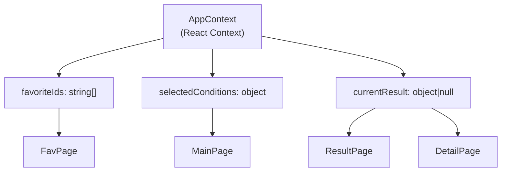
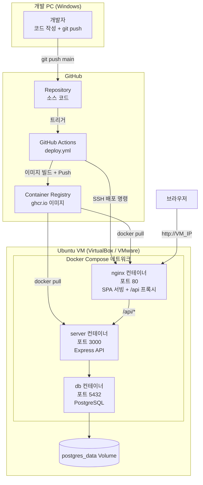
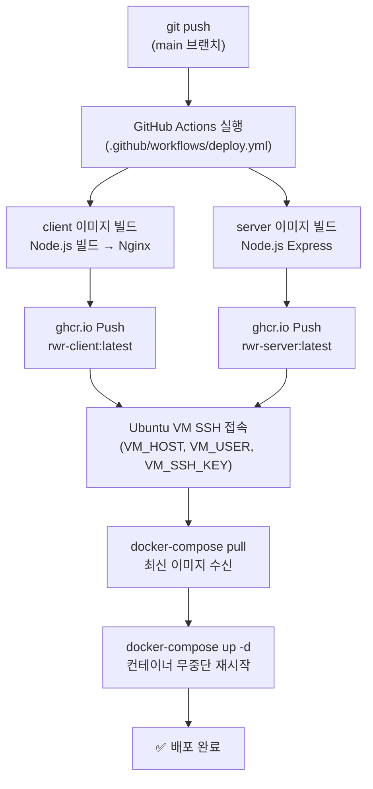

# 07. 기술 스택 & 아키텍처

> **문서 유형**: 기술 설계서  
> **작성일**: 2026.05.28  
> **최종 수정일**: 2026.05.29 (풀스택 전환 + Docker / GitHub Actions / Ubuntu VM 배포 인프라 추가)  
> **관련 문서**: [데이터 명세](./06-data-spec.md) | [개발 일정](./08-schedule.md)

---

## 목차

1. [기술 스택 선정 배경](#1-기술-스택-선정-배경)
2. [최종 기술 스택](#2-최종-기술-스택)
3. [아키텍처 개요](#3-아키텍처-개요)
4. [컴포넌트 구조](#4-컴포넌트-구조)
5. [프로젝트 폴더 구조](#5-프로젝트-폴더-구조)

---

## 1. 기술 스택 선정 배경

### 추천안 비교 분석

| 항목                | ✅ 채택안 (풀스택)                        | 기존안 (프론트엔드 단독)  |
| ------------------- | ----------------------------------------- | ------------------------- |
| **구성**            | React + Vite + Express + PostgreSQL       | React + Vite + 순수 CSS   |
| **특징**            | REST API + DB 연동, 데이터 서버 관리      | 정적 데이터, localStorage |
| **백엔드 필요**     | ✅ Express (Node.js)                      | ❌ 불필요                 |
| **DB 필요**         | ✅ PostgreSQL                             | ❌ 불필요                 |
| **학습 목표**       | React + Node.js + Express + SQL 전체 경험 | React + CSS 집중          |
| **포트폴리오 가치** | 🟢 높음 (풀스택 구조 시연)                | 🟡 중간 (프론트엔드 집중) |
| **구현 복잡도**     | 중간                                      | 낮음                      |
| **배포 방법**       | Docker + Ubuntu VM + GitHub Actions CI/CD | GitHub Pages / Netlify    |
| **채택 이유**       | 배운 기술 전체 활용, 풀스택 경험 확보     | 단기 완성 최적            |

> **결론**: React + Node.js(Express) + PostgreSQL 풀스택 구조를 채택합니다.  
> 배운 기술을 실제 서비스 흐름에 적용하고, REST API 설계와 DB 연동 경험을 확보합니다.

### 선정 기준



---

## 2. 최종 기술 스택

### 프론트엔드 스택

| 분류                | 기술                        | 버전 | 역할                                |
| ------------------- | --------------------------- | ---- | ----------------------------------- |
| **UI 라이브러리**   | React                       | 18.x | 컴포넌트 기반 UI 구성               |
| **빌드 도구**       | Vite                        | 5.x  | 개발 서버 + 빠른 HMR, 프로덕션 빌드 |
| **라우팅**          | React Router DOM            | 6.x  | SPA 화면 전환                       |
| **언어**            | JavaScript ES6+             | -    | 모든 로직 구현                      |
| **스타일링**        | 순수 CSS                    | -    | Flexbox/Grid 기반 반응형 레이아웃   |
| **상태 관리**       | React useState / useContext | -    | 전역 상태 (조건 선택, 추천 결과 등) |
| **HTTP 클라이언트** | fetch API (내장)            | -    | Express API 호출                    |
| **영속 저장**       | localStorage                | -    | 익명 사용자 ID(UUID) 저장           |

### 백엔드 스택

| 분류            | 기술               | 버전 | 역할                      |
| --------------- | ------------------ | ---- | ------------------------- |
| **런타임**      | Node.js            | 20.x | 서버 실행 환경            |
| **프레임워크**  | Express            | 4.x  | REST API 서버             |
| **DB 드라이버** | pg (node-postgres) | 8.x  | PostgreSQL 연결 + 쿼리    |
| **환경변수**    | dotenv             | 16.x | .env 파일 로드            |
| **CORS**        | cors               | 2.x  | 프론트엔드 도메인 허용    |
| **입력 검증**   | express-validator  | 7.x  | 요청 파라미터 유효성 검사 |
| **언어**        | JavaScript ES6+    | -    | 서버 로직 구현            |

### 데이터베이스

| 분류      | 기술       | 버전 | 역할                          |
| --------- | ---------- | ---- | ----------------------------- |
| **RDBMS** | PostgreSQL | 16.x | 코스 / 즐겨찾기 / 이력 데이터 |

### 공통 인프라

| 분류                        | 기술             | 역할                                 |
| --------------------------- | ---------------- | ------------------------------------ |
| **패키지 관리**             | npm              | 의존성 관리                          |
| **버전 관리**               | Git + GitHub     | 소스 코드 관리                       |
| **외부 API**                | 카카오맵 SDK     | 코스 시작점 마커 표시                |
| **컨테이너**                | Docker           | 앱 이미지 빌드 및 실행 환경 격리     |
| **컨테이너 오케스트레이션** | Docker Compose   | nginx·server·db 멀티 컨테이너 관리   |
| **CI/CD**                   | GitHub Actions   | push 이벤트 기반 자동 빌드·배포      |
| **웹 서버 / 리버스 프록시** | Nginx            | React 정적 파일 서빙 + `/api` 프록시 |
| **배포 서버**               | Ubuntu VM (로컬) | 노트북 가상머신 기반 자체 서버       |

---

### 의존성 목록

#### client/package.json

```json
{
  "dependencies": {
    "react": "^18.3.1",
    "react-dom": "^18.3.1",
    "react-router-dom": "^6.26.1"
  },
  "devDependencies": {
    "@vitejs/plugin-react": "^4.3.1",
    "vite": "^5.4.1"
  }
}
```

#### server/package.json

```json
{
  "dependencies": {
    "cors": "^2.8.5",
    "dotenv": "^16.4.5",
    "express": "^4.19.2",
    "express-validator": "^7.2.0",
    "pg": "^8.12.0"
  },
  "devDependencies": {
    "nodemon": "^3.1.4"
  }
}
```

---

## 3. 아키텍처 개요

### 전체 시스템 아키텍처



### 데이터 흐름 요약

```
[초기 진입]
브라우저 열기
    ↓
localStorage에 익명 UUID 없으면 생성 후 저장
    ↓
GET /api/courses → 코스 목록 로드

[코스 추천]
사용자 조건 선택 (거리 / 시간 / 유형)
    ↓
추천 버튼 클릭
    ↓
GET /api/courses/random?distance=3&time=30&type=조깅
    ↓
Express → courses 테이블 필터링 + 랜덤 반환
    ↓
ResultPage 렌더링
    ↓
POST /api/history → history 테이블 저장

[즐겨찾기]
즐겨찾기 버튼 클릭
    ↓
POST /api/favorites { userId, courseId }  (추가)
DELETE /api/favorites/:courseId?userId=  (해제)
    ↓
favorites 테이블 반영
```

### 포트 정리

| 서비스       | 포트 | 비고                      |
| ------------ | ---- | ------------------------- |
| React (Vite) | 5173 | 개발 서버 (`npm run dev`) |
| Express      | 3000 | API 서버 (`npm run dev`)  |
| PostgreSQL   | 5432 | 기본 포트                 |

---

## 4. 컴포넌트 구조

### 전체 컴포넌트 트리



### 컴포넌트별 역할 요약

| 컴포넌트            | 파일                               | 역할                                |
| ------------------- | ---------------------------------- | ----------------------------------- |
| `App`               | `App.jsx`                          | 라우터 설정, 전역 컨텍스트 제공     |
| `MainPage`          | `pages/MainPage.jsx`               | 조건 선택 화면                      |
| `ResultPage`        | `pages/ResultPage.jsx`             | 추천 결과 표시                      |
| `DetailPage`        | `pages/DetailPage.jsx`             | 코스 상세 정보                      |
| `FavoritesPage`     | `pages/FavoritesPage.jsx`          | 즐겨찾기 목록                       |
| `HistoryPage`       | `pages/HistoryPage.jsx`            | 최근 추천 이력                      |
| `Header`            | `components/Header.jsx`            | 상단 타이틀 + 뒤로 가기             |
| `ConditionSelector` | `components/ConditionSelector.jsx` | 3개 조건 선택 묶음                  |
| `ConditionGroup`    | `components/ConditionGroup.jsx`    | 거리/시간/유형 단위 그룹            |
| `OptionChip`        | `components/OptionChip.jsx`        | 선택 가능한 칩 단일 아이템          |
| `CourseCard`        | `components/CourseCard.jsx`        | 코스 카드 (결과·즐겨찾기·이력 공용) |
| `FavoriteButton`    | `components/FavoriteButton.jsx`    | 즐겨찾기 토글 버튼                  |
| `EmptyState`        | `components/EmptyState.jsx`        | 빈 상태 UI                          |
| `BottomTab`         | `components/BottomTab.jsx`         | 하단 탭 바                          |
| `CourseInfo`        | `components/CourseInfo.jsx`        | 상세 섹션 (설명/이유/주의/팁)       |

### 전역 상태 설계 (Context)



> **변경 사항**: 즐겨찾기와 이력은 Context가 아닌 Express API를 통해 PostgreSQL에서 직접 읽고 씁니다.  
> Context에는 UI 반응에 필요한 최소 상태(현재 결과, 선택 조건, 즐겨찾기 ID 목록)만 유지합니다.

---

## 5. 프로젝트 폴더 구조

```
rwr-project/
├── client/                          # React + Vite 프론트엔드
│   ├── public/
│   │   └── favicon.ico
│   ├── src/
│   │   ├── api/                     # Express API 호출 함수
│   │   │   ├── coursesApi.js        # 코스 관련 API
│   │   │   ├── favoritesApi.js      # 즐겨찾기 관련 API
│   │   │   └── historyApi.js        # 이력 관련 API
│   │   ├── components/              # 재사용 가능한 UI 컴포넌트
│   │   │   ├── BottomTab.jsx
│   │   │   ├── BottomTab.css
│   │   │   ├── ConditionGroup.jsx
│   │   │   ├── ConditionGroup.css
│   │   │   ├── ConditionSelector.jsx
│   │   │   ├── CourseCard.jsx
│   │   │   ├── CourseCard.css
│   │   │   ├── CourseInfo.jsx
│   │   │   ├── CourseInfo.css
│   │   │   ├── EmptyState.jsx
│   │   │   ├── EmptyState.css
│   │   │   ├── FavoriteButton.jsx
│   │   │   ├── Header.jsx
│   │   │   ├── Header.css
│   │   │   └── OptionChip.jsx
│   │   ├── context/
│   │   │   └── AppContext.jsx       # 전역 상태 컨텍스트
│   │   ├── pages/                   # 화면 단위 컴포넌트
│   │   │   ├── MainPage.jsx
│   │   │   ├── MainPage.css
│   │   │   ├── ResultPage.jsx
│   │   │   ├── ResultPage.css
│   │   │   ├── DetailPage.jsx
│   │   │   ├── DetailPage.css
│   │   │   ├── FavoritesPage.jsx
│   │   │   ├── FavoritesPage.css
│   │   │   ├── HistoryPage.jsx
│   │   │   └── HistoryPage.css
│   │   ├── utils/
│   │   │   └── userIdentity.js      # 익명 UUID 생성 및 localStorage 관리
│   │   ├── App.jsx
│   │   ├── App.css
│   │   ├── index.css
│   │   └── main.jsx
│   ├── .env.example                 # VITE_API_BASE_URL, VITE_KAKAO_MAP_KEY
│   ├── Dockerfile                   # 멀티 스테이지: Node.js 빌드 → Nginx 정적 서빙
│   ├── index.html
│   ├── vite.config.js
│   └── package.json
│
├── server/                          # Node.js + Express 백엔드
│   ├── src/
│   │   ├── routes/
│   │   │   ├── courses.js           # GET /api/courses, GET /api/courses/random
│   │   │   ├── favorites.js         # GET/POST/DELETE /api/favorites
│   │   │   └── history.js           # GET/POST /api/history
│   │   ├── controllers/
│   │   │   ├── coursesController.js
│   │   │   ├── favoritesController.js
│   │   │   └── historyController.js
│   │   ├── services/
│   │   │   ├── coursesService.js
│   │   │   ├── favoritesService.js
│   │   │   └── historyService.js
│   │   ├── db/
│   │   │   ├── index.js             # pg Pool 설정 및 export
│   │   │   ├── schema.sql           # CREATE TABLE 정의
│   │   │   └── seed.sql             # 샘플 코스 10개 INSERT
│   │   ├── middleware/
│   │   │   ├── errorHandler.js      # 공통 에러 처리 미들웨어
│   │   │   └── validateRequest.js   # express-validator 결과 처리
│   │   └── app.js                   # Express 앱 설정
│   ├── server.js                    # 서버 진입점 (listen)
│   ├── .env.example                 # DB_URL, PORT, CORS_ORIGIN
│   ├── Dockerfile                   # Node.js Express 실행 이미지
│   └── package.json
│
├── nginx/
│   └── nginx.conf                   # React SPA 서빙 + /api 리버스 프록시 설정
├── .github/
│   └── workflows/
│       └── deploy.yml               # GitHub Actions CI/CD 파이프라인
├── docker-compose.yml               # 운영 환경 멀티 컨테이너 정의
├── docker-compose.dev.yml           # 개발 환경 (볼륨 마운트 + hot-reload)
├── docs/                            # 프로젝트 문서
├── .gitignore
└── README.md
```

---

## 6. 배포 인프라

### 배포 환경 비교

| 구분            | 개발 환경                  | 운영 환경 (Ubuntu VM)                              |
| --------------- | -------------------------- | -------------------------------------------------- |
| **React**       | Vite 개발 서버 (포트 5173) | Nginx 컨테이너 (포트 80) — 빌드된 정적 파일 서빙   |
| **Express**     | nodemon (포트 3000)        | Docker 컨테이너 (포트 3000)                        |
| **PostgreSQL**  | 로컬 설치 또는 Docker      | Docker 컨테이너 (포트 5432)                        |
| **실행 방법**   | `npm run dev` (각 폴더)    | `docker-compose up -d`                             |
| **배포 트리거** | 수동                       | GitHub main 브랜치 push → GitHub Actions 자동 배포 |

### 운영 배포 아키텍처



### GitHub Actions CI/CD 흐름



### 주요 파일 역할

| 파일                           | 위치      | 역할                                              |
| ------------------------------ | --------- | ------------------------------------------------- |
| `Dockerfile`                   | `client/` | 멀티 스테이지: Node.js 빌드 → Nginx 정적 서빙     |
| `Dockerfile`                   | `server/` | Node.js Express 실행 이미지                       |
| `docker-compose.yml`           | 루트      | 운영 환경 3개 컨테이너 정의 (nginx + server + db) |
| `docker-compose.dev.yml`       | 루트      | 개발 환경 (소스 볼륨 마운트, hot-reload)          |
| `nginx/nginx.conf`             | 루트      | 정적 파일 경로 설정 + `/api` 리버스 프록시        |
| `.github/workflows/deploy.yml` | 루트      | CI/CD 파이프라인 (빌드 → Push → SSH 배포)         |

### GitHub Secrets 등록 목록

Ubuntu VM 배포를 위해 GitHub 저장소 **Settings → Secrets and variables → Actions**에 등록합니다.

| Secret 이름  | 값 예시                 | 용도                                |
| ------------ | ----------------------- | ----------------------------------- |
| `VM_SSH_KEY` | PEM 형식 SSH 개인키     | Ubuntu VM SSH 접속 인증             |
| `VM_HOST`    | `192.168.x.x`           | Ubuntu VM IP 주소                   |
| `VM_USER`    | `ubuntu`                | SSH 접속 사용자명                   |
| `GHCR_TOKEN` | GitHub PAT (write 권한) | Container Registry 이미지 Push/Pull |

> ⚠️ **보안 주의**: SSH 키, IP, 토큰을 소스 코드에 직접 작성하지 마세요. 반드시 GitHub Secrets를 통해 주입합니다. `.env` 파일도 `.gitignore`에 반드시 포함해야 합니다.

---

_다음 문서: [08. 개발 일정 & 리스크](./08-schedule.md)_
