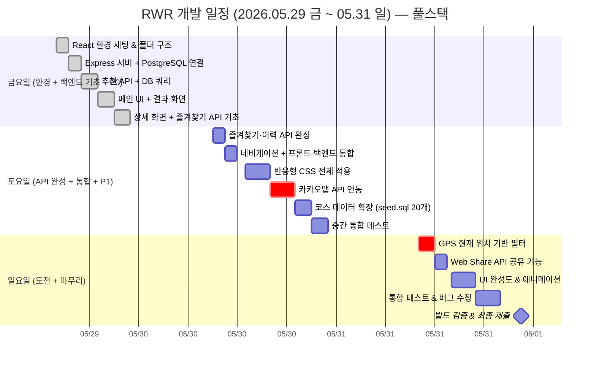
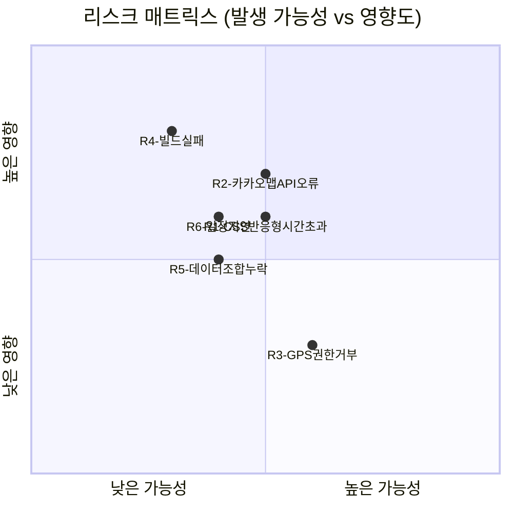

# 08. 개발 일정 & 리스크

> **문서 유형**: 프로젝트 관리 / 개발 계획  
> **작성일**: 2026.05.28  
> **최종 수정일**: 2026.05.29 (React + Express + PostgreSQL 풀스택 일정으로 업데이트)  
> **관련 문서**: [기술 스택](./07-tech-stack.md) | [요구사항 정의서](./03-requirements.md)

---

## 목차

1. [개발 기간 개요](#1-개발-기간-개요)
2. [Gantt 차트](#2-gantt-차트)
3. [단계별 작업 상세](#3-단계별-작업-상세)
4. [리스크 관리](#4-리스크-관리)
5. [완료 기준 체크리스트](#5-완료-기준-체크리스트)

---

## 1. 개발 기간 개요

> **기획/문서화**: 별도 진행 완료 (docs/ 폴더 10개 문서)  
> **실제 개발 기간**: 2026.05.29(금) 14:00 ~ 2026.05.31(일) 23:59  
> **총 캘린더 시간**: 약 58시간 / **실작업 예상**: 약 30~33시간

### 기간별 일정 요약

#### 🗓 금요일 5/29 (14:00~23:00 · 약 9시간) — 환경 세팅 + 백엔드 기초 + P0 착수

| 시간        | 단계                         | 주요 작업                                                                      | 산출물                        |
| ----------- | ---------------------------- | ------------------------------------------------------------------------------ | ----------------------------- |
| 14:00~15:30 | **환경 세팅 (프론트)**       | Vite+React 초기화, client/ 폴더 구조, GitHub 연결, CSS 변수                    | React 개발 서버 실행          |
| 15:30~17:00 | **환경 세팅 (백엔드)**       | Express 서버 초기화, server/ 폴더 구조, PostgreSQL 연결, schema.sql + seed.sql | Express API 서버 실행         |
| 17:00~19:00 | **API 1차 + 추천 로직**      | GET /courses/random 엔드포인트, DB 쿼리 + 랜덤 반환, client API 연동           | 코스 추천 API 동작            |
| 19:00~21:00 | **메인 UI + 결과 화면**      | MainPage, ConditionGroup, OptionChip, ResultPage, CourseCard                   | 조건 선택 → 결과 화면         |
| 21:00~23:00 | **상세 화면 + 즐겨찾기 API** | DetailPage, GET /courses/:id, POST/DELETE /favorites 엔드포인트 기초           | 상세 화면 + API 기반 즐겨찾기 |

#### 🗓 토요일 5/30 (09:00~23:00 · 약 14시간) — API 완성 + 프론트-백엔드 통합 + P1

| 시간        | 단계                    | 주요 작업                                                          | 산출물                 |
| ----------- | ----------------------- | ------------------------------------------------------------------ | ---------------------- |
| 09:00~10:30 | **즐겨찾기 + 이력 API** | GET/POST /favorites, GET/POST /history, FavoritesPage, HistoryPage | 즐겨찾기·이력 API 완성 |
| 10:30~12:00 | **네비게이션 + 통합**   | BottomTab, React Router 연결, API 에러 처리, 로딩 상태 UI          | 3탭 + API 완전 통합    |
| 13:00~16:00 | **반응형 CSS**          | 전체 미디어 쿼리 (375/768/1024px), 카드 그리드                     | 모바일·PC 반응형 완성  |
| 16:00~19:00 | **🗺 지도 API 연동**    | 카카오맵 SDK 연결, 코스 시작점 마커, 지도 컴포넌트                 | 코스 위치 지도 표시    |
| 19:00~21:00 | **코스 데이터 확장**    | seed.sql 10개 → 20개 추가 (DB INSERT), 조건 조합 커버리지 보완     | 더 풍부한 추천 결과    |
| 21:00~23:00 | **중간 테스트**         | 프론트 + 백엔드 통합 기능 점검, 빌드 오류 수정, 버그 목록 작성     | 통합 동작 확인         |

#### 🗓 일요일 5/31 (10:00~23:59 · 약 14시간) — 도전 기능 + 마무리

| 시간        | 단계                 | 주요 작업                                                   | 산출물             |
| ----------- | -------------------- | ----------------------------------------------------------- | ------------------ |
| 10:00~12:00 | **📍 GPS 위치 기반** | Geolocation API, 내 주변 코스 우선 표시 필터                | GPS 기반 코스 필터 |
| 12:00~13:30 | **🔗 공유 기능**     | Web Share API, 코스 공유 버튼 (네이티브 공유 시트)          | 코스 공유 기능     |
| 14:00~17:00 | **UI 완성도**        | 화면 전환 애니메이션, 로딩 상태, 빈 상태 UI, 세부 다듬기    | UX 완성도 향상     |
| 17:00~20:00 | **통합 테스트**      | 시나리오 1~4 전체 수동 테스트, 버그 수정, 엣지 케이스 처리  | 품질 보장          |
| 20:00~23:59 | **최종 제출**        | npm run build, README 최종 업데이트, GitHub 푸시, 제출 확인 | 🎉 제출 완료       |

---

## 2. Gantt 차트



---

## 3. 단계별 작업 상세

### [금 14:00~15:30] 환경 세팅 — 프론트엔드 (client/)

```
□ mkdir rwr-project && cd rwr-project
□ npm create vite@latest client -- --template react
□ cd client && npm install react-router-dom
□ 폴더 구조 생성 (src/api, components, pages, utils, context)
□ index.css — CSS 변수 정의 (컬러, 폰트, spacing)
□ App.jsx — 기본 라우터 구조 설정
□ client/.env.example — VITE_API_BASE_URL, VITE_KAKAO_MAP_KEY
□ 첫 커밋: "chore: initial project structure"
```

**완료 기준**: `npm run dev` 실행 후 브라우저에서 기본 화면 확인

---

### [금 15:30~17:00] 환경 세팅 — 백엔드 (server/)

```
□ cd ../server && npm init -y
□ npm install express cors dotenv express-validator pg
□ npm install -D nodemon
□ 폴더 구조 생성 (src/routes, controllers, services, db, middleware)
□ server/src/db/index.js — pg Pool 설정
□ server/src/db/schema.sql — CREATE TABLE 3개 작성
□ server/src/db/seed.sql — 샘플 코스 10개 INSERT 작성
□ server/.env.example — DATABASE_URL, PORT, CORS_ORIGIN
□ PostgreSQL 데이터베이스 생성: CREATE DATABASE rwr_db;
□ 스키마 + 시드 실행 확인
□ server.js + app.js — Express 기본 설정
□ client/Dockerfile — 멀티 스테이지 기본 구조 (Node.js 빌드 → Nginx)
□ server/Dockerfile — Node.js Express 실행 이미지 기본 구조
□ docker-compose.yml — nginx·server·db 3개 컨테이너 정의 (기본 구조)
□ nginx/nginx.conf — 정적 파일 서빙 + /api 리버스 프록시 설정
□ .github/workflows/deploy.yml — GitHub Actions CI/CD 파이프라인 기본 구조
□ 커밋: "chore: express server, postgresql, and docker setup"
```

**완료 기준**: `npm run dev` 실행 후 `GET /api/health` 200 응답 확인, courses 테이블 데이터 확인, `docker-compose build` 오류 없음

---

### [금 19:00~21:00] 메인 UI + 결과 화면

```
□ Header.jsx — 타이틀, 뒤로 가기 버튼
□ OptionChip.jsx — selected prop에 따른 스타일 변경
□ ConditionGroup.jsx — 그룹 레이블 + OptionChip 3개
□ ConditionSelector.jsx — 3개 ConditionGroup 조합
□ MainPage.jsx — 전체 레이아웃, useState로 조건 상태 관리
□ 추천 버튼 — 3조건 미선택 시 비활성 처리
□ CourseCard.jsx — 코스명, 메타, 설명, 추천 이유
□ ResultPage.jsx — API 결과 렌더링 + 다시 추천 버튼
□ 커밋: "feat: main page and result page"
```

**완료 기준**: 조건 선택 → 추천 → 결과 카드 표시, 다시 추천 동작 확인

---

### [금 17:00~19:00] 추천 API + 프론트엔드 연동

```
□ coursesService.js — getRandomCourse(distance, time, type, exclude) DB 쿼리
□ coursesController.js — 요청 파라미터 파싱 + 유효성 검사
□ routes/courses.js — GET /api/courses/random, GET /api/courses/:id
□ client/src/api/coursesApi.js — fetch 기반 API 호출 함수
□ client/src/utils/userIdentity.js — getUserId() 익명 UUID 관리
□ AppContext — selectedConditions 전역 상태
□ 추천 버튼 클릭 → API 호출 → ResultPage 이동
□ 빈 결과 케이스 처리
□ 커밋: "feat: courses api and recommendation flow"
```

**완료 기준**: 조건 선택 → API 호출 → 결과 화면 이동, 코스 데이터 정상 반환 확인

---

### [금 21:00~23:00] 상세 화면 + 즐겨찾기 API 기초

```
□ DetailPage.jsx — 코스 설명/이유/주의/팁 4개 섹션 레이아웃
□ CourseInfo.jsx — 섹션 단위 컴포넌트
□ GET /api/courses/:id 라우트 연결 (서버)
□ favoritesService.js — addFavorite, removeFavorite, getFavoritesByUser
□ routes/favorites.js — GET/POST/DELETE /api/favorites 기초 구현
□ client/src/api/favoritesApi.js — API 호출 함수
□ 커밋: "feat: detail page and favorites api"
```

**완료 기준**: 상세 화면 렌더링, 즐겨찾기 추가/해제 API 200 응답 확인

---

### [토 09:00~10:30] 즐겨찾기 + 이력 API 완성

```
□ FavoriteButton.jsx — API 연동 후 상태 변화
□ AppContext — favoriteIds 전역 상태 (페이지 간 동기화)
□ FavoritesPage.jsx — API에서 목록 로드 + EmptyState
□ historyService.js — addHistory, getHistoryByUser
□ routes/history.js — GET/POST /api/history
□ client/src/api/historyApi.js
□ 추천 발생 시 POST /api/history 자동 호출
□ 커밋: "feat: favorites and history api complete"
```

**완료 기준**: 즐겨찾기 토글 → DB 반영 확인, 추천 후 이력 API 저장 확인

---

### [토 10:30~12:00] 네비게이션 + 프론트-백엔드 완전 통합

```
□ HistoryCard.jsx — 코스 정보 + 추천 시각 표시
□ HistoryPage.jsx — API에서 이력 로드 + EmptyState
□ BottomTab.jsx — 홈/즐겨찾기/이력 탭
□ React Router 전체 라우팅 연결
□ API 에러 처리 — 로딩 상태, 에러 메시지 표시
□ 공통 에러 처리 미들웨어 (server/src/middleware/errorHandler.js)
□ 커밋: "feat: history page and full api integration"
```

**완료 기준**: 3탭 전환 동작, 모든 API 연동 정상, 에러 상태 처리 확인

---

### [토 13:00~16:00] 반응형 CSS

```
□ 전체 화면 미디어 쿼리 적용 (375px / 768px / 1024px)
□ BottomTab PC 뷰 조정 (사이드바 또는 상단 탭)
□ 카드 그리드 (모바일 1열 → 태블릿 2열)
□ Chrome DevTools 모바일 에뮬레이션으로 검증
□ 커밋: "style: responsive layout"
```

**완료 기준**: 375px iPhone SE ~ 1280px PC 레이아웃 모두 정상

---

### [토 16:00~19:00] 🗺 카카오맵 API 연동 (기존 '도전' → 정식 P1)

```
□ 카카오 Developers 앱 등록, JavaScript 키 발급
□ index.html — Kakao Maps SDK 스크립트 삽입
□ MapView.jsx — 지도 컴포넌트 (코스 시작점 마커)
□ DetailPage에 MapView 통합
□ course 데이터에 lat/lng 좌표 추가 (20개 코스 기준)
□ 마커 클릭 시 로드뷰 링크 제공 (선택)
□ 커밋: "feat: kakao map with course markers"
```

**완료 기준**: 상세 화면에서 카카오맵 렌더링, 코스 시작점 마커 표시 확인

---

### [토 19:00~21:00] 코스 데이터 확장 (10개 → 20개)

```
□ server/src/db/seed.sql — 신규 코스 10개 INSERT 추가 (lat/lng 좌표 포함)
□ 조건 조합 커버리지 확인 (거리 3 × 시간 3 × 유형 3 = 27 조합 중 최소 18개 충족)
□ psql로 시드 재실행 및 데이터 확인
□ 커밋: "data: expand course seed data to 20 routes"
```

**완료 기준**: 모든 조건 조합에서 최소 1개 이상 추천 결과 반환

---

### [토 21:00~23:00] 중간 빌드 테스트

```
□ npm run build → dist/ 폴더 생성 확인
□ 빌드 오류 전체 수정
□ 주요 기능 동작 점검 (조건 선택 → 추천 → 상세 → 지도 → 즐겨찾기)
□ 버그 목록 작성 (일요일 테스트 시 수정)
□ 커밋: "fix: mid-sprint build fix"
```

**완료 기준**: 빌드 오류 0개, 핵심 플로우 정상 동작

---

### [일 10:00~12:00] 📍 GPS 현재 위치 기반 필터 (도전 기능)

```
□ Geolocation API — navigator.geolocation.getCurrentPosition
□ 내 현재 좌표와 코스 좌표 간 직선 거리 계산 (Haversine)
□ 내 주변 코스 우선 표시 (반경 5km 이내 코스 상단 정렬)
□ 위치 권한 거부 시 기존 랜덤 추천으로 fallback
□ 커밋: "feat: GPS-based nearby course filter"
```

**완료 기준**: 위치 권한 허용 시 내 주변 코스 우선 표시, 거부 시 일반 추천으로 동작

---

### [일 12:00~13:30] 🔗 Web Share API 공유 기능 (도전 기능)

```
□ ShareButton.jsx — navigator.share() 호출
□ 공유 내용: 코스명 + 거리/시간 요약 + URL
□ Web Share API 미지원 시 클립보드 복사로 fallback
□ ResultPage, DetailPage에 공유 버튼 추가
□ 커밋: "feat: web share api for course sharing"
```

**완료 기준**: 모바일에서 네이티브 공유 시트 노출, PC에서 클립보드 복사 동작

---

### [일 14:00~17:00] UI 완성도 & 애니메이션

```
□ 화면 전환 CSS transition (fade-in)
□ 추천 결과 등장 애니메이션 (slide-up)
□ FavoriteButton 하트 애니메이션
□ OptionChip 선택 시 scale 피드백
□ 로딩 상태 표시 (지도 로딩 스피너)
□ 에러 상태 UI (지도 로드 실패, GPS 오류)
□ 커밋: "style: ui animations and polish"
```

**완료 기준**: 주요 인터랙션에 시각적 피드백 존재, 에러 상태 우아하게 처리

---

### [일 17:00~20:00] 통합 테스트 & 버그 수정

```
□ 시나리오 1: 이산책 — 짧은 거리 걷기 코스 추천 전 플로우
□ 시나리오 2: 박러닝 — 5km 러닝 코스 + 즐겨찾기 저장
□ 시나리오 3: 최건강 — GPS 위치 기반 코스 필터링
□ 시나리오 4: 이력 재사용 — 최근 추천 이력에서 코스 재선택
□ 엣지 케이스: 빈 상태 UI, localStorage 초기화 후 확인
□ 모바일/PC 전체 레이아웃 최종 확인
□ 버그 수정 전부 완료 커밋
```

**완료 기준**: 4개 시나리오 모두 오류 없이 통과

---

### [일 20:00~23:59] 빌드 & 최종 제출

```
□ npm run build 최종 확인 (오류 0개)
□ docker-compose build — 전체 이미지 빌드 오류 없음 확인
□ Ubuntu VM에서 docker-compose up -d — 전체 스택 실행 확인
□ GitHub Secrets 등록 (VM_SSH_KEY, VM_HOST, VM_USER, GHCR_TOKEN)
□ main 브랜치 push → GitHub Actions 자동 배포 동작 확인
□ README.md — 실행 방법 (로컈 개발 + Docker 배포), 기능 목록, 스크린샷 추가
□ GitHub 저장소 Public 설정 확인
□ 제출 커밋: "chore: final submission v1.0"
□ 제출 링크/URL 최종 확인
```

**완료 기준**: 빌드 성공, Docker 이미지 빌드 성공, Ubuntu VM 배포 동작 확인, GitHub Actions CI/CD 자동 배포 확인, GitHub Public 저장소 접근 가능

---

## 4. 리스크 관리

### 리스크 매트릭스



### 리스크 목록 및 대응 계획

| ID  | 리스크                                     | 발생 가능성 | 영향도  | 대응 계획                                                                |
| --- | ------------------------------------------ | :---------: | :-----: | ------------------------------------------------------------------------ |
| R1  | 반응형 CSS 작업이 예상보다 오래 걸림       |   🟡 중간   | 🟡 중간 | 토요일 13~16시 블록 보호; 부족하면 1024px 생략, 모바일 우선 처리         |
| R2  | 카카오맵 API 키 발급 오류 또는 렌더링 실패 |   🟡 중간   | 🔴 높음 | API 키 미리 발급 준비; 실패 시 정적 이미지 또는 링크로 대체              |
| R3  | GPS 위치 권한 거부로 기능 무력화           |   🟡 중간   | 🟢 낮음 | 권한 거부 시 기존 랜덤 추천으로 자동 fallback 처리; graceful degradation |
| R4  | npm run build 시 빌드 오류 발생            |   🟢 낮음   | 🔴 높음 | 토요일 중간(21시) 빌드 테스트 1회 실시; 오류 즉시 해결                   |
| R5  | 일부 조건 조합에 코스 데이터 없음          |   🟢 낮음   | 🟡 중간 | 20개 코스 + 빈 결과 안내 UI로 처리; 조합 커버리지 표로 사전 확인         |
| R6  | 도전 기능 구현 시간 초과                   |   🟡 중간   | 🟡 중간 | GPS·공유는 일요일 배치; 시간 부족 시 해당 기능만 스킵하고 P1 완성 우선   |

### 우선순위 기반 절충 계획

```
시간 부족 시 포기 순서 (일요일 기준):
1. Web Share API 공유 기능 (도전) — 없어도 서비스 기능에 영향 없음
2. GPS 현재 위치 필터 (도전) — 없어도 랜덤 추천은 동작
3. UI 애니메이션 세부 다듬기 — 기능 동작하면 OK

절대 포기하지 않는 것 (P0/P1):
- 조건 선택 UI + 랜덤 코스 추천
- 추천 결과 카드 + 다시 추천
- 즐겨찾기 + 이력
- 카카오맵 마커 (정식 P1)
- 반응형 UI
```

---

## 5. 완료 기준 체크리스트

### 기능 체크리스트

```
기능 요구사항 (필수 P0/P1)
□ FR-01~04  조건 선택 (거리/시간/유형) 정상 동작
□ FR-06~09  추천 및 다시 추천 정상 동작
□ FR-11     결과 카드 모든 필드 표시
□ FR-12~14  상세 화면 및 뒤로 가기
□ FR-15~19  즐겨찾기 저장/해제/영속성
□ FR-21~22  최근 이력 저장 (최대 10개)
□ FR-20, 24 빈 상태 UI 표시
□ MAP-01    카카오맵 코스 시작점 마커 표시 (P1 신규)

도전 기능 (P2)
□ GPS-01    현재 위치 기반 코스 우선 정렬
□ GPS-02    위치 권한 거부 시 fallback 동작
□ SHARE-01  Web Share API 코스 공유
□ SHARE-02  미지원 환경 클립보드 복사 fallback

비기능 요구사항
□ NFR-01    추천 결과 1초 이내 표시
□ NFR-04    375px ~ 1280px 반응형 동작
□ NFR-07~08 새로고침 후 즐겨찾기/이력 유지
□ NFR-13    npm run build 오류 없음
□ NFR-14    GitHub Public 저장소 Push 완료
□ NFR-15    README 실행 방법 포함
□ DEPLOY-01  Docker 이미지 빌드 성공 (client + server)
□ DEPLOY-02  docker-compose up -d 전체 스택 실행 성공 (Ubuntu VM)
□ DEPLOY-03  GitHub Actions CI/CD 자동 배포 동작 확인
```

---

_다음 문서: [09. PRD (제품 요구사항 문서)](./09-prd.md)_
