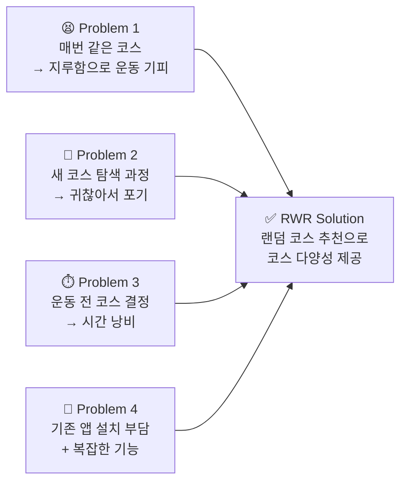
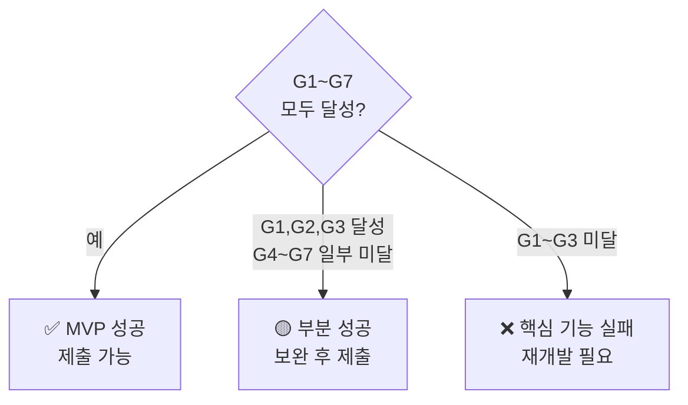
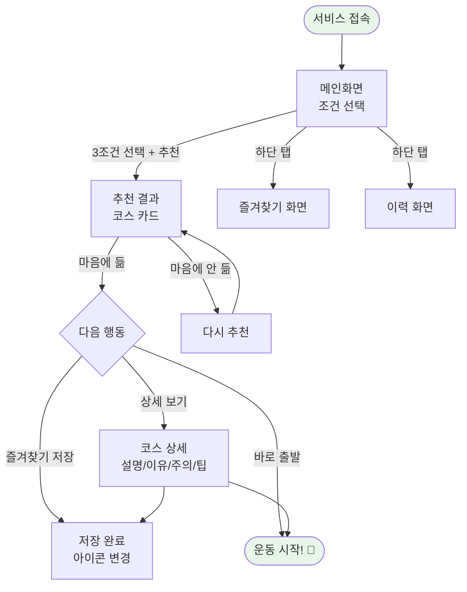
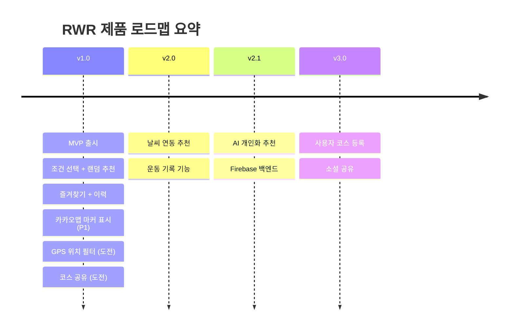

# 09. PRD (Product Requirements Document)

> **문서 유형**: 제품 요구사항 문서 (PRD)  
> **작성일**: 2026.05.28  
> **버전**: v1.0  
> **작성자**: RWR 프로젝트팀  
> **관련 문서**: [프로젝트 개요](./01-overview.md) | [요구사항 정의서](./03-requirements.md) | [로드맵](./10-roadmap.md)

---

## 목차

1. [제품 개요](#1-제품-개요)
2. [배경 및 문제 정의](#2-배경-및-문제-정의)
3. [목표 및 성공 기준](#3-목표-및-성공-기준)
4. [타겟 사용자](#4-타겟-사용자)
5. [핵심 기능 명세](#5-핵심-기능-명세)
6. [사용자 플로우 요약](#6-사용자-플로우-요약)
7. [제외 범위 (Out of Scope)](#7-제외-범위-out-of-scope)
8. [리스크 및 의존성](#8-리스크-및-의존성)
9. [향후 확장 방향](#9-향후-확장-방향)

---

## 1. 제품 개요

### 제품 기본 정보

| 항목          | 내용                                                         |
| ------------- | ------------------------------------------------------------ |
| **제품명**    | RWR: Run Walk Random                                         |
| **버전**      | v1.0 (MVP)                                                   |
| **유형**      | 반응형 웹 서비스 (SPA)                                       |
| **플랫폼**    | 모바일 브라우저 우선, PC 브라우저 지원                       |
| **기술 스택** | React 18 + Vite 5 + JavaScript ES6+ + CSS                    |
| **데이터**    | 정적 JSON 기반 (서버/DB 없음)                                |
| **저장소**    | localStorage                                                 |
| **개발 기간** | 3일 (2026.05.29 금 14:00 ~ 05.31 일 23:59, 실작업 약 30시간) |

### 한 줄 제품 정의

> **"거리·시간·운동 유형 3가지 조건을 선택하면, 오늘의 동네 산책/러닝 코스를 랜덤으로 추천해주는 반응형 웹 서비스"**

---

## 2. 배경 및 문제 정의

### 기회 배경

꾸준히 운동하고 싶지만 *"오늘 어디로 갈까"*라는 사소한 고민이 운동 실행의 마찰(friction)로 작용합니다. 기존 러닝 앱(Nike Run Club, Strava 등)은 GPS 기록 측정에 초점이 맞춰져 있어, 코스 결정 고민을 해소해주는 서비스가 존재하지 않습니다.

### 핵심 문제

| 문제                            | 사용자 맥락                                 | 비즈니스 영향        |
| ------------------------------- | ------------------------------------------- | -------------------- |
| 반복 코스로 인한 운동 동기 저하 | 주 3~4회 산책·러닝하는 직장인               | 서비스 재방문율 직결 |
| 새 코스 탐색의 불편함           | 앱/지도 없이 즉시 결정하고 싶은 사용자      | 핵심 사용 케이스     |
| 기존 앱의 복잡성                | 단순히 "어디로 갈까"만 해결하고 싶은 사용자 | 진입 장벽 차별화     |

---

## 3. 목표 및 성공 기준

### MVP 목표

| #   | 목표                        | 측정 방법                 | 기준값       |
| --- | --------------------------- | ------------------------- | ------------ |
| G1  | 3클릭 이내로 코스 추천 완료 | 클릭 수 카운트            | ≤ 3회        |
| G2  | 추천 결과 응답 속도         | 버튼 클릭 → 결과 표시까지 | < 1,000ms    |
| G3  | 전체 화면 완성              | 5개 화면 모두 렌더링 정상 | 100%         |
| G4  | 반응형 지원                 | 모바일~PC 레이아웃 정상   | 375px~1280px |
| G5  | 즐겨찾기 영속성             | 새로고침 후 데이터 유지   | 100%         |
| G6  | 빌드 성공                   | npm run build             | 오류 0건     |
| G7  | 소스 공개                   | GitHub Public 저장소      | 접근 가능    |

### 성공/실패 기준

---

## 4. 타겟 사용자

### Primary User

| 항목           | 내용                    |
| -------------- | ----------------------- |
| **연령**       | 20~40대                 |
| **직업**       | 직장인, 자영업자        |
| **운동 패턴**  | 주 2~4회, 30~60분       |
| **기기**       | 스마트폰 (iOS/Android)  |
| **핵심 니즈**  | 빠르고 간편한 코스 결정 |
| **Pain Point** | 반복 코스, 탐색 귀찮음  |

### Secondary User

| 항목          | 내용                        |
| ------------- | --------------------------- |
| **연령**      | 40~60대                     |
| **운동 패턴** | 매일 걷기 30~60분           |
| **핵심 니즈** | 목적지 있는 걷기, 단순한 UI |
| **기기**      | 안드로이드 스마트폰         |

---

## 5. 핵심 기능 명세

### Feature 1: 조건 기반 코스 추천

> **우선순위**: P0 | **화면**: 메인 화면 → 추천 결과 화면

**기능 설명**  
사용자가 거리(1/3/5km), 소요 시간(15/30/60분), 운동 유형(걷기/조깅/러닝) 총 3가지 조건을 선택하면 해당 조건에 맞는 코스를 1개 랜덤으로 추천합니다.

**수용 기준 (Acceptance Criteria)**

- [ ] 3가지 조건 모두 선택 시 추천 버튼 활성화
- [ ] 추천 버튼 클릭 시 1초 이내 결과 표시
- [ ] 결과 카드에 코스명, 거리, 시간, 유형, 설명, 추천 이유 표시
- [ ] 조건에 맞는 코스가 없을 때 안내 메시지 표시

---

### Feature 2: 다시 추천

> **우선순위**: P0 | **화면**: 추천 결과 화면

**기능 설명**  
결과가 마음에 들지 않을 때 동일 조건으로 다른 코스를 재추천합니다. 직전 추천 코스는 제외됩니다.

**수용 기준**

- [ ] "다시 추천" 버튼 클릭 시 직전 코스와 다른 코스 표시
- [ ] 조건 코스가 1개뿐일 때 "현재 조건에 코스가 1개뿐이에요" 안내

---

### Feature 3: 코스 상세 보기

> **우선순위**: P1 | **화면**: 코스 상세 화면

**기능 설명**  
코스 카드에서 상세 화면으로 이동하면 설명, 추천 이유, 주의사항, 준비 팁을 확인할 수 있습니다.

**수용 기준**

- [ ] 상세 화면에 4개 섹션(설명/이유/주의/팁) 모두 표시
- [ ] 뒤로 가기 버튼으로 이전 화면 복귀

---

### Feature 4: 즐겨찾기

> **우선순위**: P1 | **화면**: 결과 화면, 상세 화면, 즐겨찾기 화면

**기능 설명**  
마음에 드는 코스를 즐겨찾기에 저장하고, 즐겨찾기 탭에서 목록을 관리합니다. localStorage 기반으로 새로고침 후에도 유지됩니다.

**수용 기준**

- [ ] 저장/미저장 상태에 따른 아이콘 색상 변화
- [ ] 새로고침 후에도 즐겨찾기 상태 유지
- [ ] 즐겨찾기 화면에서 코스 상세 보기 및 해제 가능
- [ ] 즐겨찾기 없을 때 빈 상태 UI 표시

---

### Feature 5: 최근 추천 이력

> **우선순위**: P1 | **화면**: 최근 이력 화면

**기능 설명**  
코스 추천 시 자동으로 이력이 저장되어 최근 추천받은 코스 목록(최대 10개)을 확인할 수 있습니다.

**수용 기준**

- [ ] 추천 발생 시 자동 이력 저장
- [ ] 이력 최대 10개 제한 (초과 시 오래된 항목 자동 삭제)
- [ ] 이력 항목에 추천 날짜·시간 표시
- [ ] 이력 없을 때 빈 상태 UI 표시

---

## 6. 사용자 플로우 요약

---

## 7. 제외 범위 (Out of Scope)

### v1.0에서 의도적으로 제외하는 기능

| 제외/도전 기능               | 분류        | 이유                           | 향후 버전 |
| ---------------------------- | ----------- | ------------------------------ | --------- |
| 카카오맵 마커 표시           | ✅ P1 포함  | 개발 기간 내 구현 가능         | -         |
| GPS 현재 위치 기반 필터      | 🟡 도전(P2) | 권한 처리 + fallback 구현 필요 | v1.1      |
| Web Share API 공유           | 🟡 도전(P2) | 간단, 개발 기간 내 시도 가능   | -         |
| 회원 가입 / 로그인           | ❌ 제외     | 인증 구현 범위 초과            | v2.0+     |
| 날씨 API 연동                | ❌ 제외     | 외부 API 연동 시간 부족        | v2.0      |
| AI 개인화 추천               | ❌ 제외     | 외부 AI API 비용 및 복잡도     | v2.1      |
| 사용자 직접 코스 등록        | ❌ 제외     | DB 필요                        | v3.0      |
| 운동 기록 (거리·칼로리 측정) | ❌ 제외     | GPS + 센서 의존                | v2.0      |
| 코스 댓글 / 평점             | ❌ 제외     | DB + 인증 필요                 | v3.0+     |
| 다국어 (English 지원)        | ❌ 제외     | 리소스 부족                    | 미정      |

---

## 8. 리스크 및 의존성

### 기술 리스크

| 리스크                                     | 영향                    | 대응                                         |
| ------------------------------------------ | ----------------------- | -------------------------------------------- |
| 특정 조건 조합에 코스 없음                 | 빈 결과 노출            | 빈 결과 안내 UI + 데이터 보완                |
| localStorage 용량 초과                     | 저장 실패               | try-catch 처리 + 이력 최대 10개 제한         |
| Safari 개인정보 설정으로 localStorage 차단 | 즐겨찾기/이력 저장 불가 | 저장 실패 조용히 처리, 핵심 기능은 영향 없음 |

### 외부 의존성

| 의존 항목        | 상태                  | 대안                 |
| ---------------- | --------------------- | -------------------- |
| React 18         | ✅ 안정 릴리스        | -                    |
| React Router 6   | ✅ 안정 릴리스        | -                    |
| Vite 5           | ✅ 안정 릴리스        | -                    |
| localStorage API | ✅ 모든 브라우저 지원 | 메모리 상태 fallback |

---

## 9. 향후 확장 방향

| 버전     | 주요 기능                              | 목표 시기  |
| -------- | -------------------------------------- | ---------- |
| **v1.0** | MVP (현재 문서 범위)                   | 2026.05.28 |
| v1.1     | 지도 API 코스 위치 표시, GPS 현재 위치 | +1주       |
| v2.0     | 날씨 API 연동, 운동 기록               | +1개월     |
| v2.1     | AI 추천, Firebase 인증                 | +3개월     |
| v3.0     | 사용자 코스 등록, 소셜 공유            | +6개월     |

---

_다음 문서: [10. 로드맵 & 최종 요약](./10-roadmap.md)_
