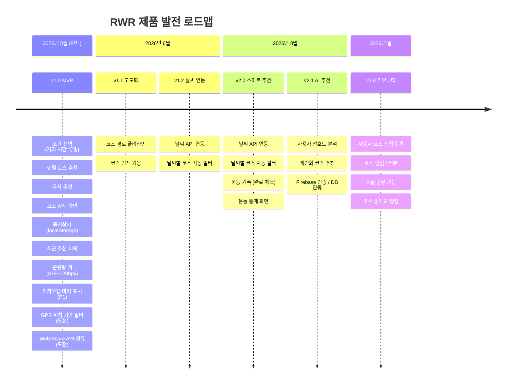
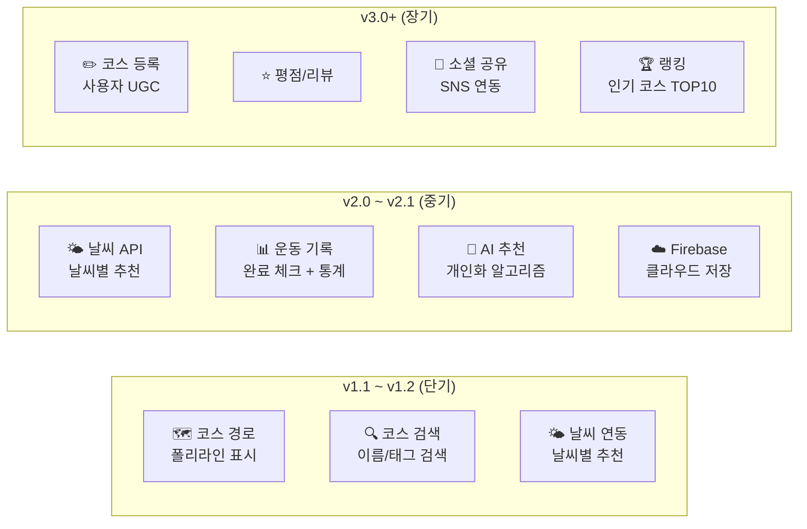
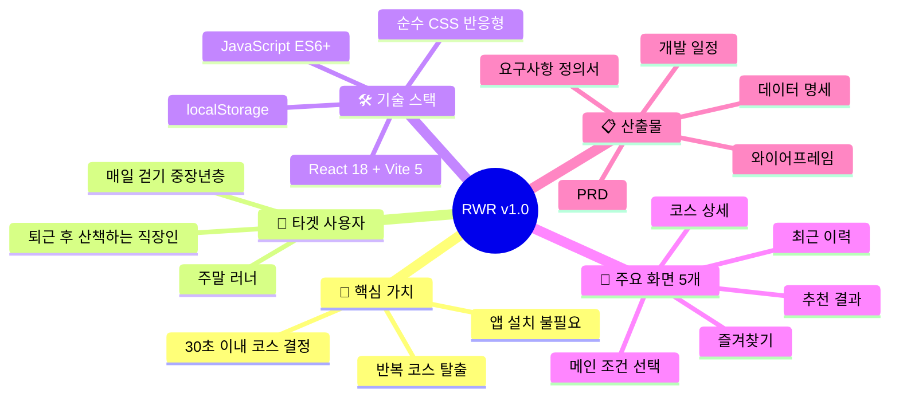

# 10. 로드맵 & 최종 요약

> **문서 유형**: 제품 로드맵 / 프로젝트 종합 요약  
> **작성일**: 2026.05.28  
> **관련 문서**: [PRD](./09-prd.md) | [프로젝트 개요](./01-overview.md)

---

## 목차

1. [버전 로드맵](#1-버전-로드맵)
2. [기능 확장 계획](#2-기능-확장-계획)
3. [프로젝트 최종 요약](#3-프로젝트-최종-요약)
4. [문서 목록 인덱스](#4-문서-목록-인덱스)

---

## 1. 버전 로드맵

### 로드맵 타임라인

### 버전별 목표 요약

| 버전     | 별칭        | 핵심 목표                                  |  상태   |
| -------- | ----------- | ------------------------------------------ | :-----: |
| **v1.0** | MVP         | 랜덤 코스 추천 + 저장 + 카카오맵 마커 완성 | 🟢 현재 |
| v1.1     | 고도화      | 코스 경로 폴리라인, 코스 검색              | 📋 계획 |
| v1.2     | 날씨 연동   | 날씨별 코스 자동 필터                      | 📋 계획 |
| v2.0     | 스마트 추천 | 날씨 연동 + 운동 기록                      | 🔵 향후 |
| v2.1     | AI 개인화   | 사용자 맞춤 추천 + 클라우드 저장           | 🔵 향후 |
| v3.0     | 커뮤니티    | 코스 등록 + 소셜 공유                      | 🔵 장기 |

---

## 2. 기능 확장 계획

### MVP 이후 기능 우선순위

### 기능 확장 상세 계획

| 기능                          | 설명                                             | 필요 기술                 | 예상 공수 |
| ----------------------------- | ------------------------------------------------ | ------------------------- | --------- |
| **카카오맵 마커** (v1.0 P1)   | 코스 시작점을 지도에 마커로 표시                 | 카카오맵 JavaScript API   | 1~2일     |
| **GPS 위치 기반** (v1.0 도전) | 현재 위치 탐지 후 근처 코스 우선 추천            | Geolocation API           | 1일       |
| **Web Share API** (v1.0 도전) | 코스를 네이티브 공유 / 클립보드 복사 fallback    | navigator.share()         | 0.5일     |
| **코스 경로** (v1.1)          | 코스 경로를 폴리라인으로 지도에 표시             | 카카오맵 API              | 1~2일     |
| **날씨 연동** (v1.2)          | 현재 날씨(맑음/비/눈/더위)에 따라 코스 자동 필터 | OpenWeather API           | 2~3일     |
| **운동 기록** (v2.0)          | 코스 완료 체크 + 월별 운동 횟수 통계             | React + localStorage      | 3~4일     |
| **AI 추천** (v2.1)            | 사용자의 과거 선호 패턴 분석 후 맞춤 추천        | OpenAI API                | 4~5일     |
| **Firebase 연동** (v2.1)      | 회원 가입/로그인, 클라우드 즐겨찾기 동기화       | Firebase Auth + Firestore | 5~7일     |
| **코스 UGC** (v3.0)           | 사용자가 직접 코스를 등록하고 공유               | Firebase + 이미지 업로드  | 7~10일    |
| **소셜 공유** (v3.1)          | 코스를 카카오톡/인스타그램 스토리로 공유         | Kakao SDK                 | 2~3일     |

---

## 3. 프로젝트 최종 요약

### 프로젝트 한눈에 보기

### MVP 핵심 수치 요약

| 항목                | 수치                             |
| ------------------- | -------------------------------- |
| 목표 추천 소요 시간 | **30초 이내**                    |
| 추천 응답 속도      | **1초 이내**                     |
| 전체 화면 수        | **5개**                          |
| 샘플 코스 데이터    | **20개**                         |
| 지원 반응형 범위    | **375px ~ 1280px**               |
| 총 개발 기간        | **3일 (실작업 약 30시간)**       |
| 외부 API 의존       | **카카오맵 API (P1)**            |
| 서버/DB 필요 여부   | **불필요 (localStorage만 사용)** |

### 기획 의도 및 마무리

이 프로젝트는 단순한 미니 프로젝트를 넘어, **실제 문제를 해결하는 서비스를 기획하고 구현하는 전 과정**을 경험하기 위한 프로젝트입니다.

- **기획 → 요구사항 → PRD → 설계 → 구현**의 실무형 흐름을 따랐습니다.
- 3일이라는 기간 안에서 **MVP 우선순위**를 명확히 정하고, 기술 부채 없이 완성도 있는 산출물을 목표로 했습니다.
- 이 문서 패키지(docs/ 폴더)는 프로젝트 제출물이자, 포트폴리오 자료로도 활용할 수 있습니다.

> _"좋은 서비스는 복잡한 기능이 아니라, 사용자의 한 가지 문제를 완벽히 해결하는 것에서 시작한다."_

---

## 4. 문서 목록 인덱스

| #   | 문서                                               | 내용                                           |
| --- | -------------------------------------------------- | ---------------------------------------------- |
| 01  | [프로젝트 개요](./01-overview.md)                  | 배경, 문제 정의, 서비스 목표                   |
| 02  | [목표 사용자 & 가치 제안](./02-users-and-value.md) | 3개 페르소나, 가치 제안, 포지셔닝              |
| 03  | [요구사항 정의서](./03-requirements.md)            | MVP 범위, FR/NFR 요구사항 목록                 |
| 04  | [사용자 시나리오 & 플로우](./04-user-scenarios.md) | 4개 시나리오, 플로우 다이어그램                |
| 05  | [UI 설계 & 와이어프레임](./05-ui-wireframe.md)     | 5개 화면 와이어프레임, 컴포넌트 정의           |
| 06  | [데이터 명세](./06-data-spec.md)                   | 코스 데이터 모델, 샘플 10개, localStorage 구조 |
| 07  | [기술 스택 & 아키텍처](./07-tech-stack.md)         | 스택 선정 이유, 컴포넌트 구조, 폴더 구조       |
| 08  | [개발 일정 & 리스크](./08-schedule.md)             | 금~일 3일 개발 일정 Gantt, 리스크 대응         |
| 09  | [PRD](./09-prd.md)                                 | 제품 요구사항 문서 전문                        |
| 10  | [로드맵 & 최종 요약](./10-roadmap.md)              | 버전별 확장 계획, 프로젝트 정리                |

---

_📁 이 문서는 `docs/` 폴더의 마지막 문서입니다. 전체 목차는 [README.md](../README.md)에서 확인하세요._
