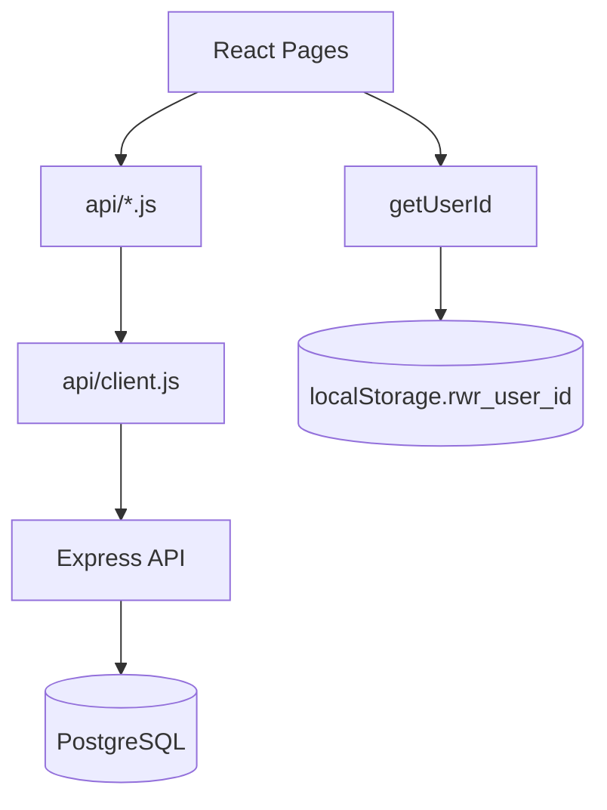
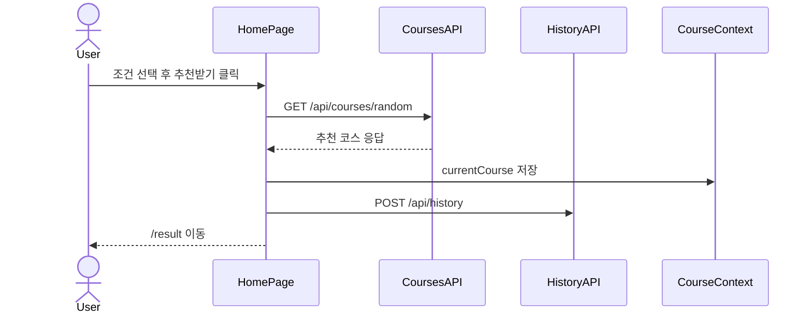

# 작업계획서 - Step 05: 프론트엔드-백엔드 연동

> **상태**: 진행 완료  
> **작성일**: 2026.05.29  
> **브랜치**: `feat/step-05-api-integration`  
> **관련 문서**: [step-05-api-integration.md](../steps/step-05-api-integration.md) | [pr-05-api-integration.md](../pr/pr-05-api-integration.md)

---

## 1. 목표

Step 05의 목표는 Step 04에서 mock 데이터로 동작하던 React 화면을 Step 03에서 구현된 Express REST API와 연결하는 것이다.

이번 단계에서는 사용자가 조건을 선택하면 실제 추천 API를 호출하고, 추천 결과를 최근 이력에 저장하며, 즐겨찾기와 최근 추천 화면을 익명 UUID 기반 API로 조회한다.

---

## 2. 작업 범위

### 수정할 파일

| 파일 | 수정 내용 |
| --- | --- |
| `client/src/api/courses.js` | 랜덤 추천, 상세 조회 API 함수 구현 |
| `client/src/api/favorites.js` | 즐겨찾기 목록, 추가, 삭제 API 함수 구현 |
| `client/src/api/history.js` | 최근 추천 이력 목록, 저장 API 함수 구현 |
| `client/src/utils/userId.js` | 익명 UUID 생성 fallback 보완 |
| `client/src/pages/HomePage.jsx` | 추천 API 호출, 추천 성공 후 이력 저장 |
| `client/src/pages/ResultPage.jsx` | 다시 추천, 즐겨찾기 상태 조회/토글 |
| `client/src/pages/DetailPage.jsx` | 상세 API 조회, 즐겨찾기 상태 조회/토글 |
| `client/src/pages/FavoritesPage.jsx` | 즐겨찾기 목록 조회, 삭제 |
| `client/src/pages/HistoryPage.jsx` | 최근 추천 이력 조회, 즐겨찾기 토글 |
| `client/src/components/CourseCard.jsx` | 목록 응답처럼 상세 필드가 없는 코스 렌더링 보완 |
| `client/src/index.css` | API 오류 메시지 스타일 추가 |

### 생성할 파일

| 파일 | 설명 |
| --- | --- |
| `client/src/api/client.js` | API base URL, URL 생성, 공통 JSON 응답/오류 처리 |
| `client/src/utils/courseDisplay.js` | 서버 저장값과 사용자 표시 라벨 변환 |
| `docs/plans/plan-05-api-integration.md` | Step 05 작업계획서 |
| `docs/steps/step-05-api-integration.md` | Step 05 작업 결과 문서 |
| `docs/pr/pr-05-api-integration.md` | Step 05 PR 문서 |

### 제외 항목

| 제외 내용 | 이유 |
| --- | --- |
| 서버 API 구조 변경 | Step 03에서 구현 완료, 이번 단계는 프론트 연동 중심 |
| DB schema/seed 수정 | 데이터 정리는 Step 06 또는 별도 단계에서 처리 |
| Docker 실행 검증 | 현재 실제 개발 환경이 아닐 수 있어 코드/문서/빌드 중심 진행 |
| 커밋, 브랜치 생성, push, PR 생성 | 사용자 직접 수행 규칙 준수 |

---

## 3. 연동 대상 API

| 메서드 | 경로 | 사용 화면 | 목적 |
| --- | --- | --- | --- |
| `GET` | `/api/courses/random` | `HomePage`, `ResultPage` | 조건 기반 랜덤 추천, 다시 추천 |
| `GET` | `/api/courses/:id` | `DetailPage` | 코스 상세 직접 조회 |
| `GET` | `/api/favorites` | `ResultPage`, `DetailPage`, `FavoritesPage`, `HistoryPage` | 즐겨찾기 상태/목록 조회 |
| `POST` | `/api/favorites` | `ResultPage`, `DetailPage`, `HistoryPage` | 즐겨찾기 추가 |
| `DELETE` | `/api/favorites/:courseId` | `ResultPage`, `DetailPage`, `FavoritesPage`, `HistoryPage` | 즐겨찾기 삭제 |
| `GET` | `/api/history` | `HistoryPage` | 최근 추천 이력 조회 |
| `POST` | `/api/history` | `HomePage`, `ResultPage` | 추천 성공 후 이력 저장 |

---

## 4. API 계층 설계

### 공통 API 클라이언트

| 함수 | 역할 |
| --- | --- |
| `buildUrl(path, params)` | `VITE_API_BASE_URL` 기준으로 URL과 query string 생성 |
| `requestJson(path, options)` | fetch 실행, JSON 파싱, 실패 응답을 `ApiError`로 변환 |
| `ApiError` | API 실패 상태와 메시지를 UI에서 다루기 위한 오류 타입 |

---

## 5. 화면별 데이터 흐름

### HomePage

### ResultPage

| 사용자 행동 | 처리 |
| --- | --- |
| 화면 진입 | 현재 코스가 즐겨찾기인지 조회 |
| 저장 클릭 | `POST /api/favorites` 호출 |
| 저장됨 클릭 | `DELETE /api/favorites/:courseId` 호출 |
| 다시 추천 클릭 | 현재 코스 ID를 `exclude`로 전달해 `GET /api/courses/random` 재호출 |

### DetailPage

| 진입 방식 | 처리 |
| --- | --- |
| 카드에서 이동 | `location.state.course` 우선 사용 |
| 직접 URL 접근 | `GET /api/courses/:id` 호출 |
| 저장/해제 | favorites API 호출 |

### FavoritesPage / HistoryPage

| 화면 | 처리 |
| --- | --- |
| FavoritesPage | `GET /api/favorites?userId=...`로 목록 조회, 삭제 시 목록에서 즉시 제거 |
| HistoryPage | `GET /api/history?userId=...&limit=10`로 최근 이력 조회, 즐겨찾기 상태도 함께 조회 |

---

## 6. 상태 설계

| 상태 | 위치 | 설명 |
| --- | --- | --- |
| `conditions` | `CourseContext` | 추천 조건 공유 |
| `currentCourse` | `CourseContext` | 결과/상세 화면 간 현재 추천 코스 공유 |
| `isLoading` | 각 page | API 호출 중 버튼/문구 상태 제어 |
| `message` / `errorMessage` | 각 page | 사용자에게 보여줄 API 실패 메시지 |
| `favorites` | `FavoritesPage` | 즐겨찾기 목록 |
| `history` | `HistoryPage` | 최근 추천 이력 |
| `favoriteIds` | `HistoryPage` | 최근 추천 카드의 즐겨찾기 표시용 ID 목록 |

---

## 7. 의사결정 근거

| 결정 사항 | 선택 | 이유 |
| --- | --- | --- |
| API base URL | `VITE_API_BASE_URL` + 기본값 | 로컬/배포 환경 분리 가능 |
| 공통 fetch 처리 | `api/client.js` | 응답 형식과 오류 처리를 일관화 |
| 전역 상태 확대 | 하지 않음 | MVP 규모에서는 page-local 상태가 단순함 |
| 추천 이력 저장 실패 | 추천 흐름 차단하지 않음 | 추천 결과 표시가 핵심 행동이므로 history 실패는 부가 기능으로 처리 |
| 목록 응답 상세 필드 부족 | `CourseCard`에서 선택 렌더링 | favorites/history 목록 API는 설명 필드가 없을 수 있음 |
| 서버 저장값 표시 | `courseDisplay.js`에서 라벨 변환 | 현재 서버 seed/검증값 인코딩 이슈와 UI 문구를 분리 |

---

## 8. 위험 요소 및 대응

| 위험 요소 | 대응 |
| --- | --- |
| 서버 또는 DB가 실행되지 않음 | 화면에 오류 메시지 표시, 빌드 검증 우선 |
| 서버 seed 데이터의 한글 인코딩 깨짐 | 화면 표시 라벨 변환 유틸 추가 |
| 중복 즐겨찾기 409 응답 | Step 06에서 사용자 메시지 UX 보완 |
| API 응답 필드가 화면 기대와 다름 | 상세 필드는 optional 렌더링 처리 |
| 직접 상세 URL 접근 시 context 없음 | `GET /api/courses/:id` fallback 조회 |

---

## 9. 완료 기준

- [x] `client/src/api/`의 Step 05 TODO fetch 구현 완료
- [x] 홈 화면에서 추천 API 호출
- [x] 추천 성공 후 최근 이력 저장 시도
- [x] 결과 화면 다시 추천 API 호출
- [x] 결과/상세/최근 화면 즐겨찾기 저장/해제 API 연결
- [x] 즐겨찾기 목록 API 조회
- [x] 최근 추천 이력 API 조회
- [x] API 실패 시 사용자 메시지 표시
- [x] `npm run build` 성공
- [x] Step/PR/Plan 문서 작성

---

## 10. 다음 단계

Step 06에서는 예외 처리와 보안을 보완한다.

- 서버 CORS 개발/운영 설정 점검
- API 실패 상태별 메시지 정교화
- 중복 즐겨찾기 409 UX 처리
- seed 데이터 및 문서 인코딩 이슈 정리 여부 결정
- 로딩/빈 상태/오류 상태 접근성 점검
