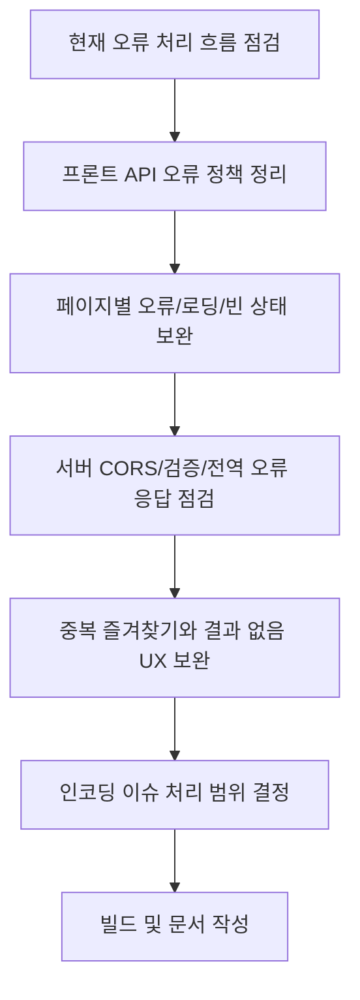

# 작업계획서 - Step 06: 예외 처리 및 보안 보완

> **상태**: 진행 예정  
> **작성일**: 2026.05.29  
> **브랜치**: `fix/step-06-error-security`  
> **관련 문서**: Step 06 진행 후 `docs/steps/step-06-error-security.md`, `docs/pr/pr-06-error-security.md` 작성 예정

---

## 1. 목표

Step 06의 목표는 Step 05에서 연결한 프론트엔드-백엔드 API 흐름을 더 안전하고 예측 가능하게 만드는 것이다.

이번 단계에서는 새로운 기능을 크게 추가하지 않고, API 실패 상황, 중복 즐겨찾기, 서버/DB 장애, 사용자 입력 검증, CORS/환경 변수, 민감 정보 노출 방지 등 MVP 운영 안정성에 필요한 보완을 수행한다.

---

## 2. 작업 범위

### 수정 예정 파일

| 파일 | 수정 내용 | 이유 |
| --- | --- | --- |
| `client/src/api/client.js` | 네트워크 오류, JSON 파싱 실패, HTTP 상태별 오류 메시지 정리 | 사용자에게 일관된 오류 메시지 제공 |
| `client/src/pages/HomePage.jsx` | 추천 실패, 조건 미선택, 결과 없음 상태 메시지 보완 | 추천 흐름의 실패 UX 개선 |
| `client/src/pages/ResultPage.jsx` | 중복 즐겨찾기, 다시 추천 실패, 이력 저장 실패 처리 보완 | API 실패가 화면 전체를 깨지 않게 처리 |
| `client/src/pages/DetailPage.jsx` | 상세 조회 실패, 없는 코스 ID, 즐겨찾기 실패 메시지 보완 | 직접 URL 접근 안정화 |
| `client/src/pages/FavoritesPage.jsx` | 목록 조회 실패, 삭제 실패 UX 보완 | 저장 목록 관리 안정화 |
| `client/src/pages/HistoryPage.jsx` | 이력 조회 실패, 즐겨찾기 토글 실패 UX 보완 | 최근 추천 화면 안정화 |
| `client/src/utils/userId.js` | localStorage 접근 실패 대비 try-catch 검토 | 브라우저 저장소 제한 상황 대응 |
| `client/src/utils/courseDisplay.js` | 서버 저장값/표시값 매핑 보완 | 인코딩 이슈가 UI에 번지는 것 완화 |
| `client/src/index.css` | 오류/경고/성공 메시지 스타일 분리 | 상태별 UI 가독성 개선 |
| `server/src/app.js` | CORS origin, JSON limit, 전역 오류 응답 재검토 | 운영/개발 환경 분리와 민감 정보 노출 방지 |
| `server/src/routes/*.js` | 검증 메시지와 허용값 정리 검토 | 잘못된 요청에 명확한 400 응답 제공 |
| `server/src/controllers/*.js` | DB 오류/중복 오류/없는 리소스 응답 정리 | API 응답 형식 일관성 유지 |

### 생성 예정 파일

| 파일 | 설명 |
| --- | --- |
| `docs/steps/step-06-error-security.md` | Step 06 작업 결과 문서 |
| `docs/pr/pr-06-error-security.md` | Step 06 PR 문서 |

### 제외 항목

| 제외 내용 | 이유 |
| --- | --- |
| 신규 기능 추가 | Step 06은 안정화/보안 보완 단계 |
| DB schema 대규모 변경 | MVP 데이터 구조는 유지 |
| 로그인/인증 기능 | MVP 범위 밖 |
| 외부 지도/GPS/공유 기능 | 후속 확장 기능 |
| Docker 기반 통합 실행 강제 | 현재 환경상 실행 실패 가능성이 있어 코드/문서/빌드 검증 중심 |
| 커밋, push, PR 생성 | 사용자 직접 수행 규칙 준수 |

---

## 3. 현재 확인된 이슈

| 이슈 | 영향 | Step 06 처리 방향 |
| --- | --- | --- |
| 서버 seed/검증값에 한글 인코딩 깨짐 존재 | 화면 표시값과 API 전송값이 분리되어 있음 | 데이터 정리 여부를 판단하고 최소한 문서화 |
| API 실패 메시지가 화면별로 흩어져 있음 | UX 일관성 부족 | 공통 오류 메시지 정책 수립 |
| 중복 즐겨찾기 409 응답 UX 미흡 | 사용자가 실패로 오해 가능 | 이미 저장된 상태로 처리하거나 안내 메시지 개선 |
| localStorage 사용 실패 가능성 | UUID 생성/조회 실패 가능 | try-catch와 fallback 정책 검토 |
| 서버 CORS 설정이 단일 origin 중심 | 배포 환경 확장 시 문제 가능 | `.env` 기반 개발/운영 분리 재확인 |
| 전역 오류 응답이 모두 500 중심 | 장애 원인 추적/사용자 안내 한계 | 에러 타입별 status/message 정리 |

---

## 4. 예외 처리 설계

### 프론트엔드 오류 분류

| 분류 | 예시 | 사용자 메시지 방향 |
| --- | --- | --- |
| 네트워크 오류 | 서버 미실행, DNS 실패 | 서버에 연결할 수 없다는 일반 메시지 |
| 검증 오류 | 조건 누락, 잘못된 코스 ID | 사용자가 수정 가능한 안내 |
| 결과 없음 | 조건에 맞는 코스 없음 | 조건 변경 유도 |
| 중복 요청 | 이미 저장된 즐겨찾기 | 저장된 상태로 간주하거나 부드러운 안내 |
| 서버 오류 | DB 연결 실패, 500 | 잠시 후 다시 시도 안내 |

### 백엔드 오류 분류

| 상황 | HTTP status | 응답 형식 |
| --- | --- | --- |
| validation 실패 | 400 | `{ success: false, message }` |
| 리소스 없음 | 404 | `{ success: false, message }` |
| 중복 즐겨찾기 | 409 | `{ success: false, message }` |
| payload 초과 | 413 | `{ success: false, message }` |
| 알 수 없는 서버 오류 | 500 | `{ success: false, message: "Internal server error" }` |

---

## 5. 보안 보완 계획

| 항목 | 현재 상태 | 보완 방향 |
| --- | --- | --- |
| CORS | `process.env.CORS_ORIGIN || http://localhost:5173` | 운영/개발 origin 분리 문서화 및 설정 재확인 |
| Helmet | 적용됨 | CSP가 프론트/API 환경과 충돌하지 않는지 확인 |
| JSON body limit | `4kb` 적용됨 | 초과 요청 응답이 안전한지 확인 |
| SQL Injection | parameterized query 사용 | 유지 |
| UUID 검증 | express-validator 사용 | 오류 메시지 정리 |
| 민감 정보 노출 | 전역 500에서 내부 메시지 숨김 | 로그와 응답 분리 유지 |
| 환경 변수 | `.env` 사용 | 문서에 필요한 키 정리, 커밋 제외 확인 |

---

## 6. 데이터/인코딩 정리 검토

현재 서버 seed 데이터와 일부 기존 문서에 한글 깨짐이 존재한다. Step 06에서 아래 중 하나를 결정한다.

| 선택지 | 장점 | 단점 |
| --- | --- | --- |
| A. 코드상 표시 라벨 변환 유지 | 수정 범위 작음, 현재 API와 호환 | DB 데이터 자체는 계속 깨져 있음 |
| B. seed/schema/routes 허용값을 정상 한글로 정리 | 근본 해결 | 서버 검증값, seed, 프론트 전송값 동시 수정 필요 |
| C. 이번 단계에서는 문서화만 하고 Step 07로 이관 | 안정화 범위 유지 | 사용자 화면 외 데이터 품질 문제 지속 |

권장안: **B를 우선 검토하되, 수정 범위가 커지면 C로 이관**한다.

---

## 7. 작업 순서



---

## 8. 완료 기준

- [ ] API 실패 상황별 사용자 메시지 기준 정리
- [ ] 프론트 공통 API 오류 처리 개선
- [ ] 추천/상세/즐겨찾기/최근 화면의 오류 UX 보완
- [ ] 중복 즐겨찾기 409 응답 처리 개선
- [ ] localStorage 접근 실패 대비 검토
- [ ] 서버 CORS와 전역 오류 응답 재점검
- [ ] 검증 오류 메시지의 민감 정보 노출 여부 확인
- [ ] 인코딩 이슈 처리 방향 문서화
- [ ] `npm run build` 성공
- [ ] Step 06 작업 결과 문서 작성
- [ ] Step 06 PR 문서 작성

---

## 9. 검증 계획

실행 위치: `C:\dev\RWR_project`

CMD:

```cmd
cd client
npm run build
```

PowerShell:

```powershell
Set-Location client
npm run build
```

추가 통합 검증은 서버와 PostgreSQL이 준비된 환경에서 진행한다.

| 검증 항목 | 방법 |
| --- | --- |
| 프론트 빌드 | `client`에서 `npm run build` |
| 서버 health | `GET /api/health` |
| validation 오류 | 잘못된 query/body로 400 응답 확인 |
| 중복 즐겨찾기 | 같은 `userId/courseId`로 2회 저장 시 UX 확인 |
| 서버 미실행 | 클라이언트 오류 메시지 확인 |
| DB 미실행 | API 실패 메시지와 서버 로그 분리 확인 |

---

## 10. 다음 단계 예고

Step 07에서는 테스트 및 리팩토링을 진행한다.

- 핵심 API 함수 단위 테스트 또는 수동 검증 체크리스트 정리
- 반복되는 페이지 오류 처리 로직 리팩토링
- CSS/목업 정합성 재점검
- 문서 인코딩과 seed 데이터 품질 최종 정리
