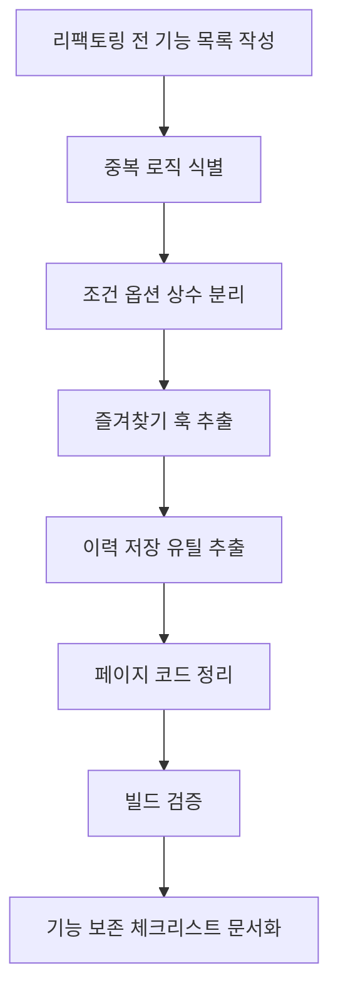

# 작업계획서 - Step 07: 테스트 문서화 및 리팩토링

> **상태**: 진행 완료  
> **작성일**: 2026.05.29  
> **브랜치**: `refactor/step-07-test-docs-refactor`  
> **관련 문서**: [step-07-test-docs-refactor.md](../steps/step-07-test-docs-refactor.md) | [pr-07-test-docs-refactor.md](../pr/pr-07-test-docs-refactor.md)

---

## 1. 목표

Step 07의 목표는 실행 환경 제약을 고려해 테스트 전략을 문서화하고, 기존 기능을 제거하지 않는 범위에서 중복 로직을 정리하는 것이다.

현재 Docker와 PostgreSQL 통합 실행이 어렵고 램 여유도 작으므로, 실제 통합 테스트 대신 다음에 실행 가능한 수동 검증 절차와 기능 보존 체크리스트를 남긴다.

---

## 2. 작업 범위

### 리팩토링 대상

| 대상 | 작업 |
| --- | --- |
| 조건 옵션 | `courseOptions.js`로 거리/시간/유형 옵션 분리 |
| 즐겨찾기 상태 | `useFavoriteStatus` 훅으로 조회/토글/409 처리 중복 제거 |
| 이력 저장 | `saveHistoryQuietly`로 추천 후 이력 저장 실패 처리 공통화 |
| Context 구조 | Fast Refresh 규칙에 맞게 Provider/Context/hook 분리 |
| 오류 메시지 | 깨진 한글 문구를 정상 한국어로 복구 |
| 화면 코드 | Home/Result/Detail/Favorites/History의 기능 유지 상태로 정리 |

### 문서화 대상

| 문서 | 내용 |
| --- | --- |
| `docs/plans/plan-07-test-docs-refactor.md` | 작업 계획 |
| `docs/steps/step-07-test-docs-refactor.md` | 리팩토링 전/후 기능 보존 결과 |
| `docs/pr/pr-07-test-docs-refactor.md` | PR 설명과 검증 체크리스트 |

### 제외 항목

| 제외 내용 | 이유 |
| --- | --- |
| Docker/PostgreSQL 통합 실행 | 현재 환경 제약 |
| 기능 추가 | Step 07은 품질 보완 단계 |
| API 계약 변경 | 기존 Step 05/06 기능 보존 우선 |
| 서버 DB/seed 전면 정리 | 별도 데이터 정리 작업으로 분리 권장 |

---

## 3. 리팩토링 전 기능 목록

| 기능 | 보존 기준 |
| --- | --- |
| 홈 조건 선택 | 거리/시간/이동 유형을 선택하고 추천 버튼 활성화 |
| 추천 API 호출 | 조건 선택 후 `GET /api/courses/random` 호출 |
| 추천 이력 저장 | 추천 성공 후 `POST /api/history` 시도 |
| 결과 표시 | 현재 추천 코스를 결과 화면에 표시 |
| 다시 추천 | 기존 코스 ID를 `exclude`로 전달 |
| 상세 보기 | 카드에서 `/courses/:id` 이동 |
| 직접 상세 접근 | context가 없어도 상세 API 조회 |
| 즐겨찾기 추가/삭제 | 결과/상세/최근 화면에서 토글 |
| 중복 즐겨찾기 | 409를 저장된 상태와 notice로 처리 |
| 즐겨찾기 목록 | 사용자 UUID 기준 목록 조회 |
| 최근 추천 목록 | 사용자 UUID 기준 최근 이력 조회 |
| 오류 메시지 | API 실패 시 `form-error` 또는 `form-notice` 표시 |

---

## 4. 작업 순서

---

## 5. 검증 계획

현재 환경에서는 아래 수준으로 검증한다.

| 검증 | 방법 |
| --- | --- |
| 클라이언트 정적 검증 | `npm run build` |
| 린트 검증 | `npm run lint` |
| 서버 문법 검증 | `node -e "require('./src/app')"` |
| 기능 보존 검증 | 문서 체크리스트 기반 수동 확인 절차 작성 |

통합 검증은 추후 Docker/PostgreSQL이 가능한 환경에서 진행한다.

---

## 6. 완료 기준

- [x] 리팩토링 전 기능 목록 작성
- [x] 조건 옵션 상수 분리
- [x] 즐겨찾기 중복 로직 훅 분리
- [x] 추천 이력 저장 실패 처리 유틸 분리
- [x] CourseProvider/useCourse 구조 분리
- [x] 깨진 JSX/한글 문구 복구
- [x] 기능 보존 체크리스트 작성
- [x] `npm run lint` 성공
- [x] `npm run build` 성공
- [x] 서버 앱 모듈 로드 성공
- [x] Step/PR 문서 작성
