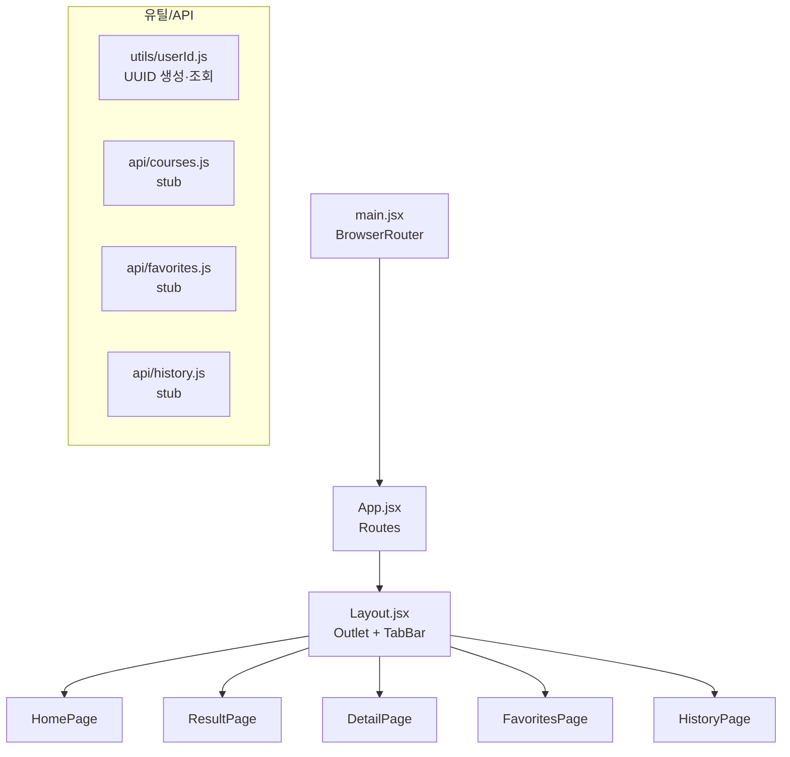

# Step 02. 프로젝트 기본 구조 구성

> **작성일**: 2026.05.29  
> **브랜치**: `feature/step-02-project-structure`  
> **관련 문서**: [작업계획서](../plans/plan-02-project-structure.md) | [PR 문서](../pr/pr-02-project-structure.md)

---

## 1. 작업 목표

React Router DOM 설정, 공통 레이아웃(하단 탭바), 5개 페이지 뼈대,
익명 UUID 유틸, API 함수 구조를 구성한다.  
실제 API 연동 없이 **구조만** 완성하는 단계.

---

## 2. 작업 배경

Step 01에서 React + Vite 초기 구조만 만들었으므로, 실제 기능을 붙이기 전에
라우팅과 레이아웃 뼈대가 필요하다.  
Step 03(Express API), Step 04(화면 구현)의 작업 기반을 마련한다.

---

## 3. 아키텍처 개요



### 라우팅 구조

| 경로           | 컴포넌트        | 설명             |
| -------------- | --------------- | ---------------- |
| `/`            | `HomePage`      | 조건 선택 화면   |
| `/result`      | `ResultPage`    | 추천 결과 화면   |
| `/courses/:id` | `DetailPage`    | 코스 상세 화면   |
| `/favorites`   | `FavoritesPage` | 즐겨찾기 목록    |
| `/history`     | `HistoryPage`   | 최근 추천 이력   |
| `*`            | → `/` redirect  | 잘못된 경로 처리 |

---

## 4. 생성/수정 파일 목록

### 수정

| 파일                    | 수정 내용                                     |
| ----------------------- | --------------------------------------------- |
| `client/vite.config.js` | `/api → http://localhost:3000` 프록시 추가    |
| `client/src/main.jsx`   | `<BrowserRouter>` 래핑 추가                   |
| `client/src/App.jsx`    | Vite 기본 코드 → React Router `<Routes>` 구성 |
| `client/src/index.css`  | RWR 디자인 변수 + 전역 리셋 + 공통 클래스     |
| `client/src/App.css`    | Vite 기본 CSS 제거                            |

### 생성

| 파일                                      | 설명                                               |
| ----------------------------------------- | -------------------------------------------------- |
| `client/src/components/Layout.jsx`        | `<Outlet>` + `<TabBar>` 공통 레이아웃              |
| `client/src/components/Layout.css`        | 레이아웃 기본 스타일                               |
| `client/src/components/TabBar.jsx`        | 홈·즐겨찾기·최근 3탭 하단 네비게이션               |
| `client/src/components/TabBar.css`        | 탭바 스타일                                        |
| `client/src/pages/HomePage.jsx`           | 조건 선택 화면 뼈대                                |
| `client/src/pages/ResultPage.jsx`         | 추천 결과 화면 뼈대                                |
| `client/src/pages/DetailPage.jsx`         | 코스 상세 화면 뼈대                                |
| `client/src/pages/FavoritesPage.jsx`      | 즐겨찾기 목록 화면 뼈대                            |
| `client/src/pages/HistoryPage.jsx`        | 최근 추천 이력 화면 뼈대                           |
| `client/src/utils/userId.js`              | `crypto.randomUUID()` → `localStorage.rwr_user_id` |
| `client/src/api/courses.js`               | 코스 API 함수 stub                                 |
| `client/src/api/favorites.js`             | 즐겨찾기 API 함수 stub                             |
| `client/src/api/history.js`               | 이력 API 함수 stub                                 |
| `docs/plans/plan-01-dev-environment.md`   | Step 01 작업계획서 (사후 작성)                     |
| `docs/plans/plan-02-project-structure.md` | Step 02 작업계획서                                 |

---

## 5. 주요 파일 설명

### client/src/main.jsx

```jsx
// BrowserRouter로 전체 앱 감싸기
createRoot(document.getElementById("root")).render(
  <StrictMode>
    <BrowserRouter>
      <App />
    </BrowserRouter>
  </StrictMode>,
);
```

### client/src/App.jsx

```jsx
// Layout을 부모 Route로 설정 → 모든 페이지에 TabBar 자동 포함
<Routes>
  <Route path="/" element={<Layout />}>
    <Route index element={<HomePage />} />
    <Route path="result" element={<ResultPage />} />
    <Route path="courses/:id" element={<DetailPage />} />
    <Route path="favorites" element={<FavoritesPage />} />
    <Route path="history" element={<HistoryPage />} />
    <Route path="*" element={<Navigate to="/" replace />} />
  </Route>
</Routes>
```

### client/src/utils/userId.js

```js
const USER_ID_KEY = "rwr_user_id";

export function getUserId() {
  let userId = localStorage.getItem(USER_ID_KEY);
  if (!userId) {
    userId = crypto.randomUUID();
    localStorage.setItem(USER_ID_KEY, userId);
  }
  return userId;
}
```

- `crypto.randomUUID()` — 브라우저 내장 API, HTTPS/localhost에서 동작
- 키 이름 `rwr_user_id` — 기획서 `06-data-spec.md` 명세와 일치

### client/src/api/\*.js

모든 API 함수는 `throw new Error('Not implemented')` stub 상태.  
Step 05에서 실제 `fetch()` 호출로 교체.  
응답 형식은 `{ success: true, data: ... }` / `{ success: false, message: ... }` 통일.

---

## 6. 실행 방법

```
실행 위치: C:\dev\RWR_project\client

CMD:
npm install
npm run dev

기대 결과:
http://localhost:5173 — 홈 화면 표시
하단 탭바 3개 탭 전환 동작
```

---

## 7. 검증 방법

| 검증 항목      | 방법                                                                |
| -------------- | ------------------------------------------------------------------- |
| 라우팅 동작    | `/`, `/result`, `/favorites`, `/history` 직접 URL 입력              |
| 탭바 전환      | 탭 클릭 후 URL·화면 변경 확인                                       |
| `*` 리다이렉트 | `/nonexistent` 입력 → `/`로 이동 확인                               |
| UUID 생성      | 브라우저 DevTools → Application → localStorage → `rwr_user_id` 확인 |
| 콘솔 오류 없음 | DevTools → Console 탭에 빨간 오류 없음 확인                         |

---

## 8. 오류 대처

| 오류                                    | 원인                                          | 해결                               |
| --------------------------------------- | --------------------------------------------- | ---------------------------------- |
| `Cannot find module 'react-router-dom'` | npm install 미실행                            | `cd client && npm install`         |
| 화면 흰 화면 (blank)                    | JSX 문법 오류 또는 import 경로 오류           | DevTools Console 확인              |
| 탭바가 중복 표시됨                      | `<Layout>` 외부에 `<TabBar>` 별도 추가된 경우 | App.jsx Route 구조 확인            |
| `crypto.randomUUID is not a function`   | HTTP 환경 (http:// 비보안)                    | localhost 또는 HTTPS 환경에서 실행 |

---

## 9. 보안 고려사항

- 익명 UUID는 localStorage에만 저장 — 서버로 전송 시 Step 05에서 헤더/쿼리 방식 검토
- API stub에서 `throw new Error` 처리 — 실수로 호출해도 콘솔에서 즉시 확인 가능
- `<Navigate replace>` 사용 — 잘못된 URL 방문 이력 남기지 않음

---

## 10. 다음 단계 예고

**Step 03: Express API 라우터 구현**

- `GET /api/courses/random` — 조건 필터링 + 랜덤 코스 반환
- `GET /api/courses/:id` — 코스 상세
- `GET/POST/DELETE /api/favorites` — 즐겨찾기 CRUD
- `GET/POST /api/history` — 이력 조회·저장
- express-validator 입력 검증
- 라우터 → 컨트롤러 → 서비스 계층 분리
