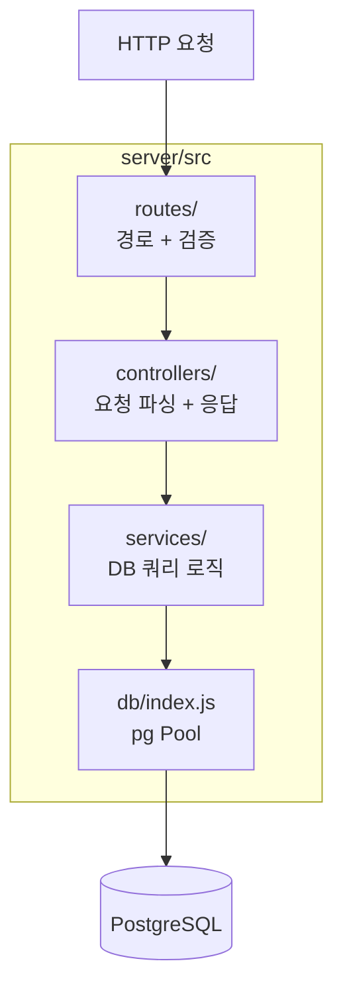

# Step 03. Express API 라우터 구현

> **작성일**: 2026.05.29  
> **브랜치**: `feat/step-03-express-api`  
> **관련 문서**: [작업계획서](../plans/plan-03-express-api.md) | [PR 문서](../pr/pr-03-express-api.md)

---

## 1. 작업 목표

courses / favorites / history REST API 엔드포인트를 구현한다.  
라우터 → 컨트롤러 → 서비스 3계층 구조로 분리하며,  
express-validator 입력 검증과 전역 에러 핸들러를 활용한다.

---

## 2. 작업 배경

Step 01에서 `app.js`에 라우터 등록 코드를 TODO 주석으로 남겨두었다.  
Step 02에서 클라이언트 API stub 함수를 정의했으므로,  
이제 실제 서버 엔드포인트를 만들어 Step 05 연동의 기반을 마련한다.

---

## 3. 아키텍처 개요



### 폴더 구조 (Step 03 완료 후)

```
server/src/
├── app.js               ← 라우터 등록 활성화
├── db/
│   ├── index.js
│   ├── schema.sql
│   └── seed.sql
├── routes/
│   ├── courses.js
│   ├── favorites.js
│   └── history.js
├── controllers/
│   ├── coursesController.js
│   ├── favoritesController.js
│   └── historyController.js
└── services/
    ├── coursesService.js
    ├── favoritesService.js
    └── historyService.js
```

---

## 4. 생성/수정 파일 목록

### 수정

| 파일                | 수정 내용                         |
| ------------------- | --------------------------------- |
| `server/src/app.js` | 라우터 require + `app.use()` 등록 |

### 생성

| 파일                                            | 설명                                 |
| ----------------------------------------------- | ------------------------------------ |
| `server/src/routes/courses.js`                  | 코스 라우터 + express-validator 검증 |
| `server/src/routes/favorites.js`                | 즐겨찾기 라우터 + 검증               |
| `server/src/routes/history.js`                  | 이력 라우터 + 검증                   |
| `server/src/controllers/coursesController.js`   | 코스 컨트롤러                        |
| `server/src/controllers/favoritesController.js` | 즐겨찾기 컨트롤러                    |
| `server/src/controllers/historyController.js`   | 이력 컨트롤러                        |
| `server/src/services/coursesService.js`         | 코스 DB 쿼리                         |
| `server/src/services/favoritesService.js`       | 즐겨찾기 DB 쿼리                     |
| `server/src/services/historyService.js`         | 이력 DB 쿼리                         |

---

## 5. 엔드포인트 명세

### 5-1. 코스 API

#### `GET /api/courses/random`

| 파라미터   | 필수 | 허용값                 | 설명                       |
| ---------- | ---- | ---------------------- | -------------------------- |
| `distance` | ✅   | `1`, `3`, `5`          | 거리(km)                   |
| `time`     | ✅   | `15`, `30`, `60`       | 소요 시간(분)              |
| `type`     | ✅   | `걷기`, `조깅`, `러닝` | 운동 유형                  |
| `exclude`  | ❌   | `route-XXX`            | 제외할 코스 ID (다시 추천) |

```json
// 성공 응답 200
{ "success": true, "data": { "id": "route-001", "title": "서울숲 둘레길", ... } }

// 조건에 맞는 코스 없음 404
{ "success": false, "message": "조건에 맞는 코스가 없습니다." }
```

#### `GET /api/courses/:id`

```json
// 성공 200
{ "success": true, "data": { "id": "route-001", ... } }

// 없는 ID 404
{ "success": false, "message": "코스를 찾을 수 없습니다." }
```

---

### 5-2. 즐겨찾기 API

#### `GET /api/favorites?userId=<uuid>`

```json
// 성공 200 (없으면 빈 배열)
{ "success": true, "data": [ { "id": 1, "courseId": "route-001", ... } ] }
```

#### `POST /api/favorites`

```json
// Request Body
{ "userId": "550e8400-...", "courseId": "route-001" }

// 성공 201
{ "success": true, "data": { "id": 5, "userId": "...", "courseId": "route-001", "createdAt": "..." } }

// 중복 409
{ "success": false, "message": "이미 즐겨찾기에 추가된 코스입니다." }
```

#### `DELETE /api/favorites/:courseId?userId=<uuid>`

```json
// 성공 200
{ "success": true }

// 없는 항목 404
{ "success": false, "message": "즐겨찾기 항목을 찾을 수 없습니다." }
```

---

### 5-3. 이력 API

#### `GET /api/history?userId=<uuid>&limit=10`

```json
// 성공 200
{
  "success": true,
  "data": [{ "id": 1, "courseId": "route-001", "recommendedAt": "..." }]
}
```

#### `POST /api/history`

```json
// Request Body
{ "userId": "550e8400-...", "courseId": "route-001" }

// 성공 201
{ "success": true, "data": { "id": 10, "userId": "...", "courseId": "route-001", "recommendedAt": "..." } }
```

---

## 6. 검증 규칙 (express-validator)

| 파라미터   | 검증 규칙                                                | 실패 응답 |
| ---------- | -------------------------------------------------------- | --------- |
| `distance` | `isInt({ min: 1 })` + `isIn([1,3,5])`                    | 400       |
| `time`     | `isInt()` + `isIn([15,30,60])`                           | 400       |
| `type`     | `isIn(['걷기','조깅','러닝'])`                           | 400       |
| `userId`   | `isUUID(4)`                                              | 400       |
| `courseId` | `isString` + `matches(/^route-/)` + `isLength({max:20})` | 400       |
| `limit`    | `optional` + `isInt({min:1,max:50})`                     | 400       |

---

## 7. 실행 방법

```
실행 위치: C:\dev\RWR_project\server

CMD:
npm install
npm run dev

기대 결과:
RWR API Server running on port 3000 출력
http://localhost:3000/api/health → {"success":true, ...} 응답
```

> ⚠️ DB 없이 실행 시 서버는 기동되지만, DB 쿼리 호출 시 연결 오류 발생  
> DB 연결 실제 테스트는 Step 07 Docker 환경에서 진행

---

## 8. 검증 방법 (서버 기동 후)

| 검증 항목      | 명령어 (PowerShell)                                                              |
| -------------- | -------------------------------------------------------------------------------- |
| 헬스체크 유지  | `Invoke-RestMethod http://localhost:3000/api/health`                             |
| 검증 오류 확인 | `Invoke-RestMethod "http://localhost:3000/api/courses/random?distance=99"` → 400 |
| 없는 경로      | `Invoke-RestMethod http://localhost:3000/api/wrong` → 404                        |

---

## 9. 오류 대처

| 오류                                    | 원인                      | 해결                                       |
| --------------------------------------- | ------------------------- | ------------------------------------------ |
| `Cannot find module './routes/courses'` | 파일 경로 오타            | `server/src/routes/courses.js` 존재 확인   |
| `ValidationError` 미동작                | `validationResult` 미호출 | 컨트롤러 상단 `validationResult(req)` 확인 |
| DB 연결 오류                            | PostgreSQL 미실행         | 정상 — Step 07에서 해결                    |
| `UNIQUE constraint` → 500 응답          | 중복 즐겨찾기 오류 미처리 | 서비스에서 `23505` 오류 코드 catch         |

---

## 10. 보안 고려사항

- `userId` UUID 형식 검증 → SQL Injection 기본 방어
- `courseId` 형식 검증 (`route-` 접두사) → 임의 문자열 주입 방지
- `express-validator` sanitize 적용 (`trim()`) → 공백 입력 처리
- 에러 핸들러에서 스택 트레이스 미노출 (이미 `app.js`에 구현)
- `limit` 최대값 제한(50) → 과도한 데이터 반환 방지

---

## 11. 다음 단계 예고

**Step 04: React 주요 화면 구현**

- 조건 선택 칩 UI + 상태 관리
- 코스 결과 카드 컴포넌트
- 즐겨찾기·이력 목록 화면 디자인 완성
- 빈 상태(Empty State) UI
