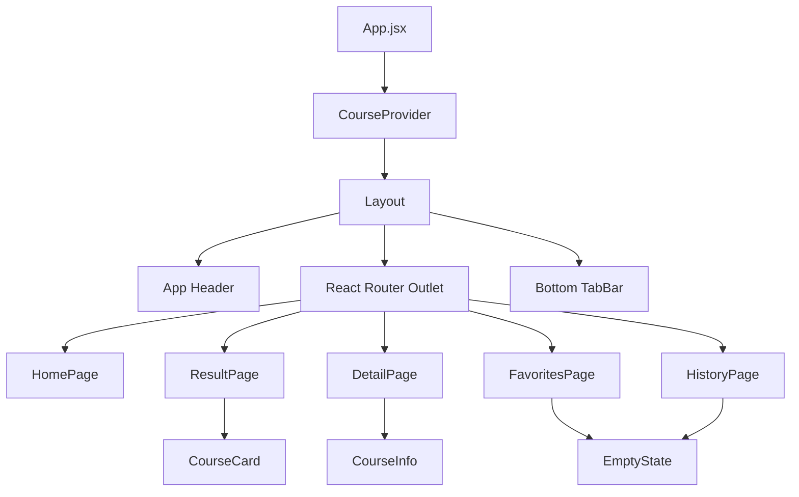
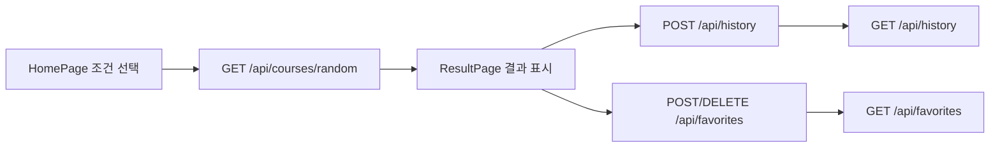

# Step 04. React UI 구현

> 작성일: 2026.05.29  
> 보정일: 2026.05.29  
> 관련 PR 문서: [docs/pr/pr-04-react-ui.md](../pr/pr-04-react-ui.md)

---

## 1. 작업 목표

Step 04의 목표는 Step 02에서 준비한 React Router 기반 구조 위에 MVP 주요 화면을 실제 사용 가능한 정적 UI로 구현하는 것이다. 실제 API 호출은 Step 05에서 처리하므로, 이번 단계는 화면 흐름, 공통 컴포넌트, mock 데이터 기반 인터랙션을 안정화하는 데 집중한다.

| 목표 | 완료 기준 |
| --- | --- |
| 공통 레이아웃 | `Layout`이 헤더, 페이지 영역, 하단 탭을 감싼다 |
| 메인 화면 | 거리, 시간, 이동 유형 선택 후 추천 결과로 이동한다 |
| 결과 화면 | mock 추천 코스, 선택 조건, 다시 추천 버튼을 표시한다 |
| 상세 화면 | 코스 소개, 추천 이유, 주의사항, 이용 팁을 표시한다 |
| 즐겨찾기/이력 화면 | API 연동 전 empty state를 표시한다 |
| UI 안정화 | 깨진 JSX와 한글 문구를 복구해 빌드 가능한 상태를 유지한다 |

---

## 2. 작업 배경

현재 저장소에는 Step 01~04 문서와 코드가 존재한다. 다만 일부 파일에서 한글 인코딩이 깨지며 JSX 문자열이 닫히지 않는 문제가 확인되었다. 이 상태에서는 실제 개발 환경이 아니더라도 Vite 빌드 단계에서 실패할 가능성이 높으므로, Step 05 API 연동 전에 Step 04 UI 안정화가 필요하다.

또한 `docs/images/`의 DALL-E 목업 이미지와 실제 CSS 구현 사이에 차이가 있어, 이번 문서에 UI 정합성 이슈를 명시하고 후속 작업 기준을 남긴다.

---

## 3. 아키텍처 개요



---

## 4. 생성/수정 파일 목록

| 구분 | 파일 | 설명 |
| --- | --- | --- |
| 수정 | `client/src/context/CourseContext.jsx` | 조건 상태, 현재 코스 상태, Step 04 mock 코스 데이터 정리 |
| 수정 | `client/src/pages/HomePage.jsx` | 조건 선택 UI와 추천 이동 흐름 복구 |
| 수정 | `client/src/pages/ResultPage.jsx` | 결과 화면 텍스트, 조건 배지, 다시 추천 버튼 복구 |
| 수정 | `client/src/pages/DetailPage.jsx` | 상세 화면의 뒤로가기, 저장 버튼, 코스 메타 정보 복구 |
| 수정 | `client/src/pages/FavoritesPage.jsx` | 즐겨찾기 empty state 문구 복구 |
| 수정 | `client/src/pages/HistoryPage.jsx` | 최근 추천 empty state 문구 복구 |
| 수정 | `client/src/components/CourseCard.jsx` | 코스 카드, 저장 버튼, 상세 보기 버튼 복구 |
| 수정 | `client/src/components/CourseInfo.jsx` | 상세 정보 4개 섹션 복구 |
| 수정 | `client/src/components/EmptyState.jsx` | empty state 공통 컴포넌트 단순화 |
| 수정 | `client/src/components/Layout.jsx` | 헤더 표기 복구 |
| 수정 | `client/src/components/TabBar.jsx` | 하단 탭 라벨과 접근성 라벨 복구 |
| 수정 | `docs/steps/step-04-react-ui.md` | Step 04 구현 및 안정화 내역 문서화 |
| 수정 | `docs/pr/pr-04-react-ui.md` | PR 설명과 검증 항목 보정 |

---

## 5. 주요 파일 설명

| 파일 | 역할 |
| --- | --- |
| `CourseContext.jsx` | 조건 선택값과 현재 추천 코스를 페이지 간 공유한다 |
| `HomePage.jsx` | 사용자가 거리, 시간, 이동 유형을 선택하는 진입 화면이다 |
| `ResultPage.jsx` | 추천 결과를 표시하고 다시 추천 흐름을 제공한다 |
| `DetailPage.jsx` | 추천 코스의 상세 설명과 주의사항을 보여준다 |
| `CourseCard.jsx` | 결과, 즐겨찾기, 이력 화면에서 재사용할 코스 카드이다 |
| `CourseInfo.jsx` | 상세 화면에서 코스 정보를 섹션 단위로 표시한다 |
| `EmptyState.jsx` | 데이터가 없을 때 사용자에게 다음 행동을 안내한다 |

---

## 6. 실행 방법

실행 위치: `C:\dev\RWR_project\client`

CMD:

```cmd
npm install
npm run dev
```

PowerShell:

```powershell
npm install
npm run dev
```

기대 결과:

- Vite 개발 서버가 실행된다.
- 브라우저에서 `http://localhost:5173` 접속 시 RWR UI가 표시된다.

오류 발생 시 확인할 항목:

- `node_modules` 설치 여부
- `react-router-dom` 설치 여부
- 깨진 JSX 문자열 또는 닫히지 않은 태그 여부

---

## 7. 검증 방법

| 화면 | 검증 항목 |
| --- | --- |
| 홈 | 거리, 시간, 이동 유형을 모두 선택해야 추천 버튼이 활성화된다 |
| 홈 | 초기화 버튼으로 선택값이 해제된다 |
| 결과 | 추천 코스 카드와 선택 조건 배지가 표시된다 |
| 결과 | 저장 버튼이 토글된다 |
| 결과 | 상세 보기 버튼으로 상세 화면에 이동한다 |
| 상세 | 코스 소개, 추천 이유, 주의사항, 이용 팁이 표시된다 |
| 즐겨찾기 | API 연동 전 empty state가 표시된다 |
| 최근 | API 연동 전 empty state가 표시된다 |
| 공통 | 하단 탭으로 홈, 즐겨찾기, 최근 화면을 이동할 수 있다 |

---

## 8. 오류 대처

| 증상 | 확인할 항목 |
| --- | --- |
| 화면이 흰색으로 표시됨 | 브라우저 콘솔의 JSX 파싱 오류 확인 |
| 버튼 클릭 후 이동하지 않음 | `BrowserRouter`, `Routes`, `Navigate` 설정 확인 |
| 상세 화면 데이터가 비어 있음 | `location.state`, `currentCourse`, `MOCK_COURSE` fallback 순서 확인 |
| 한글이 깨져 보임 | 파일 인코딩을 UTF-8로 저장했는지 확인 |

---

## 9. 보안 고려사항

- Step 04는 실제 API 호출과 사용자 데이터 저장을 수행하지 않는다.
- 즐겨찾기와 이력 저장은 Step 05에서 익명 UUID와 API 응답 형식을 기준으로 연결한다.
- mock 데이터에는 민감 정보가 포함되지 않는다.

---

## 10. 목업-CSS 정합성 메모

현재 `docs/images/mockup-main.png`, `mockup-result.png`, `mockup-detail.png`는 DALL-E로 제작된 시각 기준이며, 실제 CSS 구현과 완전히 일치하지 않는다.

| 항목 | 현재 상태 | 후속 조치 |
| --- | --- | --- |
| 색상 | 실제 구현은 `#4caf50` 계열 중심 | 목업의 톤과 디자인 시스템 중 하나를 기준으로 확정 필요 |
| 버튼/카드 반경 | 코드상 8~16px 혼재 | 반복 카드와 버튼 반경 기준 통일 필요 |
| 헤더 | 실제 구현은 단순 브랜드 헤더 | 목업 헤더의 시각 밀도 반영 여부 결정 필요 |
| 아이콘 | 깨짐 방지를 위해 텍스트 라벨 중심으로 보정 | 아이콘 라이브러리 도입 여부는 별도 결정 |
| 상세 디자인 | Step 04는 구조 우선 | Step 05 이후 API 상태 UI와 함께 시각 정합성 보완 |

---

## 11. 다음 단계 예고

Step 05에서는 현재 mock 데이터 흐름을 실제 Express API와 연결한다.



Step 05 주요 작업:

- `client/src/api/`의 TODO fetch 함수 구현
- 추천 결과 로딩/오류 상태 처리
- 즐겨찾기 저장/해제 API 연동
- 최근 추천 이력 저장/조회 API 연동
- API 실패 시 사용자 메시지 표시
