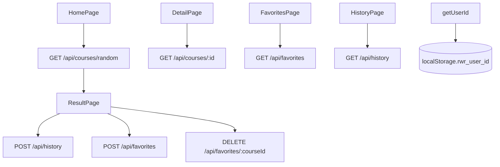

# Step 05. 프론트엔드-백엔드 연동

> 작성일: 2026.05.29  
> 브랜치: `feat/step-05-api-integration`  
> 관련 PR 문서: [docs/pr/pr-05-api-integration.md](../pr/pr-05-api-integration.md)

---

## 1. 작업 목표

Step 05의 목표는 Step 04에서 mock 데이터로 동작하던 React 화면을 Step 03에서 구현한 Express REST API와 연결하는 것이다.

| 목표 | 완료 기준 |
| --- | --- |
| API 호출 함수 구현 | `client/src/api/`의 TODO fetch 함수 제거 |
| 추천 연동 | 홈 화면에서 `GET /api/courses/random` 호출 |
| 이력 저장 | 추천 성공 시 `POST /api/history` 호출 |
| 즐겨찾기 연동 | 저장/해제/목록 조회 API 연결 |
| 상세 조회 | 직접 상세 URL 접근 시 `GET /api/courses/:id` 호출 |
| 오류 처리 | API 실패 시 화면에 안전한 오류 메시지 표시 |

---

## 2. 작업 배경

Step 04까지는 `MOCK_COURSE`와 빈 배열을 사용해 화면 흐름만 확인했다. Step 05에서는 익명 UUID(`localStorage.rwr_user_id`)를 기준으로 즐겨찾기와 최근 추천 이력을 서버에 저장하고 조회한다.

실제 실행 환경에서는 PostgreSQL과 Express 서버가 함께 필요하다. 현재 작업은 코드 작성과 Vite 빌드 검증 중심으로 진행했다.

---

## 3. 아키텍처 개요



---

## 4. 생성/수정 파일 목록

| 구분 | 파일 | 설명 |
| --- | --- | --- |
| 생성 | `client/src/api/client.js` | API base URL, URL 생성, 공통 JSON 요청/오류 처리 |
| 생성 | `client/src/utils/courseDisplay.js` | 서버 저장값을 화면 표시 라벨로 변환 |
| 수정 | `client/src/api/courses.js` | 코스 랜덤 추천/상세 조회 API 구현 |
| 수정 | `client/src/api/favorites.js` | 즐겨찾기 목록/추가/삭제 API 구현 |
| 수정 | `client/src/api/history.js` | 최근 추천 이력 목록/저장 API 구현 |
| 수정 | `client/src/utils/userId.js` | UUID 생성 fallback 보완 |
| 수정 | `client/src/pages/HomePage.jsx` | 추천 API 호출, 이력 저장, 로딩/오류 처리 |
| 수정 | `client/src/pages/ResultPage.jsx` | 다시 추천, 즐겨찾기 토글, 즐겨찾기 상태 조회 |
| 수정 | `client/src/pages/DetailPage.jsx` | 상세 API 조회, 즐겨찾기 토글 |
| 수정 | `client/src/pages/FavoritesPage.jsx` | 즐겨찾기 목록 조회 및 삭제 |
| 수정 | `client/src/pages/HistoryPage.jsx` | 최근 추천 이력 조회 및 즐겨찾기 토글 |
| 수정 | `client/src/components/CourseCard.jsx` | 목록 응답처럼 상세 필드가 없는 코스도 렌더링 |
| 수정 | `client/src/components/TabBar.jsx` | 깨진 탭 라벨 복구 |
| 수정 | `client/src/index.css` | API 오류 메시지 스타일 추가 |

---

## 5. 주요 파일 설명

| 파일 | 역할 |
| --- | --- |
| `api/client.js` | 모든 API 요청의 공통 처리 계층 |
| `api/courses.js` | 추천/상세 코스 API |
| `api/favorites.js` | 즐겨찾기 API |
| `api/history.js` | 최근 추천 이력 API |
| `utils/userId.js` | 익명 사용자 UUID 생성 및 localStorage 저장 |
| `utils/courseDisplay.js` | 서버 검증값과 화면 표시값 분리 |

---

## 6. 실행 방법

실행 위치: `C:\dev\RWR_project`

CMD:

```cmd
cd server
npm install
npm run dev
```

```cmd
cd client
npm install
npm run dev
```

PowerShell:

```powershell
Set-Location server
npm install
npm run dev
```

```powershell
Set-Location client
npm install
npm run dev
```

기대 결과:

- 서버: `http://localhost:3000/api/health` 응답 확인
- 클라이언트: `http://localhost:5173`에서 추천/즐겨찾기/최근 이력 화면 접근

환경 변수:

```text
VITE_API_BASE_URL=http://localhost:3000/api
```

미설정 시 기본값으로 `http://localhost:3000/api`를 사용한다.

---

## 7. 검증 방법

| 항목 | 검증 내용 |
| --- | --- |
| 빌드 | `client`에서 `npm run build` 성공 |
| 추천 | 조건 선택 후 추천 버튼 클릭 시 `/api/courses/random` 호출 |
| 이력 | 추천 성공 후 `/api/history` 저장 요청 |
| 다시 추천 | 결과 화면에서 기존 코스 ID를 `exclude`로 전달 |
| 즐겨찾기 | 결과/상세/이력 화면에서 저장/해제 API 호출 |
| 목록 | 즐겨찾기/최근 화면 진입 시 사용자 UUID 기반 목록 조회 |
| 오류 | 서버/DB 오류 시 화면에 오류 메시지 표시 |

---

## 8. 오류 대처

| 증상 | 확인할 항목 |
| --- | --- |
| `Failed to fetch` | Express 서버 실행 여부, `VITE_API_BASE_URL` 값 |
| 400 validation error | 클라이언트가 서버가 허용하는 `distance/time/type` 값을 보내는지 확인 |
| 500 DB error | PostgreSQL 실행 및 seed 데이터 여부 |
| 즐겨찾기 목록 비어 있음 | `localStorage.rwr_user_id`가 이전과 달라졌는지 확인 |
| 상세 화면 데이터 없음 | `/api/courses/:id`가 해당 `route-XXX`를 찾는지 확인 |

---

## 9. 보안 고려사항

- API base URL은 `VITE_API_BASE_URL`로 분리했다.
- 사용자 식별은 로그인 없는 MVP용 익명 UUID이며 인증 수단이 아니다.
- API 오류는 서버 메시지 또는 일반 메시지만 표시하고 내부 스택은 노출하지 않는다.
- 즐겨찾기/이력 요청은 서버의 UUID 검증을 통과해야 한다.

---

## 10. 다음 단계 예고

Step 06에서는 예외 처리와 보안을 더 보완한다.

- API 실패 상태별 사용자 메시지 정교화
- 서버 CORS 운영/개발 분리 재확인
- 깨진 seed 데이터와 문서 인코딩 정리 여부 검토
- 중복 즐겨찾기 409 응답 UX 보완
- 접근성/모바일 터치 영역 재점검
