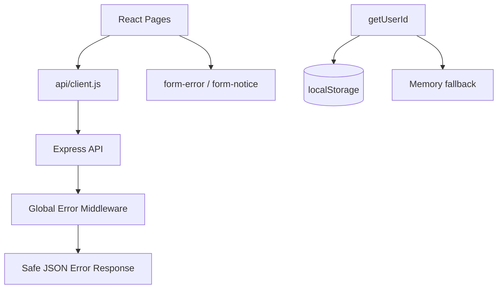

# Step 06. 예외 처리 및 보안 보완

> 작성일: 2026.05.29  
> 브랜치: `fix/step-06-error-security`  
> 작업 계획서: [docs/plans/plan-06-error-security.md](../plans/plan-06-error-security.md)  
> 관련 PR 문서: [docs/pr/pr-06-error-security.md](../pr/pr-06-error-security.md)

---

## 1. 작업 목표

Step 06의 목표는 Step 05에서 연결한 API 흐름을 더 안전하고 예측 가능하게 만드는 것이다. 신규 기능을 추가하기보다 네트워크 오류, API 실패, 중복 즐겨찾기, localStorage 실패, CORS 제한, 요청 크기 초과 같은 예외 상황을 안정적으로 처리한다.

---

## 2. 작업 배경

Step 05 이후 프론트엔드는 실제 API를 호출하지만, 서버 미실행/DB 미실행/중복 요청/직접 URL 접근 같은 실패 상황에서 사용자 메시지가 화면별로 흩어져 있었다. 또한 일부 파일에 인코딩 깨짐이 다시 발생해 JSX 문자열이 불안정한 상태였으므로, Step 06에서 오류 처리 보완과 함께 문구를 정상화했다.

---

## 3. 아키텍처 개요



---

## 4. 생성/수정 파일 목록

| 구분 | 파일 | 설명 |
| --- | --- | --- |
| 수정 | `client/src/api/client.js` | 네트워크/HTTP/JSON 오류 공통 처리와 friendly message helper 추가 |
| 수정 | `client/src/utils/userId.js` | localStorage 접근 실패 시 memory fallback 적용 |
| 수정 | `client/src/utils/courseDisplay.js` | 깨진 서버 저장값과 화면 표시 라벨 분리 유지 |
| 수정 | `client/src/components/CourseCard.jsx` | 깨진 문구 복구, 목록 응답 optional 렌더링 유지 |
| 수정 | `client/src/components/CourseInfo.jsx` | 상세 섹션 문구 복구 |
| 수정 | `client/src/pages/HomePage.jsx` | 추천 실패/이력 저장 실패 메시지 분리 |
| 수정 | `client/src/pages/ResultPage.jsx` | 중복 즐겨찾기 409 처리와 다시 추천 실패 메시지 보완 |
| 수정 | `client/src/pages/DetailPage.jsx` | 상세 조회 실패, 직접 접근 실패, 중복 저장 처리 보완 |
| 수정 | `client/src/pages/FavoritesPage.jsx` | 목록/삭제 실패 메시지 보완 |
| 수정 | `client/src/pages/HistoryPage.jsx` | 이력 조회/즐겨찾기 토글 실패 메시지 보완 |
| 수정 | `client/src/index.css` | `form-notice` 스타일 추가 |
| 수정 | `server/src/app.js` | CORS origin 목록, body limit env, 413/403 전역 오류 응답 보완 |
| 수정 | `server/src/controllers/favoritesController.js` | 중복 즐겨찾기/없는 즐겨찾기 응답 메시지 정리 |
| 생성 | `docs/steps/step-06-error-security.md` | Step 06 결과 문서 |
| 생성 | `docs/pr/pr-06-error-security.md` | Step 06 PR 문서 |

---

## 5. 주요 변경 내용

### 5.1 프론트 API 오류 처리

| 항목 | 내용 |
| --- | --- |
| `ApiError` | API 실패 status와 message를 가진 오류 타입 |
| `getFriendlyErrorMessage` | 네트워크 오류와 API 오류를 화면용 메시지로 변환 |
| `requestJson` | fetch 실패, JSON 파싱 실패, HTTP 실패를 일관되게 처리 |

### 5.2 화면 오류 UX

| 화면 | 보완 내용 |
| --- | --- |
| HomePage | 추천 실패는 error, 이력 저장 실패는 notice로 분리 |
| ResultPage | 409 중복 즐겨찾기는 저장된 상태로 반영 |
| DetailPage | 직접 URL 상세 조회 실패 메시지 보완 |
| FavoritesPage | 목록 조회/삭제 실패 메시지 보완 |
| HistoryPage | 이력 조회 실패와 즐겨찾기 토글 실패 메시지 보완 |

### 5.3 서버 보안/오류 처리

| 항목 | 보완 내용 |
| --- | --- |
| CORS | `CORS_ORIGIN`을 쉼표로 분리해 여러 origin 허용 가능 |
| JSON limit | `JSON_BODY_LIMIT` env를 우선 사용하고 기본값은 `4kb` 유지 |
| 413 | 요청 body 초과 시 안전한 JSON 오류 응답 |
| 403 | 허용되지 않은 CORS origin에 안전한 JSON 오류 응답 |
| 500 | 내부 스택을 응답에 노출하지 않음 |

---

## 6. 실행 방법

실행 위치: `C:\dev\RWR_project\client`

CMD:

```cmd
npm run build
```

PowerShell:

```powershell
npm run build
```

서버 문법 확인:

실행 위치: `C:\dev\RWR_project\server`

CMD:

```cmd
node -e "require('./src/app'); console.log('server app loaded')"
```

PowerShell:

```powershell
node -e "require('./src/app'); console.log('server app loaded')"
```

---

## 7. 검증 방법

| 검증 항목 | 결과 |
| --- | --- |
| 클라이언트 빌드 | `npm run build` 성공 |
| 서버 앱 모듈 로드 | `server app loaded` 출력 |
| JSX 깨짐 여부 | 빌드 통과로 문법 오류 없음 확인 |
| 중복 즐겨찾기 UX | 409 응답을 저장된 상태/notice로 처리하도록 코드 반영 |
| localStorage 실패 대비 | memory fallback 적용 |

---

## 8. 오류 대처

| 증상 | 확인할 항목 |
| --- | --- |
| 서버 연결 실패 | Express 서버 실행 여부, `VITE_API_BASE_URL` 값 |
| CORS 403 | `CORS_ORIGIN`에 클라이언트 origin 포함 여부 |
| 413 응답 | 요청 body 크기, `JSON_BODY_LIMIT` 설정 |
| 중복 즐겨찾기 | 409 응답이 notice로 표시되는지 확인 |
| 이력 저장 실패 | 추천 결과 표시가 차단되지 않는지 확인 |

---

## 9. 보안 고려사항

- CORS origin은 `.env`로 분리할 수 있도록 했다.
- 요청 body limit은 기본 `4kb`를 유지하되 환경 변수로 조정 가능하다.
- 서버 내부 오류는 클라이언트에 스택이나 DB 오류 상세를 노출하지 않는다.
- localStorage 실패 시 UUID는 memory fallback으로만 유지되며, 인증 수단으로 사용하지 않는다.

---

## 10. 다음 단계 예고

Step 07에서는 테스트 및 리팩토링을 진행한다.

- API 호출 흐름 수동 테스트 체크리스트 정리
- 반복되는 페이지 오류 처리 로직 리팩토링 검토
- seed 데이터와 문서 인코딩 문제 최종 정리
- 목업-CSS 정합성 재점검
