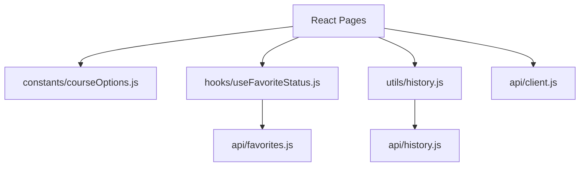

# Step 07. 테스트 문서화 및 리팩토링

> 작성일: 2026.05.29  
> 브랜치: `refactor/step-07-test-docs-refactor`  
> 작업 계획서: [docs/plans/plan-07-test-docs-refactor.md](../plans/plan-07-test-docs-refactor.md)  
> 관련 PR 문서: [docs/pr/pr-07-test-docs-refactor.md](../pr/pr-07-test-docs-refactor.md)

---

## 1. 작업 목표

Step 07은 테스트 및 리팩토링 단계다. 현재 환경에서는 Docker와 PostgreSQL 통합 실행이 어렵기 때문에, 실행 가능한 범위에서는 빌드와 서버 앱 로드를 확인하고, 나머지 통합 테스트는 문서화된 수동 절차로 남긴다.

리팩토링은 기능 삭제 없이 중복 로직만 정리하는 것을 원칙으로 한다.

---

## 2. 작업 배경

Step 06 이후 API 오류 처리와 보안 보완이 들어갔지만, 페이지별로 반복되는 즐겨찾기 로직과 추천 이력 저장 실패 처리 로직이 있었다. 또한 일부 파일에서 한글 문구가 깨져 있어 기능 보존 검증 전 정리가 필요했다.

---

## 3. 아키텍처 개요

---

## 4. 생성/수정 파일 목록

| 구분 | 파일 | 설명 |
| --- | --- | --- |
| 생성 | `client/src/constants/courseOptions.js` | 거리/시간/유형 선택 옵션 분리 |
| 생성 | `client/src/hooks/useFavoriteStatus.js` | 즐겨찾기 조회/토글/409 처리 공통 훅 |
| 생성 | `client/src/hooks/useCourse.js` | Context 사용 훅 분리 |
| 생성 | `client/src/context/CourseProvider.jsx` | CourseProvider 컴포넌트 분리 |
| 생성 | `client/src/context/courseContext.js` | CourseContext 값 분리 |
| 생성 | `client/src/utils/history.js` | 추천 이력 저장 실패를 조용히 처리하는 유틸 |
| 수정 | `client/src/api/client.js` | 깨진 오류 메시지 복구 |
| 수정 | `client/src/utils/courseDisplay.js` | 표시 라벨 변환 복구 |
| 수정 | `client/src/pages/HomePage.jsx` | 옵션 상수와 이력 저장 유틸 사용 |
| 수정 | `client/src/pages/ResultPage.jsx` | 즐겨찾기 훅과 이력 저장 유틸 사용 |
| 수정 | `client/src/pages/DetailPage.jsx` | 즐겨찾기 훅 사용 |
| 수정 | `client/src/pages/FavoritesPage.jsx` | 문구 복구 및 삭제 로직 명확화 |
| 수정 | `client/src/pages/HistoryPage.jsx` | 문구 복구 및 기존 기능 유지 |
| 생성 | `docs/plans/plan-07-test-docs-refactor.md` | Step 07 작업 계획 |
| 생성 | `docs/steps/step-07-test-docs-refactor.md` | Step 07 결과 문서 |
| 생성 | `docs/pr/pr-07-test-docs-refactor.md` | Step 07 PR 문서 |

---

## 5. 리팩토링 전/후 기능 보존 비교

| 기능 | 리팩토링 전 | 리팩토링 후 | 보존 여부 |
| --- | --- | --- | --- |
| 조건 선택 | 각 옵션이 HomePage 내부에 정의됨 | `courseOptions.js`에서 import | 보존 |
| 추천 API 호출 | HomePage에서 직접 호출 | 동일 | 보존 |
| 추천 이력 저장 | Home/Result에서 각각 try-catch | `saveHistoryQuietly` 사용 | 보존 |
| 결과 화면 표시 | `currentCourse` 표시 | 동일 | 보존 |
| 다시 추천 | `exclude` 전달 | 동일 | 보존 |
| 상세 보기 | CourseCard에서 상세 이동 | 동일 | 보존 |
| 상세 직접 접근 | `fetchCourseById` fallback | 동일 | 보존 |
| 즐겨찾기 상태 조회 | Result/Detail에서 중복 구현 | `useFavoriteStatus` | 보존 |
| 즐겨찾기 토글 | Result/Detail에서 중복 구현 | `useFavoriteStatus` | 보존 |
| 중복 즐겨찾기 409 | 저장된 상태와 notice 처리 | 훅 내부 처리 | 보존 |
| 즐겨찾기 목록 | FavoritesPage에서 조회 | 동일 | 보존 |
| 최근 추천 목록 | HistoryPage에서 조회 | 동일 | 보존 |
| 오류 메시지 | 화면별 표시 | 동일, 문구 복구 | 보존 |
| CourseContext 사용 | Provider와 hook이 한 파일에 있음 | Provider/Context/hook 분리 | 보존 |

---

## 6. 수동 테스트 절차

Docker/PostgreSQL 실행 가능 환경에서 아래 순서로 확인한다.

| 순서 | 확인 내용 |
| --- | --- |
| 1 | 서버와 DB 실행 후 `GET /api/health` 확인 |
| 2 | 클라이언트 접속 후 홈 화면 표시 확인 |
| 3 | 거리/시간/유형 선택 전 추천 버튼 비활성 확인 |
| 4 | 세 조건 선택 후 추천 버튼 활성 확인 |
| 5 | 추천 성공 후 결과 화면 이동 확인 |
| 6 | 결과 화면에서 저장/저장됨 토글 확인 |
| 7 | 결과 화면에서 다시 추천 확인 |
| 8 | 상세 보기 이동 및 직접 URL 새로고침 확인 |
| 9 | 즐겨찾기 목록에서 저장된 코스 표시/삭제 확인 |
| 10 | 최근 추천 화면에서 이력 표시 확인 |
| 11 | 서버 중지 후 API 오류 메시지 확인 |
| 12 | 중복 저장 시 notice 표시 확인 |

---

## 7. 검증 결과

| 검증 항목 | 결과 |
| --- | --- |
| 클라이언트 빌드 | 성공 |
| 클라이언트 린트 | 성공 |
| 서버 앱 모듈 로드 | 성공 |
| Docker/PostgreSQL 통합 테스트 | 환경 제약으로 문서화 대체 |

---

## 8. 보안/품질 고려사항

- API 계약은 변경하지 않았다.
- 리팩토링 후에도 기존 화면 경로와 사용자 흐름을 유지했다.
- 공통 훅은 Result/Detail처럼 단일 코스 즐겨찾기 상태가 필요한 화면에만 적용했다.
- Favorites/History 목록 화면은 목록 상태를 직접 관리해야 하므로 과도하게 추상화하지 않았다.

---

## 9. 다음 단계

추후 실제 통합 실행 환경에서 Step 07 수동 테스트 절차를 수행하고, 실패 항목이 있으면 Step 07 보정 또는 별도 QA 브랜치에서 처리한다.
