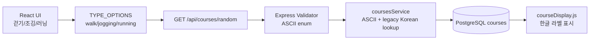

# Step 08. DB 통합 검증 및 타입 인코딩 보정

> 작성일: 2026.05.30  
> 브랜치: `fix/course-type-encoding`  
> 작업 계획서: [docs/plans/plan-08-db-integration-verification.md](../plans/plan-08-db-integration-verification.md)  
> 관련 PR 문서: [docs/pr/pr-08-course-type-encoding.md](../pr/pr-08-course-type-encoding.md)

---

## 1. 작업 목표

Step 08의 원래 목표는 Docker/PostgreSQL 환경에서 실제 DB 저장/조회 흐름을 검증하는 것이다. 이번 작업에서는 통합 검증 중 먼저 발견된 이동 유형 `type` 인코딩 문제를 해결했다.

사용자에게 보이는 값은 `걷기`, `조깅`, `러닝`으로 유지하되, 프론트엔드와 서버, DB가 주고받는 내부 값은 `walk`, `jogging`, `running`으로 통일한다.

---

## 2. 문제 배경

홈 화면에서 거리, 소요 시간, 이동 유형을 선택한 뒤 추천을 요청하면 서버에서 다음 오류가 표시됐다.

```text
이동 유형은 걷기, 조깅, 러닝 중 하나여야 합니다.
```

확인된 요청 payload는 다음과 같았다.

```text
distance=3&time=30&type=%3F%D1%89%EB%96%87
```

원인은 `client/src/constants/courseOptions.js`의 `TYPE_OPTIONS.value`가 정상 한글이나 안정적인 내부 코드가 아니라 깨진 문자열로 저장되어 있었기 때문이다. 사용자는 화면에서 한글 라벨을 누르지만, 실제 API 요청에는 `value`가 전달되므로 서버 검증을 통과하지 못했다.

---

## 3. 변경 방향

| 영역 | 변경 전 | 변경 후 |
| --- | --- | --- |
| 화면 라벨 | 걷기/조깅/산책 | 걷기/조깅/러닝 |
| API type 값 | 깨진 문자열 또는 한글 | `walk`/`jogging`/`running` |
| 서버 검증 | 한글 enum 검증 | ASCII enum 검증 |
| 서버 오류 메시지 | 한글 메시지 | 한글 메시지 유지 |
| DB seed type | 한글 | ASCII enum |
| DB seed mood | 한글 | ASCII enum |
| 화면 표시 | 깨진 값 매핑 | ASCII/기존 한글 값 모두 한글 표시 |

---

## 4. 생성/수정 파일 목록

| 구분 | 파일 | 설명 |
| --- | --- | --- |
| 생성 | `server/src/constants/courseValues.js` | 서버 이동 유형 enum과 기존 한글 DB 값 조회 호환 매핑 |
| 수정 | `client/src/constants/courseOptions.js` | 이동 유형 전송 값을 `walk`, `jogging`, `running`으로 변경 |
| 수정 | `client/src/utils/courseDisplay.js` | ASCII enum과 기존 한글 DB 값을 화면용 한글 라벨로 변환 |
| 수정 | `server/src/routes/courses.js` | `type` 검증 기준을 서버 상수로 변경하고 한글 오류 메시지 유지 |
| 수정 | `server/src/services/coursesService.js` | 신규 ASCII 값과 기존 한글 DB 값 모두 조회되도록 `ANY` 조건 적용 |
| 수정 | `server/src/db/schema.sql` | 신규 DB 초기화 시 type/mood CHECK 값을 ASCII enum으로 변경 |
| 수정 | `server/src/db/seed.sql` | 신규 DB 초기화 시 seed type/mood 값을 ASCII enum으로 변경 |
| 수정 | `docs/06-data-spec.md` | 데이터 명세의 type/mood/API 예시를 ASCII enum 기준으로 갱신 |
| 수정 | `docs/plans/plan-08-db-integration-verification.md` | Step 08 계획에 타입 인코딩 보정 내용 추가 |
| 생성 | `docs/steps/step-08-db-integration-verification.md` | Step 08 수행 결과 문서 |
| 생성 | `docs/pr/pr-08-course-type-encoding.md` | PR 설명 문서 |

---

## 5. 아키텍처 개요



---

## 6. 호환성 고려

이미 생성된 Docker PostgreSQL 볼륨에는 기존 한글 `type` 값이 남아 있을 수 있다. 이 경우 `schema.sql`과 `seed.sql` 수정만으로 기존 데이터가 자동 변경되지는 않는다.

그래서 서버 조회 로직은 사용자가 `type=walk`로 요청해도 DB의 `type`이 `walk` 또는 `걷기`인 코스를 모두 찾도록 했다. 새 DB를 초기화하면 seed 데이터는 ASCII enum으로 저장된다.

---

## 7. 검증 결과

| 검증 항목 | 명령 | 결과 |
| --- | --- | --- |
| 클라이언트 빌드 | `npm run build` | 성공 |
| 클라이언트 린트 | `npm run lint` | 성공 |
| 서버 앱 모듈 로드 | `node -e "require('./src/app'); console.log('server app loaded')"` | 성공 |
| 깨진 타입 문자열 검색 | `rg "嫄룰린|議곌퉭|\\?щ떇" client/src server/src` | 미검출 |

---

## 8. 남은 검증

실제 Docker/PostgreSQL 통합 검증은 별도로 실행해야 한다.

| 항목 | 확인 내용 |
| --- | --- |
| 신규 DB 초기화 | `courses.type`이 `walk/jogging/running`으로 저장되는지 |
| 기존 DB 호환 | 기존 한글 `type` 데이터가 `type=walk` 요청으로 조회되는지 |
| 추천 요청 | `GET /api/courses/random?distance=3&time=30&type=jogging` 성공 여부 |
| 화면 표시 | API 응답의 ASCII enum이 한글 배지로 보이는지 |
| 오류 메시지 | 잘못된 type 요청 시 한글 오류 메시지가 보이는지 |

---

## 9. 다음 단계

Docker/PostgreSQL 실행 가능 환경에서 Step 08 통합 검증 체크리스트를 진행한다. 기존 볼륨을 계속 사용할 경우 한글 type 데이터 호환 조회를 확인하고, 새 볼륨으로 초기화할 경우 ASCII enum seed가 정상 입력되는지 확인한다.
