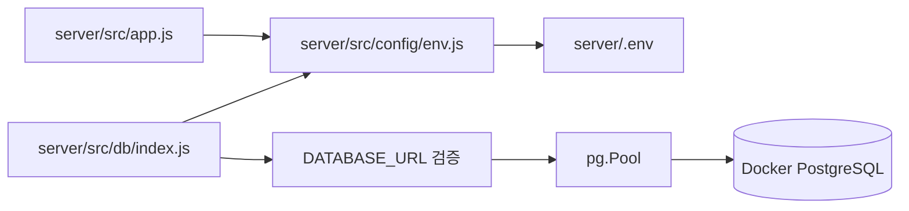

# Step 09. DB 비밀번호 환경변수 로딩 보정

> 작성일: 2026.05.31  
> 브랜치: `fix/db-password-env`  
> 작업 계획서: [docs/plans/plan-09-db-password-env.md](../plans/plan-09-db-password-env.md)  
> 관련 PR 문서: [docs/pr/pr-09-db-password-env.md](../pr/pr-09-db-password-env.md)

---

## 1. 작업 목표

PostgreSQL 접속 시 발생한 다음 오류를 해결한다.

```text
SASL: SCRAM-SERVER-FIRST-MESSAGE: client password must be a string
```

이 오류로 인해 아래 추천 API가 500 응답을 반환했다.

```text
GET /api/courses/random?distance=3&time=60&type=running
```

---

## 2. 조사 결과

Docker PostgreSQL 컨테이너는 정상 상태였다.

| 항목 | 결과 |
| --- | --- |
| 컨테이너 | `rwr-mini-project-db-1` |
| 이미지 | `postgres:16-alpine` |
| 상태 | `healthy` |
| 포트 | `localhost:5432` |

`server/.env`의 `DATABASE_URL`은 `localhost:5432/rwr_db`를 가리키고 있었고, Node에서 직접 DB에 접속했을 때도 정상 응답을 확인했다.

```json
{
  "success": true,
  "current_user": "rwr_user",
  "current_database": "rwr_db",
  "course_count": 10
}
```

따라서 원인은 PostgreSQL 컨테이너 자체가 아니라 서버 실행 위치에 따라 `server/.env`가 로드되지 않을 수 있는 환경변수 로딩 구조로 판단했다.

---

## 3. 변경 내용

| 구분 | 파일 | 설명 |
| --- | --- | --- |
| 생성 | `server/src/config/env.js` | `server/.env`를 파일 위치 기준 고정 경로로 로드하고 필수 환경변수 검증 헬퍼 제공 |
| 수정 | `server/src/app.js` | 앱 초기화 초기에 환경변수 설정 로드 |
| 수정 | `server/server.js` | 현재 작업 디렉터리에 의존하는 직접 `dotenv.config()` 호출 제거 |
| 수정 | `server/src/db/index.js` | `DATABASE_URL` 필수 여부, URL 형식, 비밀번호 포함 여부 검증 |
| 생성 | `docs/plans/plan-09-db-password-env.md` | Step 09 작업 계획과 수행 결과 기록 |
| 생성 | `docs/pr/pr-09-db-password-env.md` | PR 설명 문서 |
| 생성 | `docs/steps/step-09-db-password-env.md` | Step 09 완료 문서 |

---

## 4. 변경 후 구조



---

## 5. 검증 결과

| 검증 항목 | 명령 | 결과 |
| --- | --- | --- |
| 브랜치/변경 상태 확인 | `git status --short --branch` | `fix/db-password-env` 확인 |
| Docker 컨테이너 확인 | `docker ps` | PostgreSQL `healthy` |
| Compose 서비스 확인 | `docker compose -f docker-compose.dev.yml ps` | DB 서비스 `healthy` |
| 서버 앱 로드 | `node -e "require('./server/src/app'); console.log('server app loaded')"` | 성공 |
| DB 접속 확인 | `SELECT current_user, current_database(), COUNT(*) FROM courses` | `rwr_user`, `rwr_db`, `10` |
| 사용자 로컬 확인 | 백엔드 실행 후 API 확인 | 정상 진행 확인 |

---

## 6. 참고 사항

현재 seed 데이터 기준으로 `distance=3&time=60&type=running` 조합은 매칭 코스가 없을 수 있다. 이 경우 올바른 동작은 DB 인증 오류로 인한 500이 아니라 조건 없음 응답이다.

---

## 7. 다음 단계

사용자가 커밋 전 최종 확인을 마치면 아래 커밋 메시지로 커밋을 진행한다. `git commit`과 `git push`는 사용자 확인 후 직접 수행한다.
